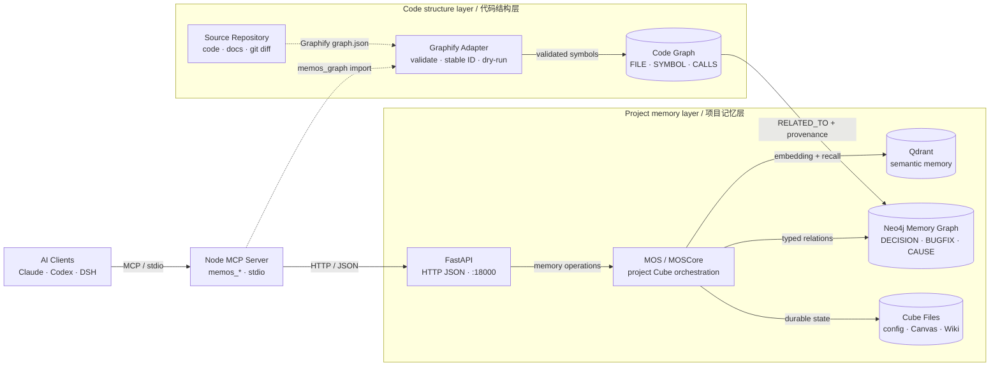
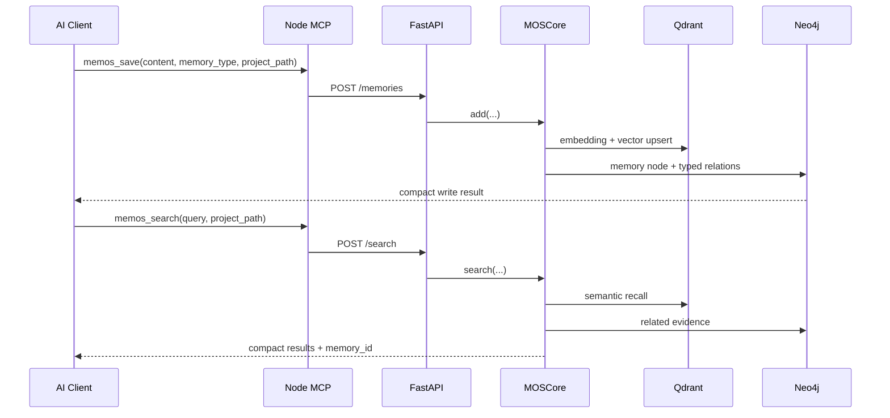

# oh-memos 架构说明

> 面向 AI 编程助手的持久化项目记忆：Node MCP 负责代理交互，FastAPI/MOS
> 负责编排，Qdrant 与 Neo4j 分别承担语义检索和关系图谱。
>
> [打开交互式架构图](docs/architecture/oh-memos.architecture.html) ·
> [查看 Archify 规范](docs/architecture/oh-memos.architecture.json)

## 系统概览

oh-memos 将自然语言工程记忆与确定性代码结构分成两个边界：

- **Project Memory** 保存 `DECISION`、`BUGFIX`、`CONFIG`、因果和冲突等语义记忆；
- **Code Graph** 保存 `FILE`、`SYMBOL`、`CALLS`、`IMPORTS` 等代码结构；
- 两层只通过显式、带 provenance 的关系连接，避免代码节点污染长期记忆召回。

| 层 | 当前主实现 | 职责 |
|---|---|---|
| AI 接入 | Claude Code / Codex / DSH / 其他 MCP Client | 发起检索、保存、图谱和上下文恢复调用 |
| MCP 工具层 | TypeScript + MCP SDK + stdio | 定义 12 个工具 schema，完成参数校验、结果压缩和 cube 路由 |
| HTTP API | FastAPI + Uvicorn，默认 `:18000` | 用户、cube、记忆、搜索、图谱、归档和聊天入口 |
| 记忆内核 | `MOS -> MOSCore -> MemCube` | 多 cube 编排、写入、检索、更新、删除与隔离 |
| 持久化 | Qdrant + Neo4j + cube 文件 | 语义召回、关系图谱、配置、Canvas 与 Wiki 导出 |
| 代码图边界 | Graphify node-link adapter | 校验、稳定 ID 与 dry-run 计划；当前不写数据库 |

## 运行时架构

<!-- architecture-aware-memory:start -->

<!-- architecture-aware-memory:end -->

默认 Docker/本地部署仍使用 FastAPI、Qdrant 与 Neo4j。Graphify 适配器是 MCP
边界上的纯校验层，不替换现有存储，也不要求数据库迁移。

## Graphify 导入边界

`memos_graph(mode="import")` 接受 Graphify/NetworkX node-link JSON，并执行：

1. 校验 `nodes` 与 `links`（兼容 `edges` 别名）；
2. 拒绝重复 ID、悬空边、危险路径、非法置信度和超大图；
3. 使用项目相对路径生成可移植的稳定代码节点 ID；
4. 返回确定性的 dry-run 节点/关系计划。

当前实现明确**不会**把 Code Graph 节点写入 Neo4j、Qdrant 或 memory cube。
后续持久化应使用独立命名空间，并通过 `RELATED_TO` 与记忆图连接。

## 证据合同

图关系和节点解释统一使用以下 provenance 字段：

| 字段 | 作用 |
|---|---|
| `evidence_kind` | `EXTRACTED` / `INFERRED` / `AMBIGUOUS` / `UNKNOWN` |
| `confidence_score` | 0 到 1 的置信度（存在时） |
| `evidence_refs` | 支撑关系的证据引用 |
| `source_file` / `source_location` | 项目相对来源位置 |
| `extractor_version` | 生成证据的提取器版本 |
| `last_verified_at` | 最近验证时间 |

旧 Neo4j 数据没有这些属性时降级为 `UNKNOWN`，不会虚构来源。

## 记忆写入与检索

## MCP 工具面

推荐 Node MCP 定义 12 个工具 schema：

| 分组 | 工具 | 作用 |
|---|---|---|
| 上下文与检索 | `memos_context_resume`, `memos_search`, `memos_list_v2`, `memos_get`, `memos_suggest`, `memos_think` | 恢复、搜索、列表、完整读取与证据包 |
| 写入 | `memos_save`, `memos_delete` | 保存带类型记忆；删除工具由 `MEMOS_ENABLE_DELETE` 控制 |
| 图谱 | `memos_graph` | related/path/impact/schema，以及 Graphify JSON dry-run 校验 |
| 管理 | `memos_admin` | cube/user 管理、统计、校验和日历 |
| 短期工作区 | `memos_canvas` | 任务画布的 open/update/show/list |
| 导出 | `memos_export_wiki` | 将 cube 渲染为可版本化 Markdown Wiki |

## 关键模块

| 路径 | 责任 |
|---|---|
| `mcp-server-node/src/tools-registry.ts` | MCP schema 与工具注解 |
| `mcp-server-node/src/handlers/index.ts` | 工具 dispatch |
| `mcp-server-node/src/handlers/graph.ts` | related/path/impact/schema/import 处理器 |
| `mcp-server-node/src/graph-provenance.ts` | provenance 归一化、格式化与稳定代码节点 ID |
| `mcp-server-node/src/graphify-import.ts` | Graphify node-link 校验与 dry-run 计划 |
| `src/oh_memos/api/start_api.py` | FastAPI/Uvicorn 主入口 |
| `src/oh_memos/mem_os/core.py` | MOSCore 的 cube、CRUD 与 search 编排 |
| `src/oh_memos/memories/textual/` | 文本记忆抽取、组织、召回与重排 |
| `src/oh_memos/vec_dbs/` | Qdrant、Milvus 等向量后端适配 |
| `src/oh_memos/graph_dbs/` | Neo4j 等图后端适配 |

## 修改导航

| 需求 | 首先查看 |
|---|---|
| 调整 MCP 工具 | `tools-registry.ts`、`handlers/index.ts` |
| 调整 Graphify/代码图边界 | `graphify-import.ts`、`graph-provenance.ts`、`handlers/graph.ts` |
| 修改记忆 API | `src/oh_memos/api/start_api.py` |
| 修改写入/检索算法 | `mem_os/core.py`、`memories/textual/` |
| 新增向量后端 | `vec_dbs/base.py`、`vec_dbs/factory.py` |
| 新增图数据库后端 | `graph_dbs/base.py`、`graph_dbs/factory.py` |
