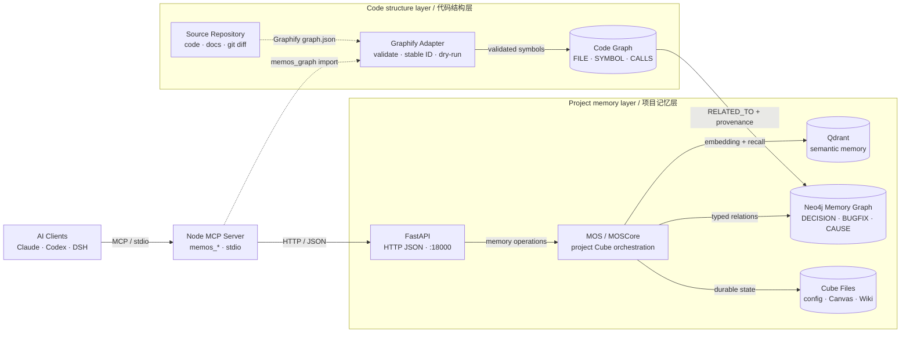
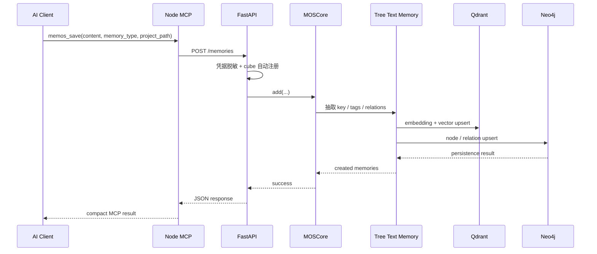
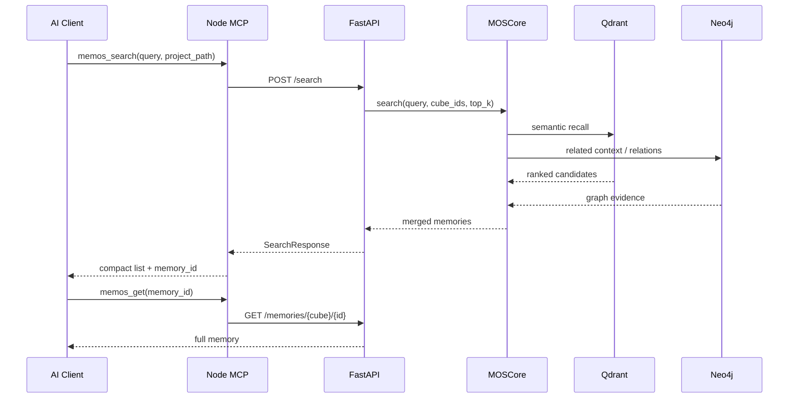
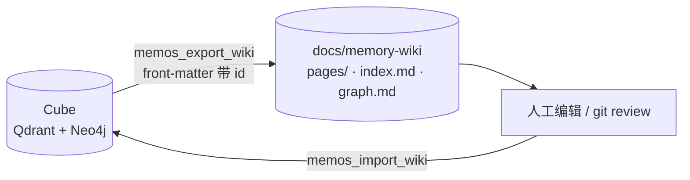
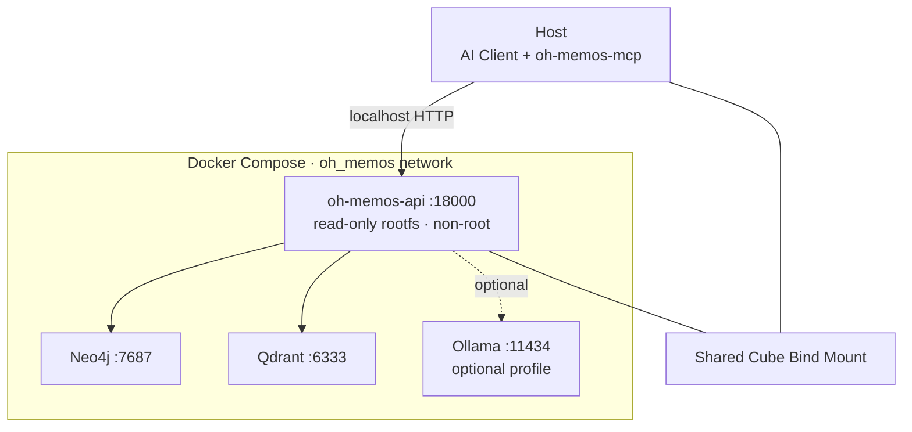

# oh-memos 架构说明

> 面向 AI 编程助手的持久化项目记忆：Node MCP 工具层负责代理交互，FastAPI/MOS 负责记忆编排，Qdrant 与 Neo4j 分别承担语义检索和关系图谱。
>
> [打开交互式架构图](docs/architecture/oh-memos.architecture.html) · [查看 Archify 规范](docs/architecture/oh-memos.architecture.json)

## 系统概览

oh-memos 把一次会话中的事实、决策、故障经验和进行中任务拆成两种时间尺度：

- **长期记忆**：经 LLM 抽取与 embedding 后写入项目 cube，通过 Qdrant 和 Neo4j 检索。
- **短期画布**：由 `memos_canvas` 写成每任务一个 Mermaid 文件，通过 `mem:<memory_id>` 回指长期证据。

| 层 | 当前主实现 | 职责 |
|---|---|---|
| AI 接入 | Claude Code / Codex / 其他 MCP Client | 发起搜索、保存、图谱和任务恢复调用 |
| MCP 工具层 | TypeScript + MCP SDK + stdio | 暴露 17 个工具 schema、参数校验、结果压缩、cube 自动注册 |
| HTTP API | FastAPI + Uvicorn，默认 `:18000` | 27 个主入口路由，处理用户、cube、记忆、搜索、图谱、归档和聊天 |
| 记忆内核 | `MOS -> MOSCore -> MemCube` | 多 cube 编排、写入、检索、更新、删除和用户隔离 |
| 持久化 | Qdrant + Neo4j + cube 文件 | 向量召回、关系图谱、配置与短期画布 |
| 模型能力 | OpenAI-compatible API / Ollama | 信息抽取、查询理解、embedding；Ollama 容器为可选 profile |
| 运行策略 | `MEMOS_MODE=full|lite` | Full 使用 API/Qdrant/Neo4j；Lite 使用 Node JSONL provider、词法检索和本地 cube 文件，不需要 Python API |

## 运行时架构

<!-- architecture-aware-memory:start -->

<!-- architecture-aware-memory:end -->

默认 Docker Compose 启动 `memos + Neo4j + Qdrant`；`ollama` 只有启用 profile 时才运行。Python `mcp-server/` 已在仓库中标记为 deprecated，当前维护入口是 `mcp-server-node/`。

### 代码图与记忆图分层

- **Code Graph**：由 Graphify/tree-sitter 提供文件、符号、包含、调用和导入关系；
  使用项目相对路径与规范化符号生成稳定 ID。
- **Memory Graph**：继续保存 `DECISION`、`BUGFIX`、`CONFIG`、因果和冲突等
  工程记忆；Qdrant 仍负责自然语言语义召回。
- **连接边**：代码节点与记忆节点只通过显式关系连接，统一携带
  `evidence_kind`、`confidence_score`、`evidence_refs`、
  `source_file` 和 `source_location`。
- **当前写入边界**：`memos_graph(mode="import")` 只验证 Graphify node-link JSON
  并生成确定性 dry-run 计划；尚未把代码图写入 Neo4j，避免未经审核的数据污染现有 cube。

## 记忆写入流程

写入边界在 `start_api.py` 先执行凭据脱敏，避免密钥进入 embedding、图谱或后续检索上下文。

## 检索流程

## MCP 工具面

推荐 Node MCP 定义 17 个工具 schema：

| 分组 | 工具 | 作用 |
|---|---|---|
| 检索 | `memos_search`, `memos_list_v2`, `memos_get`, `memos_think`, `memos_suggest` | 搜索/列表、完整读取、证据包与使用建议 |
| 写入 | `memos_save`, `memos_delete` | 持久化记忆；删除工具由 `MEMOS_ENABLE_DELETE` 控制 |
| 图谱 | `memos_graph` | 相关节点、带 provenance 的路径/影响、schema，以及 Graphify JSON dry-run 校验 |
| 管理 | `memos_admin`, `memos_context_resume` | cube/user 管理、统计、日历、能力边界和上下文恢复 |
| 短期工作区 | `memos_canvas` | 任务画布的 open/update/show/list |
| 导出与回灌 | `memos_export_wiki`, `memos_import_wiki` | 将 cube 渲染为可版本化 Markdown Wiki；编辑后回灌（id 级去重，编辑页可另存版本） |
| Skill 候选 | `memos_distill_skill`, `memos_list_skill_candidates`, `memos_review_skill_candidate`, `memos_install_skill_candidate` | 生成、审核并显式安装带来源的候选；安装仅进入项目 `.claude/skills` |

## Wiki 往返

导出与回灌构成一条可审阅、可修复的闭环：记忆不再只能通过工具读写，也能作为 Markdown 被人工纠正后写回。

回灌按页对比，四种结果：

| 页状态 | 处理 |
|---|---|
| id 在 cube 中不存在 | 以 `[TYPE] 内容` 写入，命中服务端免 LLM 抽取的快速路径 |
| 内容与库中一致 | 跳过（基于 id 的持久去重，不产生 embedding 调用） |
| 内容被编辑 | 默认跳过并报告；`on_edit="version"` 时另存为新版本，旧记忆保留 |
| `status` 非 activated | 跳过，计入归档统计 |

边界与已知限制：

- `tree_text` 原地更新当前显式返回 `TREE_TEXT_UPDATE_UNSUPPORTED`，编辑页使用版本化写入；真正更新需要 ID-preserving graph/vector 事务。
- 已版本化的页记录在 `docs/memory-wiki/.wiki-import-ledger.json`（页 id → 内容哈希），重复导入不会把同一次编辑反复版本化。
- `tags`、`confidence`、`created` 和关联边不回灌，当前 API 没有对应写入字段。
- 导入只读 `pages/` 下带导出标记的文件，从不删除任何东西；写入内容仍走服务端凭据脱敏。

## 部署边界

安全约束：

- Compose 默认只绑定 `127.0.0.1`。
- API 当前没有认证层；如需远程访问，必须在前方配置带认证的 TLS 反向代理。
- 容器以非 root 用户运行，根文件系统只读，删除 Linux capabilities，并启用 `no-new-privileges`。
- `.env`、模型密钥和数据库口令不能提交到 Git；公开文档只引用 example 文件。

## 模块地图

| 路径 | 责任 |
|---|---|
| `mcp-server-node/src/server.ts` | MCP server、stdio transport、工具注册和后台初始化 |
| `mcp-server-node/src/handlers/` | memory/search/graph/admin/canvas/wiki 工具处理器 |
| `mcp-server-node/src/graph-provenance.ts` | 统一证据种类、置信度、来源格式与稳定代码节点 ID |
| `mcp-server-node/src/graphify-import.ts` | 严格校验 Graphify node-link JSON 并生成无写入导入计划 |
| `mcp-server-node/src/wiki-import-format.ts` | Wiki 页解析（导出格式的逆运算，纯函数，有单测覆盖） |
| `mcp-server-node/src/api-client.ts` | API 超时、重试、健康检查与 cube 失效处理 |
| `src/oh_memos/api/start_api.py` | 当前 Uvicorn/FastAPI 主入口 |
| `src/oh_memos/api/start_api.py:MemoryCreate` | 写入字段校验（类型、tags、confidence、生命周期、来源与时间）及 `memory_ids` 响应 |
| `src/oh_memos/mem_os/core.py` | MOSCore 的 cube、CRUD 与 search 编排 |
| `src/oh_memos/multi_mem_cube/` | 单 cube 与复合 cube 视图 |
| `src/oh_memos/memories/textual/` | 文本/树记忆、抽取、组织、召回与重排 |
| `src/oh_memos/vec_dbs/` | Qdrant、Milvus 等向量后端适配 |
| `src/oh_memos/graph_dbs/` | Neo4j、PolarDB、Nebula 等图后端适配 |
| `src/oh_memos/mem_scheduler/` | 可选归档、Redis/RabbitMQ 调度能力 |
| `docker/docker-compose.yml` | 当前容器运行拓扑与安全边界 |
| `project-memory/` | Agent skill 与 hooks，推动主动检索和里程碑保存 |
| `project-memory/hooks/node/oh_memos_auto_capture.js` | 默认关闭的 PreCompact checkpoint 捕获；低置信度、失败开放、哈希去重 |
| `mcp-server-node/src/memory-quality.ts` | 搜索后质量评分、时效标记、自动捕获降权和跨 cube 全局排序 |
| `mcp-server-node/src/handlers/skill.ts` | 生成、审核、拒绝和显式安装带来源的 Skill 候选；安装只写 `.claude/skills/<slug>/SKILL.md` |

## 修改导航

| 需求 | 首先查看 |
|---|---|
| 新增或调整 MCP 工具 | `mcp-server-node/src/tools-registry.ts`、`handlers/index.ts` |
| 修改 Graphify/代码图适配 | `graphify-import.ts`、`graph-provenance.ts`、`handlers/graph.ts` |
| 修改记忆 API | `src/oh_memos/api/start_api.py`、`api/product_models.py` |
| 修改写入/检索算法 | `mem_os/core.py`、`multi_mem_cube/single_cube.py` |
| 新增向量后端 | `vec_dbs/base.py`、`vec_dbs/factory.py` |
| 新增图数据库后端 | `graph_dbs/base.py`、`graph_dbs/factory.py` |
| 修改容器部署 | `docker/docker-compose.yml`、`docker/Dockerfile` |
| 修改主动记忆行为 | `project-memory/SKILL.md`、`project-memory/hooks/` |

## 当前实现与可选能力

| 状态 | 能力 |
|---|---|
| 当前推荐 | Node MCP、FastAPI、MOSCore、Qdrant、Neo4j、共享 cube 目录 |
| 可选 | Ollama、OpenAI-compatible 模型、Milvus/其他图后端、Redis/RabbitMQ scheduler |
| 兼容保留 | `server_api.py`、`product_api.py`、库级 FastMCP |
| 已停用 | Python `mcp-server/`，只保留迁移参考 |
