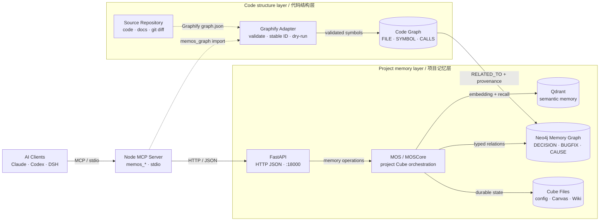

<div align="center">

# oh-memos

**Persistent, project-scoped memory for AI coding assistants**

oh-memos gives MCP-compatible assistants a durable place to store project decisions,
bug fixes, configurations, evidence, and in-flight task state. It combines semantic
search, a knowledge graph, and lightweight task canvases without mixing one project's
memory into another.

[](https://github.com/lsg1103275794/oh-memos/actions/workflows/docker-publish.yml)
[](https://www.npmjs.com/package/oh-memos-mcp)
[](pyproject.toml)
[](mcp-server-node/package.json)
[](LICENSE)

English | [简体中文](README_CN.md) ·
[Architecture](ARCHITECTURE.md) ·
[Interactive map](https://lsg1103275794.github.io/oh-memos/architecture/) ·
[MCP guide](docs/MCP_GUIDE.md)


</div>

> oh-memos is a memory layer, not a chat application. Run the backend, connect
> `oh-memos-mcp` to your AI client, and let the client retrieve and save project
> knowledge through MCP tools.

## Why oh-memos

AI assistants can reason well inside one conversation, but project work lasts much
longer than a context window. After a new session or context compaction, the same
decisions are explained again, old bugs return, and unfinished work has to be
reconstructed from files.

| Common failure | What oh-memos provides |
|---|---|
| A new session forgets prior decisions | Typed, cross-session memories with source evidence |
| The same bug is diagnosed repeatedly | Semantic search over earlier fixes and error patterns |
| Flat notes hide cause and impact | Neo4j relationships, paths, and impact queries |
| Memories from different repositories get mixed | `project_path` routing to an isolated cube |
| Context compaction loses task position | A short-term task canvas surfaced by `memos_context_resume` |
| Useful history is trapped in a service | Git-friendly Markdown wiki export |

## Core capabilities

| Capability | What it means in practice |
|---|---|
| **Typed long-term memory** | Save `DECISION`, `BUGFIX`, `ERROR_PATTERN`, `GOTCHA`, `CONFIG`, `FEATURE`, `MILESTONE`, and other explicit types |
| **Hybrid retrieval** | Qdrant handles semantic recall while Neo4j preserves relationships such as `CAUSE`, `CONDITION`, `RELATE`, and `CONFLICT` |
| **Project isolation** | A project path deterministically maps to its own memory cube |
| **Two timescales** | Durable facts live in the memory stores; fast-changing task state lives in a small Mermaid canvas |
| **MCP-native access** | The maintained TypeScript server exposes search, save, graph, admin, canvas, and export tools over stdio |
| **Write-back contract** | Memory writes return created IDs and accept source/confidence/lifecycle metadata; Wiki imports preserve that metadata |
| **Local-first deployment** | FastAPI, Qdrant, and Neo4j run locally; models can be local through Ollama or remote through an OpenAI-compatible API |
| **Local Lite provider** | `MEMOS_MODE=lite` or `MEMOS_PROVIDER=local` stores typed memories in per-cube JSONL; lexical search by default, optional hybrid semantic ranking via a local Ollama embedding model — no Python API or Neo4j required |
| **Ranking that decays** | Exponential decay with per-type half-lives (`PROGRESS` 14 days … `DECISION` 1095), plus access reinforcement — memories you keep opening stay near the top, unused ones sink |
| **Near-duplicate folding** | Character n-gram similarity with per-type thresholds, so reworded copies of the same note stop crowding out `top_k`. CJK-safe: no word segmentation involved |
| **Spreading activation** | Optional one-hop graph association (`MEMOS_SPREAD_ACTIVATION=true`): a hit pulls in strongly related memories along `CAUSE`/`CONDITION`/`RELATE` edges, tagged with the edge they came from and always ranked below direct matches |
| **Legible results** | Result lines carry the signals that mattered — `access_count`, `stale`, folded duplicate IDs, and `via CAUSE from …` for associations — so an assistant can tell evidence from side evidence |

## Choose a deployment architecture

oh-memos has two deployment architectures. **Lite** is a standalone Node.js
provider for fast, local, or offline work. **Full** connects the Node MCP server
to FastAPI/MOS, Qdrant, and Neo4j for semantic retrieval, graph context, and LLM
extraction. Native Windows and host-database Docker are Full-mode variants.

| Choose | Requires | Provides |
|---|---|---|
| **Lite** | Node.js 20+ | Local JSONL memory, typed save/list/get/search, canvas, lexical search, optional local Ollama embeddings |
| **Full** | Docker Compose or native Python + Qdrant + Neo4j | API, semantic/vector search, graph relations, LLM extraction, Wiki round-trip, graph/admin operations |

For the smallest setup, configure the MCP client with the `env` block below:

```json
{
  "MEMOS_MODE": "lite",
  "MEMOS_PROVIDER": "local",
  "MEMOS_USER": "dev_user",
  "MEMOS_DEFAULT_CUBE": "dev_cube",
  "MEMOS_CUBES_DIR": "/absolute/path/to/oh-memos/data/oh-memos_cubes",
  "MEMOS_LITE_EMBED": "off"
}
```

Lite does not require `MEMOS_URL`, Python, FastAPI, Neo4j, or Qdrant. Remove
`MEMOS_LITE_EMBED=off` to allow optional local Ollama embeddings. Full remains
the recommended choice for team use and graph-aware retrieval. See the full
[deployment mode comparison](docs/DEPLOYMENT_MODES.md) before choosing.

## Choose a deployment architecture

oh-memos has two deployment architectures. **Lite** is a standalone Node.js
provider for fast, local, or offline work. **Full** connects the Node MCP server
to FastAPI/MOS, Qdrant, and Neo4j for semantic retrieval, graph context, and LLM
extraction. Native Windows and host-database Docker are Full-mode variants.

| Choose | Requires | Provides |
|---|---|---|
| **Lite** | Node.js 20+ | Local JSONL memory, typed save/list/get/search, canvas, lexical search, optional local Ollama embeddings |
| **Full** | Docker Compose or native Python + Qdrant + Neo4j | API, semantic/vector search, graph relations, LLM extraction, Wiki round-trip, graph/admin operations |

For the smallest setup, configure the MCP client with the `env` block below:

```json
{
  "MEMOS_MODE": "lite",
  "MEMOS_PROVIDER": "local",
  "MEMOS_USER": "dev_user",
  "MEMOS_DEFAULT_CUBE": "dev_cube",
  "MEMOS_CUBES_DIR": "/absolute/path/to/oh-memos/data/oh-memos_cubes",
  "MEMOS_LITE_EMBED": "off"
}
```

Lite does not require `MEMOS_URL`, Python, FastAPI, Neo4j, or Qdrant. Remove
`MEMOS_LITE_EMBED=off` to allow optional local Ollama embeddings. Full remains
the recommended choice for team use and graph-aware retrieval. See the full
[deployment mode comparison](docs/DEPLOYMENT_MODES.md) before choosing.

## Quick start

### Prerequisites

- Docker Desktop or Docker Engine with Compose v2
- Node.js 20 or newer on the machine running the MCP client
- An OpenAI-compatible chat and embedding provider, or a local Ollama setup

The published Docker image currently targets `linux/amd64`. The same Compose file
can also build the API image from this repository.

### 1. Start the backend

```bash
git clone https://github.com/lsg1103275794/oh-memos.git
cd oh-memos

# Linux / macOS
cp docker/.env.docker.example docker/.env.docker
mkdir -p data/oh-memos_cubes

# Windows PowerShell
Copy-Item docker/.env.docker.example docker/.env.docker
New-Item -ItemType Directory -Force data/oh-memos_cubes
```

Edit `docker/.env.docker` before starting. At minimum:

- set a strong `NEO4J_PASSWORD`;
- set `MEMOS_CUBES_HOST_DIR` to the absolute host path of
  `data/oh-memos_cubes`;
- configure the chat model credentials;
- configure the embedding backend and credentials.

Then build and start the stack:

```bash
docker compose --env-file docker/.env.docker -f docker/docker-compose.yml up -d --build
docker compose --env-file docker/.env.docker -f docker/docker-compose.yml ps
curl http://127.0.0.1:18000/health
```

The API reference is available at
[`http://127.0.0.1:18000/docs`](http://127.0.0.1:18000/docs).

### 2. Connect an MCP client

Add this server definition to your MCP client's configuration. The exact config
file location depends on the client; see the [MCP guide](docs/MCP_GUIDE.md) for
Claude Code, Cursor, Windsurf, Trae, and other clients.

Install the server once, then point the config at it (`npm root -g` prints the
directory to use in `args`):

```bash
npm install -g oh-memos-mcp
npm root -g
```

```json
{
  "mcpServers": {
    "oh-memos": {
      "type": "stdio",
      "command": "node",
      "args": ["<npm root -g>/oh-memos-mcp/dist/index.js"],
      "env": {
        "MEMOS_URL": "http://127.0.0.1:18000",
        "MEMOS_USER": "dev_user",
        "MEMOS_DEFAULT_CUBE": "dev_cube",
        "MEMOS_CUBES_DIR": "/absolute/path/to/oh-memos/data/oh-memos_cubes",
        "MEMOS_ENV_FILE": "/absolute/path/to/oh-memos/.env"
      }
    }
  }
}
```

The first four environment variables are required. `MEMOS_CUBES_DIR` must point to
the same host directory used by `MEMOS_CUBES_HOST_DIR` in Docker. On Windows,
use forward slashes in JSON, for example `C:/work/oh-memos/data/oh-memos_cubes`.
`MEMOS_ENV_FILE` is what lets a globally-installed server find your `.env` — the
positional search never reaches it from outside the project.

To upgrade, run `npm i -g oh-memos-mcp@latest` and restart the client; the config
stays as it is. A running server is never swapped mid-session, so the restart is
what makes a new version take effect.

### 3. Use memory inside a project

The AI client calls these tools; they are not shell commands:

```text
memos_context_resume(project_path="/absolute/path/to/my-project")

memos_save(
  content="Use PostgreSQL advisory locks for the migration worker.",
  memory_type="DECISION",
  project_path="/absolute/path/to/my-project"
)

memos_search(
  query="DECISION migration locking",
  project_path="/absolute/path/to/my-project"
)
```

Passing `project_path` is the important part: it keeps memory scoped to the
repository that produced it.

For native Windows, migration, and alternate Docker modes, use the
[Chinese deployment guide](docs/DEPLOY_CN.md) or
[English deployment guide](docs/DEPLOY_EN.md).

## How it works

<!-- architecture-aware-memory:start -->

<!-- architecture-aware-memory:end -->

1. The AI client calls the Node MCP server over stdio.
2. The MCP server derives or registers the correct project cube and calls FastAPI.
3. MOS extracts structured memory, embeds it, and writes vector and memory-graph data.
4. Graphify node-link JSON can be validated through `memos_graph(mode="import")`;
   this is a dry-run boundary and does not write Neo4j, Qdrant, or cube data.
5. Code symbols remain separate from long-term memories and connect through
   provenance-aware `RELATED_TO` relationships.

For module boundaries, write/search sequences, deployment topology, and an
"edit here for X" guide, read [ARCHITECTURE.md](ARCHITECTURE.md). The
[interactive architecture map](https://lsg1103275794.github.io/oh-memos/architecture/)
supports zoom, themes, tracing, and export.

<a href="https://lsg1103275794.github.io/oh-memos/architecture/">
  
</a>

<p align="center"><sub>Static preview of the architecture map — click it to open the interactive version.</sub></p>

### Two memory timescales

| | Long-term memory | Short-term canvas |
|---|---|---|
| Answers | "What do we know?" | "Where was I?" |
| Lifetime | Cross-session | One task |
| Changes | When a fact or decision changes | Several times during active work |
| Storage | Qdrant + Neo4j + cube config | One Mermaid file per task |
| Tools | `memos_save`, `memos_search`, `memos_graph` | `memos_canvas` |

Canvas nodes can reference `mem:<memory_id>`, `file:<path>`, or
`note:<text>`. This keeps task state cheap to update while preserving a path
back to the underlying evidence.

## MCP tool surface

| Group | Tools | Purpose |
|---|---|---|
| Context and retrieval | `memos_context_resume`, `memos_search`, `memos_list_v2`, `memos_get`, `memos_think`, `memos_suggest` | Recover context, retrieve compact results/lists, inspect evidence, and identify gaps |
| Write and lifecycle | `memos_save`, `memos_delete` | Persist typed memories; deletion is disabled unless explicitly enabled |
| Knowledge graph | `memos_graph` | Related nodes, evidence-aware paths, impact/schema queries, and Graphify JSON dry-run validation |
| Administration | `memos_admin`, `memos_list_v2` | Cube/user maintenance, validation, statistics, calendar, and listing |
| Short-term work | `memos_canvas` | Open, update, show, and list task canvases |
| Export / import | `memos_export_wiki`, `memos_import_wiki` | Render a cube as linked Markdown pages and a Mermaid graph; re-import an edited wiki (missing pages are created, unchanged pages skipped, edited pages can be versioned) |
| Skill candidates | `memos_distill_skill`, `memos_list_skill_candidates` | Generate evidence-linked candidates for human review; never auto-install them |

The Node implementation in `mcp-server-node/` is the maintained MCP server.
The Python implementation in `mcp-server/` is retained only as a deprecated
migration reference.

## Deployment and security

| Service | Default host endpoint | Role |
|---|---|---|
| oh-memos API | `127.0.0.1:18000` | Memory, search, graph, user, cube, archive, and chat endpoints |
| Neo4j | `127.0.0.1:7474` / `:7687` | Browser/API and Bolt graph access |
| Qdrant | `127.0.0.1:16333` / `:6334` | Host HTTP and gRPC access; container HTTP remains `6333` |
| Ollama | `127.0.0.1:11434` | Optional local model profile |

Important boundaries:

- Published ports bind to `127.0.0.1` by default.
- The API does not currently provide a unified authentication layer. Do not bind
  it to `0.0.0.0` or expose it publicly without an authenticated TLS reverse proxy.
- The host MCP server and the API container must share the same cube directory.
- Compose runs the API as a non-root user with a read-only root filesystem,
  dropped Linux capabilities, and `no-new-privileges`.
- A fully local deployment requires local model and embedding backends. When a
  cloud provider is configured, extracted content and queries may leave the machine.

## Repository map

| Path | Responsibility |
|---|---|
| `mcp-server-node/` | Maintained TypeScript MCP server and tests |
| `src/oh_memos/api/start_api.py` | FastAPI/Uvicorn application entry point |
| `src/oh_memos/mem_os/` | Multi-user and multi-cube orchestration |
| `src/oh_memos/memories/` | Memory extraction, organization, retrieval, and reranking |
| `src/oh_memos/vec_dbs/` | Vector database adapters |
| `src/oh_memos/graph_dbs/` | Graph database adapters |
| `project-memory/` | Agent skill and proactive-memory hooks |
| `docker/` | Hardened Compose deployment and migration modes |
| `docs/` | Deployment, API, design, research, screenshots, and changelog |

## Documentation

| Document | Use it for |
|---|---|
| [Architecture](ARCHITECTURE.md) | Runtime boundaries, data flows, modules, and change navigation |
| [Interactive architecture](https://lsg1103275794.github.io/oh-memos/architecture/) · [source JSON](docs/architecture/oh-memos.architecture.json) | Explore and export the system diagram |
| [MCP guide](docs/MCP_GUIDE.md) | Client-specific stdio configuration for Lite and Full |
| [Deployment modes](docs/DEPLOYMENT_MODES.md) | Choose Lite vs. Full, compare capabilities, and understand the migration boundary |
| [Deployment (EN)](docs/DEPLOY_EN.md) · [部署（中文）](docs/DEPLOY_CN.md) | Full setup, operations, and alternate modes |
| [API reference](docs/product-api-tests.md) | HTTP endpoint examples |
| [Memory wiki example](docs/memory-wiki/index.md) | Git-friendly exported project knowledge |
| [Screenshots](docs/ScreenShot/README.md) | Real client and graph examples |
| [Changelog](docs/CHANGELOG.md) | Detailed release history |

## Development

```bash
# Python API and core
poetry install --with dev,test --extras tree-mem
poetry run pytest
poetry run ruff check src tests

# Node MCP server
cd mcp-server-node
npm ci
npm run build
npm test

# Regenerate the README "Recent changes" block after editing docs/CHANGELOG.md
cd .. && node scripts/generate-readme-changelog.mjs --write
```

The Docker publishing workflow also imports the API, checks dependencies, verifies
the CPU-only Torch build, and confirms that the image runs as a non-root user.

## Recent changes

The six most recent entries from the [changelog](docs/CHANGELOG.md), generated by
`scripts/generate-readme-changelog.mjs` — do not edit by hand. English titles come
from the `<!-- en: ... -->` comment under each changelog heading.

<!-- changelog-recent:start -->
- `3.1.5 · 2026-08-26` — 🔧 Reranker model switched to BAAI/bge-reranker-v2-m3 (fixes search returning only WorkingMemory)
- `3.1.5 · 2026-08-26` — 🔊 Silent fail-open degradation is now observable (upstream root cause of the entry above)
- `3.1.5 · 2026-08-26` — 🔒 Structural enforcement for tier filtering
- `3.1.5 · 2026-08-26` — 🐳 Bare .dockerignore patterns match the top level only — a password file reached the build context and 8.4 MB of stale bytecode reached the image
- `3.1.5 · 2026-08-26` — 🐛 Open: three graph.ts routes do not project the tier field
- `3.1.4 · 2026-08-24` — 🐛 Fix: the sibling-nodes list included scheduler short-term copies
<!-- changelog-recent:end -->

See the [changelog](docs/CHANGELOG.md) for the full history and the
[roadmap](docs/future/ROADMAP.md) for proposed work.

## Contributing

Issues and pull requests are welcome. Keep changes scoped, add tests near the
affected Python or Node package, and update the relevant documentation when a
tool schema or public API changes.

## Upstream and license

oh-memos builds on [MemTensor/MemOS](https://github.com/MemTensor/MemOS)
and extends it with project-oriented MCP workflows, retrieval, deployment, and
agent integration.

This repository is licensed under the
[Apache License 2.0](LICENSE).

<div align="center">

**Give every project a memory that outlives the chat.**

[Report an issue](https://github.com/lsg1103275794/oh-memos/issues) ·
[View on npm](https://www.npmjs.com/package/oh-memos-mcp)

</div>
