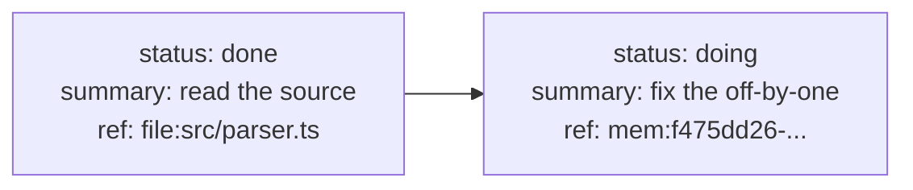
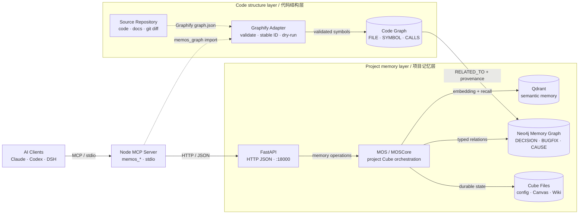
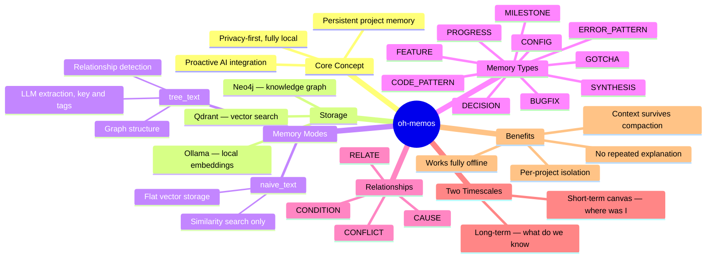
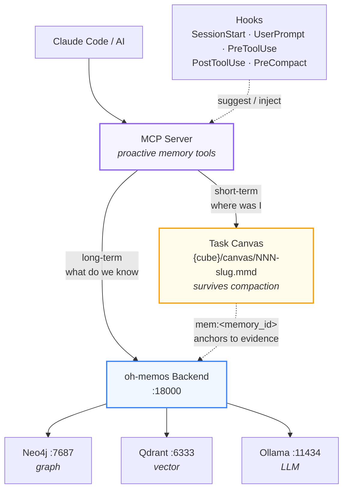

<div align="center">

# 🧠 oh-memos

**Persistent Project Memory for AI Assistants**

*让 AI 拥有持久记忆的项目级解决方案*

[](LICENSE)
[]()
[](https://neo4j.com)
[](https://qdrant.tech)

[🚀 Quick Start](#-quick-start) · [✨ Features](#-key-features) · [🏗️Architecture](#-architecture) · [📖 Docs](#-documentation)


</div>

---

## 😫 The Problem

| Issue | Symptom |
|-------|---------|
| **Memory Loss** | New chat = AI forgets everything. *"Why did we choose Redis again?"* |
| **Repeat Mistakes** | Same bug fixed 3 times. AI never learns from history. |
| **Doc Overload** | AI scatters `NOTES.md`, `TODO.md` everywhere. Project becomes a mess. |
| **Context Collapse** | After context compaction, AI degrades to `mkdir -p .../memory` instead of using MCP tools. |
| **Memory Pollution** | Different projects share the same memory cube — AudioCraft memories mixed with oh-memos memories. |

**oh-memos transforms AI from a "stateless chatbot" into a "Senior Project Partner".**

---

## 🆕 What's New — v3.1 (August 2026)

### 🗺️ Symbolic Task Canvas — task state that survives compaction

Every memory in oh-memos was **cross-session**: durable facts about the project.
Nothing tracked state *inside* a session, so when the context compacted, "where
was I" had to be rebuilt by rereading history.

`memos_canvas` is that missing layer. One Mermaid file per task, whose nodes carry
a greppable id and an anchor to the evidence behind them:



| `ref` scheme | Points at | Opened with |
|---|---|---|
| `mem:<memory_id>` | a memory in the knowledge graph | `memos_get(memory_id=...)` |
| `file:<path>` | any file, incl. offloaded tool results | Read |
| `note:<text>` | an inline remark | — |

`memos_context_resume` now surfaces **unfinished** canvases first — headlines and
counts only — so the first thing visible after a compaction is the open work.

Inspired by the symbolic memory in
[TencentDB-Agent-Memory](https://github.com/TencentCloud/TencentDB-Agent-Memory),
but deliberately **not** a port of it. Their token reduction comes from
intercepting and replacing tool output before the model sees it, which a Claude
Code hook cannot do — `PreToolUse` can rewrite a tool's *input*, but no hook can
rewrite its *output*, and the harness already offloads large results on its own.
**So this claims no token saving.** What it does claim: task state that survives
compaction, and a summary you can check against its evidence.

### 🧪 First tests in the MCP server

The `mcp-server-node` package shipped with **zero tests**. It now has 65 unit
tests plus 18 end-to-end checks driven over real MCP stdio — covering the
parse/render round trip, Mermaid injection escaping, and path-traversal refusal.

### 🐛 Graph fixes found along the way

- **Any cube holding an archived memory returned `400` from `GET /memories`** —
  `_parse_node()` converted only two temporal fields, so `archived_at` reached
  the serializer as a raw driver object. `POST /search` on the same data
  succeeded, and the error came from a global handler, so nothing in the log
  pointed at serialization. Now converts by capability, not a name allowlist.
- **PPR silently degraded to no associative results** — seed ids were resolved
  without the filter used to project the graph, so `gds.pageRank.stream` rejected
  the whole call and an `except` block swallowed it. Retrieval quality dropped
  with one log line to show for it.
- **Native Windows cube writes landed in a phantom directory tree** —
  `/mnt/...` rewriting only resolves inside WSL. Registration reported success,
  then every read failed 400.

---

## 🆕 What's New — v2.6 (March 2026)

### 🔍 Knowledge Graph — Fixed & Supercharged

The graph relationship engine was **silently broken** in v2.5 — queries always returned "No relationships found" due to a Cypher string-matching bug. This release fixes it and adds new graph intelligence tools.

| Tool | Before (v2.5) | After (v2.6) |
|------|---------------|--------------|
| `oh-memos_get_graph` | Always "No relationships found" | Shows CAUSE/RELATE/CONDITION edges via vector-ID-based Neo4j query |
| `oh-memos_trace_path` | Always "No path found" | Correct API path + field names + Neo4j fallback |
| `oh-memos_get_stats` | All memories show as PROGRESS (100%) | Accurate type distribution (MILESTONE 22%, BUGFIX 6%...) |
| `oh-memos_impact` | *Did not exist* | Forward blast radius — traces what a memory caused downstream |

### 🧠 PreToolUse: Automatic Memory Injection

Inspired by [GitNexus](https://github.com/abhigyanpatwari/GitNexus)'s PreToolUse hook pattern. When Claude uses **Grep/Glob/Read/Edit/Write**, a hook automatically searches oh-memos and injects relevant memories as `additionalContext` — **no explicit `oh-memos_search` needed**.

```
Claude: Read("src/hooks/useWebSocket.ts")
  → [Hook fires automatically]
  → Searches oh-memos → finds "WebSocket URL hardcoded bug was fixed on Jan 20"
  → Injects as additionalContext
Claude: (now aware of the history before even reading the file)
```

### ⚡ RRF Local Reranker — Zero HTTP Dependency

Replaced the external SiliconFlow BGE Reranker API with a local **Reciprocal Rank Fusion** implementation. Same algorithm used by Elasticsearch and Pinecone.

| | Before | After |
|---|--------|-------|
| Reranker | HTTP call to SiliconFlow (~200-400ms) | Local Python RRF (<1ms) |
| Dependency | Requires API key + network | Fully offline |
| Config | `"backend": "http_bge"` | `"backend": "rrf"` |

### 🏷️INFERRED Type — Graph Reasoning Nodes

LLM-inferred reasoning nodes (auto-generated by Neo4j) are now classified as `INFERRED` (🔗) instead of mixing into PROGRESS. User-saved memories with proper types (BUGFIX, DECISION, etc.) are now correctly identified from `sources` metadata, even after the `tree_text` LLM extractor strips the `[TYPE]` prefix.

---

## 🆕 What's New — v2.5 (Feb 2026)

### 🛡️Six-Layer Context Defense System

AI assistants lose conversation history after context compaction. This update introduces a **six-layer defense chain** to ensure the model always uses MCP memory tools — even after context is fully compressed.

```
Layer 1  Tool Descriptions ──── Survive compaction intact. Anti-mkdir warnings embedded.
Layer 2  project_path Routing ─ Auto-derive cube_id from working directory. No more dev_cube pollution.
Layer 3  CLAUDE.md / MEMORY.md  Always loaded into context. Rules + quick reference.
Layer 4  PreCompact Hook ────── Visual reminder before compaction: save memories NOW.
Layer 5  Context Monitor ────── Track tool call count. Warn at 70%, alert at 90%.
Layer 6  Project Hooks ──────── 7 hooks for session start, intent detection, save suggestions.
```

### 🗺️Smart Cube Routing

Each project now gets its own isolated memory cube, automatically derived from the working directory:

| Project Path | Auto-derived Cube |
|-------------|-------------------|
| `/mnt/g/test/oh-memos` | `oh-memos_cube` |
| `/mnt/g/Cyber/AudioCraft Studio` | `audiocraft_studio_cube` |
| `~/projects/my-web-app` | `my_web_app_cube` |

```python
# Just pass project_path — the server handles the rest
oh-memos_save(content="...", memory_type="BUGFIX", project_path="/mnt/g/Cyber/AudioCraft Studio")
# → saved to audiocraft_studio_cube (not dev_cube!)
```

### 🔧 New MCP Tool: `oh-memos_context_resume`

One-call context recovery after compaction:

```python
oh-memos_context_resume(project_path="/mnt/g/test/oh-memos")
# Returns: recent 24h memories + active project summary + anti-mkdir reminder
```

### 🪝 Claude Code Hooks System

Ready-to-use hooks in `project-memory/hooks/node/`:

| Hook | Event | What It Does |
|------|-------|-------------|
| `oh_memos_context_inject.js` | PreToolUse | **Auto-injects** related memories when Claude searches/edits files |
| `oh_memos_session_start.js` | SessionStart | Maps CWD → cube_id at startup |
| `oh_memos_user_prompt.js` | UserPromptSubmit | Detects intent (history, errors, decisions) → suggests oh-memos_search |
| `oh_memos_pre_compact.js` | PreCompact | Reminds: save before compaction, resume after |
| `oh_memos_suggest_compact.js` | PreToolUse | Monitors context usage, warns at 70%/90% |
| `oh_memos_auto_save.js` | PostToolUse | Suggests appropriate memory_type after edits |
| `oh_memos_block_mkdir_memory.js` | PreToolUse | Blocks `mkdir` for memory directories |
| `oh_memos_notify_milestone.js` | PostToolUse | Suggests MILESTONE save for important files |

> See [`project-memory/hooks/settings-template.json`](project-memory/hooks/settings-template.json) for setup instructions.

---

## ✨ Key Features

<table>
<tr>
<td width="50%">

</td>
<td width="50%">

### 🧠 Intelligent Auto-Memory

AI **proactively saves** key information:
- 🌟 Milestones & decisions
- 🐛 Bug fixes & solutions
- ⚠️ Gotchas & configurations

**No manual note-taking required.**

</td>
</tr>
<tr>
<td width="50%">

### 🔍 Context-Aware Search

AI **auto-retrieves** history before work:
- Similar problem solutions
- Past design decisions
- Related configurations

**Never repeat the same mistake.**

</td>
<td width="50%">

</td>
</tr>
</table>

---

## 🏗️Architecture

<!-- architecture-aware-memory:start -->

<!-- architecture-aware-memory:end -->

The Graphify adapter currently validates node-link JSON and produces a
deterministic dry-run plan. It does not write code symbols to Neo4j, Qdrant, or
a memory cube; project memories remain a separate semantic layer.

[Detailed architecture](ARCHITECTURE.md) ·
[Interactive architecture map](https://htmlpreview.github.io/?https://github.com/lsg1103275794/oh-memos/blob/main/docs/architecture/oh-memos.architecture.html)



### Two Timescales

Memory here is not one thing. Durable facts and in-flight task state have
different lifetimes, change at different rates, and belong in different places:

| | **Long-term memory** | **Short-term canvas** |
|---|---|---|
| Answers | "what do we know" | "where was I" |
| Lifetime | indefinite | one task |
| Changes | on a finding | several times an hour |
| Storage | Neo4j + Qdrant | one Mermaid file per task |
| Write cost | LLM extraction + embedding | a file write |
| Tools | `memos_save` / `memos_search` / `memos_graph` | `memos_canvas` |

They are joined by the `ref`: a canvas node anchors to a memory with
`mem:<memory_id>`, so abstraction stays cheap while the path back to evidence
stays open. A canvas is never embedded — paying an embedding round trip for a
`doing→done` flip would be absurd.

### Dual-Engine Design

| Engine | Role | Technology |
|--------|------|------------|
| **Knowledge Graph** | Logical relationships (CAUSE, CONDITION, RELATE) | Neo4j |
| **Vector Search** | Semantic similarity matching | Qdrant |
| **LLM Extraction** | Auto-extract key, tags, confidence | Ollama / OpenAI |



### 🔒 Privacy-First

- **100% Local**: All data stays on your machine
- **No Cloud Required**: Neo4j + Qdrant + Ollama run locally
- **Optional Cloud**: Qdrant Cloud for cross-device sync (vectors only)

---

## 🔬 Technical Evolution

oh-memos is constantly evolving based on the latest academic research. We have recently implemented:

- **MAGMA Multi-Graph Routing**: Intent-based sub-graph filtering to boost precision and reduce latency.
- **HippoRAG 2 PPR**: Personalized PageRank for deep causality tracing and associative memory.
- **Everoh-memos Self-Organization**: (Experimental) Memory lifecycle management and episodic trace consolidation.
- **Six-Layer Context Defense**: Ensures AI uses MCP tools after context compaction — never falls back to mkdir.
- **Smart Cube Routing**: Auto-derive per-project memory cubes from working directory path.
- **RRF Local Reranker**: Reciprocal Rank Fusion replaces HTTP reranker — zero external dependency, <1ms latency.
- **PreToolUse Memory Injection**: Auto-inject relevant memories when Claude searches/edits — inspired by GitNexus.
- **Graph Intelligence**: `oh-memos_impact` blast radius analysis + fixed `oh-memos_get_graph`/`oh-memos_trace_path`.

> 📖 View the full list of research-inspired changes in [**Changelog**](docs/CHANGELOG.md).

---

## 🚀 Quick Start

### Option 1: Bundle Install (Recommended)

Everything included - no manual setup!

| Platform | Download |
|----------|----------|
| **Windows x64** | [**夸克网盘下载**](https://pan.quark.cn/s/d24876f7c167) |

```cmd
:: 1. Extract and install
scripts\bundle\install.bat

:: 2. Configure LLM API key
notepad .env

:: 3. Start all services
scripts\bundle\start.bat
```

### Option 2: Manual Setup

<details>
<summary>Click to expand</summary>

```bash
# 1. Clone repo
git clone https://github.com/lsg1103275794/oh-memos.git
cd oh-memos

# 2. Setup environment (Windows)
setup_env.bat && install_run.bat

# 3. Configure MCP — see section below
```

</details>

### 🔌 MCP Server Setup (Claude Code)

The MCP server is published to npm as [`oh-memos-mcp`](https://www.npmjs.com/package/oh-memos-mcp). No Python required — works via `npx`.

Add to `~/.claude/settings.json`:

```json
{
  "mcpServers": {
    "oh-memos": {
      "type": "stdio",
      "command": "npx",
      "args": ["-y", "oh-memos-mcp"],
      "env": {
        "MEMOS_URL": "http://localhost:18000",
        "MEMOS_USER": "dev_user",
        "MEMOS_DEFAULT_CUBE": "dev_cube",
        "MEMOS_CUBES_DIR": "/path/to/oh-memos/data/oh-memos_cubes"
      },
      "alwaysAllow": [
        "memos_context_resume", "memos_search", "memos_save",
        "memos_list_v2", "memos_get", "memos_suggest",
        "memos_think", "memos_graph", "memos_admin", "memos_export_wiki"
      ]
    }
  }
}
```

<details>
<summary>Platform-specific path examples</summary>

| Platform | `MEMOS_CUBES_DIR` example |
|----------|--------------------------|
| **Linux / macOS** | `/home/user/oh-memos/data/oh-memos_cubes` |
| **Windows** | `C:/Users/user/oh-memos/data/oh-memos_cubes` |
| **WSL2** | `/mnt/c/Users/user/oh-memos/data/oh-memos_cubes` |

</details>

> 📖 Full options & examples: [`mcp-server-node/README.md`](mcp-server-node/README.md)

### Setting Up Hooks (Optional but Recommended)

```bash
# 1. Copy hooks to your Claude Code config
cp project-memory/hooks/node/*.js ~/.claude/hooks/scripts/

# 2. Edit settings-template.json — replace <oh-memos_PATH> with your oh-memos install path
# 3. Merge the hooks config into your ~/.claude/settings.json
```

---

## 🔌 MCP Tools

AI uses these tools **automatically** when MCP is configured via [`oh-memos-mcp`](https://www.npmjs.com/package/oh-memos-mcp):

| Tool | Function |
|------|----------|
| `memos_context_resume` | Recover context after compaction — unfinished canvases + recent 24h memories |
| `memos_search` | Search project memories; pass `context` (recent turns) for LLM intent-aware search |
| `memos_save` | Save memories with explicit type (BUGFIX, DECISION, SYNTHESIS...) |
| `memos_list_v2` | List all memories (with compression) |
| `memos_get` | Get full memory details by ID |
| `memos_suggest` | Smart search query suggestions + memory_type decision tree |
| `memos_think` | Evidence pack for a question: retrieval + contradiction/staleness flags + gap analysis; caller synthesizes and may persist as SYNTHESIS |
| `memos_graph` | Knowledge graph queries — `mode`: related / path / impact / schema |
| `memos_admin` | Maintenance — `action`: list_cubes / register_cube / create_user / validate_cubes / stats / calendar |
| `memos_export_wiki` | Export a cube as an interlinked markdown wiki (git-friendly) |
| `memos_canvas` | Symbolic task canvas — task state that survives compaction; `action`: open / update / show / list |
| `memos_delete` | Delete memories (disabled by default) |

> 📖 MCP configuration guide: [`mcp-server-node/README.md`](mcp-server-node/README.md)

---

## 📖 Documentation

| Document | Description |
|----------|-------------|
| [**🚀 Bundle Quick Start**](docs/QUICKSTART_BUNDLE.md) | One-click installation guide |
| [**🔌 MCP Guide**](docs/MCP_GUIDE.md) | MCP server setup & tools (EN/中文) |
| [**📦 Deployment Guide**](docs/DEPLOY_EN.md) | Full manual setup |
| [**📝 Changelog**](docs/CHANGELOG.md) | Version history |
| [**🔧 API Reference**](docs/product-api-tests.md) | Backend API docs |
| [**⚙️ Hooks Setup**](project-memory/hooks/settings-template.json) | Claude Code hooks configuration template |

---

## 🔗 Links

| Resource | Link |
|----------|------|
| **This Repo** | [lsg1103275794/oh-memos](https://github.com/lsg1103275794/oh-memos) |
| **Upstream** | [MemTensor/oh-memos](https://github.com/MemTensor/oh-memos) |
| **Neo4j** | [neo4j.com](https://neo4j.com) |
| **Qdrant** | [qdrant.tech](https://qdrant.tech) |
| **Ollama** | [ollama.ai](https://ollama.ai) |

---

<div align="center">

**Making AI Remember Every Project Decision** 🧠

*让 AI 记住你的每一个项目决策*

[](https://github.com/lsg1103275794/oh-memos)

MIT License · Copyright © 2026

</div>
