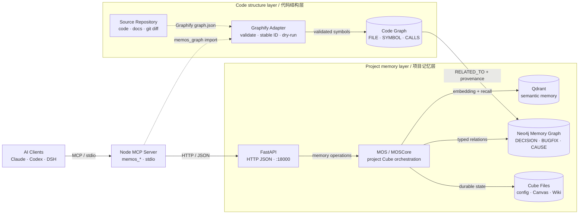
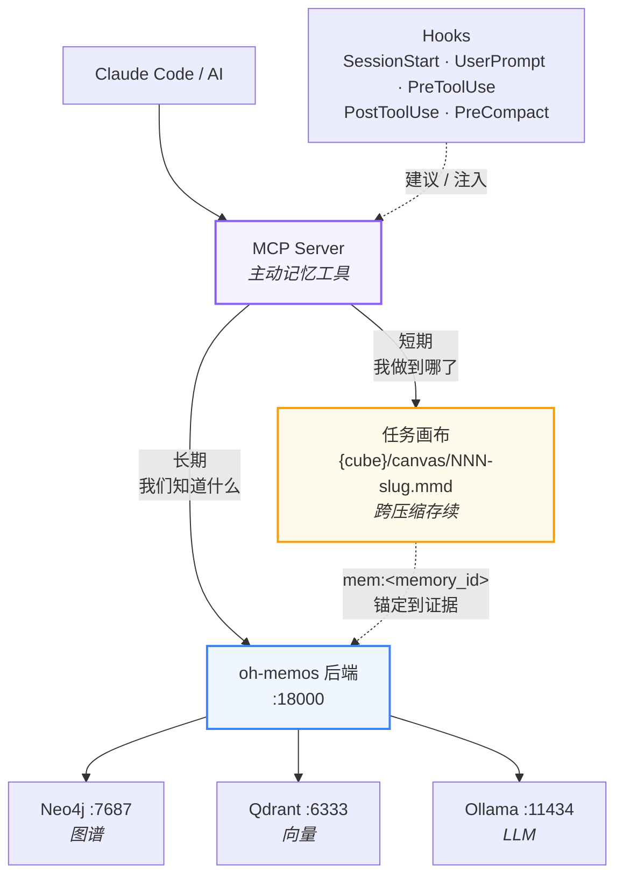

# MemOS Windows 便携版部署指南

基于 oh-memos 的 Windows 便携式部署方案，使用本地 Python 环境 + Ollama 嵌入 + Qdrant 云服务。

## 特点

- 便携式 Python 环境，无需系统安装
- 使用 Ollama 本地嵌入模型，降低 API 成本
- 支持 OpenAI 兼容 API
- 一键启动脚本

## 架构

<!-- architecture-aware-memory:start -->

<!-- architecture-aware-memory:end -->

Graphify 适配器当前只校验 node-link JSON 并生成确定性 dry-run 计划，
不会把代码符号写入 Neo4j、Qdrant 或 memory cube；项目记忆仍保持独立语义层。

[详细架构说明](ARCHITECTURE.md) ·
[交互式架构图](https://htmlpreview.github.io/?https://github.com/lsg1103275794/oh-memos/blob/main/docs/architecture/oh-memos.architecture.html)

记忆不是一件事。**持久事实**与**进行中的任务状态**生命周期不同、变更频率不同，因此存放位置也不同：

| | **长期记忆** | **短期画布** |
|---|---|---|
| 回答 | 「我们知道什么」 | 「我做到哪了」 |
| 生命周期 | 无限期 | 一个任务 |
| 变更频率 | 有新发现时 | 一小时数次 |
| 存储 | Neo4j + Qdrant | 每任务一个 Mermaid 文件 |
| 写入成本 | LLM 抽取 + embedding | 一次文件写 |
| 工具 | `memos_save` / `memos_search` / `memos_graph` | `memos_canvas` |

两者由 `ref` 相连：画布节点用 `mem:<memory_id>` 锚定到一条记忆，于是**抽象很便宜，回到证据的路仍然通畅**。画布永不做 embedding —— 为一次 `doing→done` 付一趟 embedding 往返不合理。



## 快速开始

### 💡 部署 Claude 技能 (Skills) - 推荐

为了让 Claude **完全感知**你的项目并开启**主动记忆追踪**，建议部署 `project-memory` 技能：

1. 在你的项目根目录下创建目录 `.claude/skills/project-memory/`。
2. 将本仓库的 `project-memory/SKILL.md` 复制到该目录下。

**部署优势：**
- **零配置隔离**：根据项目文件夹名称自动推导 `cube_id`，无需手动指定。
- **核心意识强化**：Claude 会意识到自己拥有“持久化记忆”，并主动记录里程碑、架构决策和 Bug 修复。
- **智能触发**：当你问“记得吗？”或“上次怎么做的？”时，Claude 会自动调用 `memos_search`。

### 一键启动

```cmd
双击 run.bat
```

### 首次安装

```cmd
双击 install_run.bat
```

### 服务地址

- API: http://localhost:18000
- 文档: http://localhost:18000/docs

## 环境配置

### 目录结构

```
MemOS/
├── run.bat                 # 启动脚本
├── install_run.bat         # 安装+启动
├── conda_venv/             # 便携式 Python (需自行准备)
│   ├── python.exe
│   └── Scripts/
├── .env                    # 配置文件
├── src/
│   └── memos/
└── data/
    └── memos_cubes/        # 记忆数据
```

### .env 配置示例

```env
# ========== LLM 配置 ==========
# OpenAI 兼容 API
OPENAI_API_KEY=sk-your-api-key
OPENAI_API_BASE=https://your-api-endpoint/v1
MOS_CHAT_MODEL=your-model-name
MOS_CHAT_MODEL_PROVIDER=openai

# ========== 嵌入模型 ==========
# 使用 Ollama 本地嵌入（推荐）
MOS_EMBEDDER_BACKEND=ollama
MOS_EMBEDDER_MODEL=nomic-embed-text-v2-moe:latest
OLLAMA_API_BASE=http://localhost:11434
EMBEDDING_DIMENSION=768

# ========== 向量数据库 ==========
# Qdrant 云服务
QDRANT_URL=https://your-cluster.cloud.qdrant.io
QDRANT_API_KEY=your-qdrant-api-key
QDRANT_COLLECTION_NAME=memories

# ========== 可选配置 ==========
# Redis 任务队列
MEMSCHEDULER_USE_REDIS_QUEUE=false

# Neo4j 图数据库
# NEO4J_URI=bolt://localhost:7687
# NEO4J_USER=neo4j
# NEO4J_PASSWORD=your-password

# 记忆读取器
MEM_READER_BACKEND=openai
```

## 启动脚本

### run.bat

```batch
@echo off
cd /d "%~dp0"

set PYTHON_EXE=%~dp0conda_venv\python.exe
set PATH=%~dp0conda_venv;%~dp0conda_venv\Scripts;%~dp0conda_venv\Library\bin;%PATH%

echo ========================================
echo    MemOS Windows Launcher
echo ========================================
echo.

echo [1/4] Checking Python...
if not exist "%PYTHON_EXE%" (
    echo [ERROR] Python not found: %PYTHON_EXE%
    pause
    exit /b 1
)
"%PYTHON_EXE%" --version

echo.
echo [2/4] Checking config...
if not exist .env (
    if exist .env.windows.example (
        copy .env.windows.example .env >nul
        echo [INFO] Created .env from template
    )
)

echo.
echo [3/4] Syncing config to src...
copy /y .env src\.env >nul

echo.
echo [4/4] Starting service...
echo ========================================
echo    Server: http://localhost:18000
echo    API Docs: http://localhost:18000/docs
echo    Press Ctrl+C to stop
echo ========================================
echo.

cd /d "%~dp0src"
"%PYTHON_EXE%" -m uvicorn oh_memos.api.start_api:app --host 0.0.0.0 --port 18000 --reload

pause
```

## 🔌 MCP Server (主动模式)

> 📖 **完整配置导航**: 针对 **Trae, Cursor, Windsurf, Claude Desktop, Roo Code** 等主流平台的详细配置，请直接查阅：
> 👉 **[MCP Server 详细配置指南](docs/MCP_GUIDE.md)**

本部分展示了适用于通用 IDE (如 Claude Desktop, Cursor, VS Code 等) 的标准 MCP 服务器配置。

MCP server 已发布到 npm（[`oh-memos-mcp`](https://www.npmjs.com/package/oh-memos-mcp)），**不需要 Python**，通过 `npx` 运行。

**通用 MCP 客户端配置示例** (如 `~/.claude/settings.json`):

```json
{
  "mcpServers": {
    "oh-memos": {
      "type": "stdio",
      "command": "npx",
      "args": ["-y", "oh-memos-mcp"],
      "env": {
        "MEMOS_URL": "http://localhost:18000",
        "MEMOS_USER": "dev_user",
        "MEMOS_DEFAULT_CUBE": "dev_cube",
        "MEMOS_CUBES_DIR": "C:/path/to/oh-memos/data/oh-memos_cubes"
      },
      "alwaysAllow": [
        "memos_context_resume", "memos_search", "memos_save",
        "memos_list_v2", "memos_get", "memos_suggest",
        "memos_think", "memos_graph", "memos_admin",
        "memos_export_wiki", "memos_canvas"
      ]
    }
  }
}
```

四个 `env` 变量全部必填，缺任一则启动即退出。Windows 路径请用正斜杠 `/`（JSON 里单个 `\` 是转义符）。

> 若客户端的工作目录与安装位置都在项目之外（`npx` 场景即是），`.env` 会加载不到任何变量——用 `MEMOS_ENV_FILE` 显式指定，详见 [MCP 配置指南](docs/MCP_GUIDE.md)。

> **📸 演示效果**: 本项目提供的截图 (如 Cherry Studio 系列) 展示了在 **Cherry Studio** 客户端中使用 **GLM-4.7** 模型调用 MemOS MCP 工具的实际演示效果。MemOS 具有极佳的跨客户端适配性，支持所有遵循 MCP 协议的 AI 助手。

### 💡 部署 Claude 技能 (Skills)

如果你在 Claude 环境中使用，可以将 `project-memory/SKILL.md` 复制到项目的 `.claude/skills/project-memory/SKILL.md`。

**优势**:
- **智能感知**: Claude 会自动识别 `project-memory` 技能。
- **核心意识**: 它会意识到自己拥有“持久化记忆”，并主动记录项目架构、决策和进度。
- **自动隔离**: 根据项目目录自动推导 `cube_id`，实现零配置的项目记忆隔离。

## API 使用

### 聊天

```bash
curl -X POST http://localhost:18000/chat \
  -H "Content-Type: application/json" \
  -d '{"user_id": "dev_user", "query": "你好"}'
```

### 添加记忆

```bash
curl -X POST http://localhost:18000/memories \
  -H "Content-Type: application/json" \
  -d '{
    "user_id": "dev_user",
    "mem_cube_id": "my_project",
    "memory_content": "项目关键信息"
  }'
```

### 搜索记忆

```bash
curl -X POST http://localhost:18000/search \
  -H "Content-Type: application/json" \
  -d '{
    "user_id": "dev_user",
    "query": "搜索关键词",
    "install_cube_ids": ["my_project"]
  }'
```

## 依赖服务

### Ollama（嵌入模型）

```bash
# 下载: https://ollama.ai
# 拉取模型
ollama pull nomic-embed-text-v2-moe:latest
```

### Qdrant（向量数据库）

推荐使用 [Qdrant Cloud](https://cloud.qdrant.io) 免费套餐。

本地部署：
```bash
docker run -p 6333:6333 qdrant/qdrant
```

### Neo4j（可选，图数据库）

下载 [Neo4j Community](https://neo4j.com/download/)：
```cmd
neo4j-community\bin\neo4j console
```

## 常见问题

| 问题 | 解决方案 |
|------|----------|
| Python 未找到 | 确保 `conda_venv/` 目录存在 |
| 端口被占用 | 修改 `run.bat` 中的端口号 |
| .env 不生效 | 脚本会自动复制到 `src/`，检查根目录 `.env` |
| 依赖安装失败 | 使用官方 PyPI: `-i https://pypi.org/simple` |

## 相关链接

- [MemOS 官方仓库](https://github.com/MemTensor/MemOS)
- [Qdrant 文档](https://qdrant.tech/documentation/)
- [Ollama](https://ollama.ai)

---

## 🔗 项目仓库

- **主仓库**: [https://github.com/lsg1103275794/oh-memos](https://github.com/lsg1103275794/oh-memos)
- **上游项目**: [MemTensor/MemOS](https://github.com/MemTensor/MemOS)

---

<div align="center">

**oh-memos** • 为 AI 打造的隐私优先持久记忆系统

Copyright © 2026 lsg1103275794. 采用 [MIT License](LICENSE) 开源协议。

</div>
