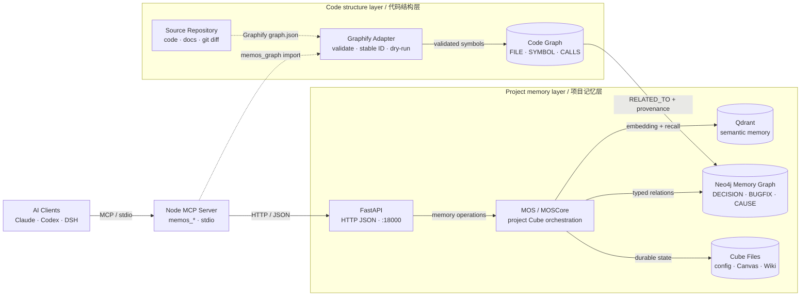
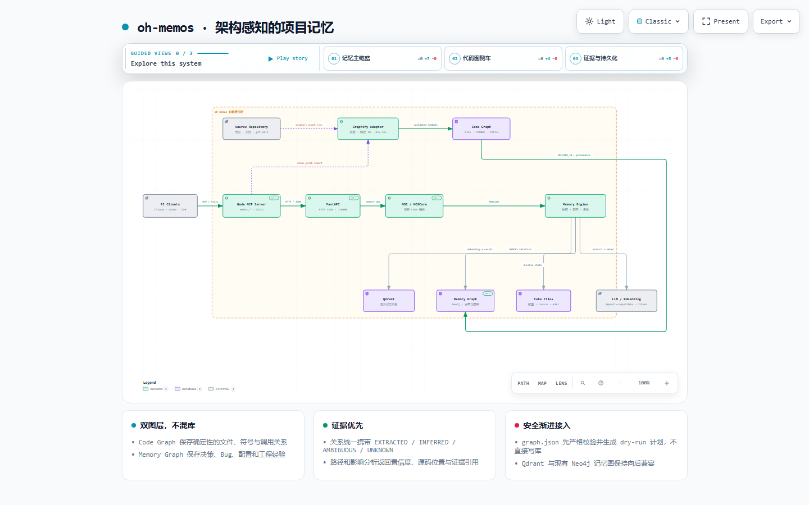

<div align="center">

# oh-memos

**面向 AI 编程助手的项目级持久记忆**

oh-memos 为兼容 MCP 的 AI 助手提供一个长期、可检索、按项目隔离的记忆层，
用于保存架构决策、Bug 修复、配置、证据和进行中的任务状态。它把语义搜索、
知识图谱和轻量任务画布组合在一起，让项目知识跨会话延续，又不会混入其他仓库。

[](https://github.com/lsg1103275794/oh-memos/actions/workflows/docker-publish.yml)
[](https://www.npmjs.com/package/oh-memos-mcp)
[](pyproject.toml)
[](mcp-server-node/package.json)
[](LICENSE)

[English](README.md) | 简体中文 ·
[架构说明](ARCHITECTURE.md) ·
[交互式架构图](https://lsg1103275794.github.io/oh-memos/architecture/) ·
[MCP 配置指南](docs/MCP_GUIDE.md)


</div>

> oh-memos 是记忆层，不是聊天应用。先启动后端，再把 `oh-memos-mcp`
> 接入 AI 客户端，客户端即可通过 MCP 工具检索和保存项目知识。

## 为什么需要 oh-memos

AI 助手在一次对话里可以很好地推理，但真实项目远比一个上下文窗口长。
新开会话或发生上下文压缩后，过去的决策需要重新解释，同一个问题会被重复排查，
尚未完成的任务也只能从文件里重新拼接。

| 常见问题 | oh-memos 的处理方式 |
|---|---|
| 新会话忘记以前的决策 | 保存带类型、可追溯证据的跨会话记忆 |
| 同一个 Bug 被反复诊断 | 语义检索历史修复和错误模式 |
| 平铺笔记看不出原因与影响 | 用 Neo4j 查询关系、路径和影响范围 |
| 不同仓库的记忆混在一起 | 通过 `project_path` 路由到独立 cube |
| 上下文压缩后不知道做到哪 | `memos_context_resume` 优先恢复短期任务画布 |
| 有价值的历史困在服务里 | 导出适合 Git 管理的 Markdown Wiki |

## 核心能力

| 能力 | 实际含义 |
|---|---|
| **带类型的长期记忆** | 显式保存 `DECISION`、`BUGFIX`、`ERROR_PATTERN`、`GOTCHA`、`CONFIG`、`FEATURE`、`MILESTONE` 等类型 |
| **混合检索** | Qdrant 负责语义召回，Neo4j 保留 `CAUSE`、`CONDITION`、`RELATE`、`CONFLICT` 等关系 |
| **项目隔离** | 项目路径会稳定映射到自己的 memory cube |
| **两种时间尺度** | 长期事实进入记忆库，频繁变化的任务状态写入小型 Mermaid 画布 |
| **原生 MCP 接入** | 当前维护的 TypeScript 服务通过 stdio 提供搜索、保存、图谱、管理、画布和导出工具 |
| **写入闭环** | 记忆写入返回新 ID，并接受来源、置信度、生命周期元数据；Wiki 回灌会保留这些字段 |
| **本地优先部署** | FastAPI、Qdrant、Neo4j 均可本地运行；模型既可使用 Ollama，也可使用 OpenAI 兼容 API |
| **本地 Lite provider** | `MEMOS_MODE=lite` 或 `MEMOS_PROVIDER=local` 使用每 cube JSONL；默认词法检索，可选接本地 Ollama embedding 做混合语义排序，不需要 Python API 或 Neo4j |
| **会衰减的排序** | 按类型分档的指数衰减（`PROGRESS` 14 天 … `DECISION` 1095 天），叠加访问强化 —— 反复打开的记忆留在前列，长期不用的自然下沉 |
| **近重复折叠** | 字符 n-gram 相似度 + 按类型分档的阈值，措辞略异的同义记忆不再挤占 `top_k`。对中文友好：不依赖分词 |
| **图扩散联想** | 可选的一跳图联想（`MEMOS_SPREAD_ACTIVATION=true`）：命中后沿 `CAUSE`/`CONDITION`/`RELATE` 边带回强关联记忆，标明经由哪条边，且恒排在直接命中之后 |
| **可读的结果** | 结果行附带真正起作用的信号 —— `access_count`、`stale`、被折叠的重复 id、以及联想来源 `via CAUSE from …` —— 让助手分得清证据与旁证 |

## 选择部署架构

oh-memos 有两种记忆部署架构。**Lite 轻部署**是独立运行的 Node.js 本地
provider，适合快速、离线和个人开发；**Full 重部署**通过 Node MCP 连接
FastAPI/MOS、Qdrant 和 Neo4j，提供语义检索、关系图谱和 LLM 抽取。原生
Windows 和 host-db Docker 都属于 Full 的运行变体，不是第三种架构。

| 选择 | 需要 | 提供 |
|---|---|---|
| **Lite 轻部署** | Node.js 20+ | 本地 JSONL 记忆、typed save/list/get/search、canvas、词法检索，可选本地 Ollama embedding |
| **Full 重部署** | Docker Compose，或 Python + Qdrant + Neo4j | API、语义/向量检索、关系图谱、LLM 抽取、Wiki 回灌、图谱和管理操作 |

最小 Lite 配置如下（放入 MCP 客户端的 `env`）：

```json
{
  "MEMOS_MODE": "lite",
  "MEMOS_PROVIDER": "local",
  "MEMOS_USER": "dev_user",
  "MEMOS_DEFAULT_CUBE": "dev_cube",
  "MEMOS_CUBES_DIR": "C:/work/oh-memos/data/oh-memos_cubes",
  "MEMOS_LITE_EMBED": "off"
}
```

Lite 不需要 `MEMOS_URL`、Python、FastAPI、Neo4j 或 Qdrant。删除
`MEMOS_LITE_EMBED=off` 后可以尝试使用本地 Ollama embedding。团队协作和
图谱感知检索请选择 Full。详见[部署架构对比](docs/DEPLOYMENT_MODES.md)。

## 快速开始

### 前置条件

- Docker Desktop，或 Docker Engine + Compose v2
- 运行 MCP 客户端的机器安装 Node.js 20 或更高版本
- 一个 OpenAI 兼容的聊天与 embedding 服务，或本地 Ollama

当前发布的 Docker 镜像目标平台是 `linux/amd64`。也可以使用同一份
Compose 配置直接从本仓库构建 API 镜像。

### 1. 启动后端

```bash
git clone https://github.com/lsg1103275794/oh-memos.git
cd oh-memos

# Linux / macOS
cp docker/.env.docker.example docker/.env.docker
mkdir -p data/oh-memos_cubes

# Windows PowerShell
Copy-Item docker/.env.docker.example docker/.env.docker
New-Item -ItemType Directory -Force data/oh-memos_cubes
```

启动前编辑 `docker/.env.docker`，至少完成以下配置：

- 为 `NEO4J_PASSWORD` 设置一个强密码；
- 将 `MEMOS_CUBES_HOST_DIR` 设置为宿主机上
  `data/oh-memos_cubes` 的绝对路径；
- 配置聊天模型及其凭据；
- 配置 embedding 后端及其凭据。

然后构建并启动：

```bash
docker compose --env-file docker/.env.docker -f docker/docker-compose.yml up -d --build
docker compose --env-file docker/.env.docker -f docker/docker-compose.yml ps
curl http://127.0.0.1:18000/health
```

API 文档位于
[`http://127.0.0.1:18000/docs`](http://127.0.0.1:18000/docs)。

### 2. 接入 MCP 客户端

把下面的服务器定义加入 MCP 客户端配置。不同客户端的配置文件位置不同；
Claude Code、Cursor、Windsurf、Trae 等平台的示例见
[MCP 配置指南](docs/MCP_GUIDE.md)。

```json
{
  "mcpServers": {
    "oh-memos": {
      "type": "stdio",
      "command": "npx",
      "args": ["-y", "oh-memos-mcp"],
      "env": {
        "MEMOS_URL": "http://127.0.0.1:18000",
        "MEMOS_USER": "dev_user",
        "MEMOS_DEFAULT_CUBE": "dev_cube",
        "MEMOS_CUBES_DIR": "/absolute/path/to/oh-memos/data/oh-memos_cubes"
      }
    }
  }
}
```

这四个环境变量都是必填项。`MEMOS_CUBES_DIR` 必须与 Docker 中
`MEMOS_CUBES_HOST_DIR` 指向同一个宿主机目录。Windows JSON 路径请使用
正斜杠，例如 `C:/work/oh-memos/data/oh-memos_cubes`。

### 3. 在项目中使用记忆

下面是 AI 客户端调用的工具示例，不是终端命令：

```text
memos_context_resume(project_path="/absolute/path/to/my-project")

memos_save(
  content="迁移任务使用 PostgreSQL advisory lock。",
  memory_type="DECISION",
  project_path="/absolute/path/to/my-project"
)

memos_search(
  query="DECISION 迁移锁",
  project_path="/absolute/path/to/my-project"
)
```

`project_path` 是项目隔离的关键：它保证记忆回到产生它的仓库，而不是落入
一个所有项目共用的默认空间。

原生 Windows、数据迁移和其他 Docker 运行模式请参考
[中文部署指南](docs/DEPLOY_CN.md)或
[英文部署指南](docs/DEPLOY_EN.md)。

## Web 记忆管理界面

项目内置一个轻量级 Web GUI，专为**多项目并行时人工浏览、预览和管理记忆**而设计。它绕开 API，直连 Neo4j 与 Qdrant，因此即使 API 容器停止也可使用。

```powershell
# 启动（需 .venv 环境）
memory-admin.bat
# 或
.venv\Scripts\python.exe tools\memory-admin\run.py
```

访问 `http://127.0.0.1:18010`。

### 功能

| 功能 | 说明 |
|---|---|
| cube 列表 | 所有 cube 的节点数（Neo4j）、向量点数（Qdrant）、目录是否存在，一行一览；孤儿 cube（数据只存在于部分数据源）会被标注 |
| 记忆浏览 | 按 cube 分页查看全部记忆，支持关键词过滤；显示 `memory_type`、创建/更新时间、`status` |
| 记忆详情 | 单条记忆的全部元数据、关联关系图（`CAUSE / RELATE / CONFLICT`）、是否含 embedding |
| 删除 | 删除单条记忆或整个 cube（需二次确认） |
| 导出 | 将 cube 全部记忆导出为 JSON |
| 备份 | 将 Neo4j 图谱快照到本地 |

### 适用场景

- 跨多个项目时，在 Web 端按 cube 快速定位哪些记忆残留了错误信息
- 手动清理 AI 存错的记忆，不需要通过 MCP 工具间接操作
- 迁移后核对各 cube 数据量是否一致（不等于就是孤儿数据）
- 导出某个项目的记忆做离线分析或备份

### 性能说明

如果 Neo4j/Qdrant 通过 `localhost` 而不是 `127.0.0.1` 连接，Windows 11 会将 `localhost` 优先解析为 `::1`（IPv6），而 Docker Desktop 只监听 IPv4，导致每次数据库请求耗费约 5 秒等待 IPv6 连接超时。已在 `tools/memory-admin/db_admin.py` 自动处理，无需手动修改任何配置。

## 工作原理

<!-- architecture-aware-memory:start -->

<!-- architecture-aware-memory:end -->

1. AI 客户端通过 stdio 调用 Node MCP 服务。
2. MCP 服务推导或注册当前项目的 cube，并请求 FastAPI。
3. MOS 提取结构化信息、生成 embedding，再写入向量库和记忆图。
4. Graphify node-link JSON 可通过 `memos_graph(mode="import")` 校验；
   该模式只生成 dry-run 计划，不写入 Neo4j、Qdrant 或 cube。
5. 代码符号与长期记忆保持分层，只通过带来源和置信度的 `RELATED_TO`
   关系连接。

模块边界、写入/检索时序、部署拓扑和“修改某能力该看哪里”详见
[ARCHITECTURE.md](ARCHITECTURE.md)。也可以打开支持缩放、主题、链路追踪和导出的
[交互式架构图](https://lsg1103275794.github.io/oh-memos/architecture/)。

<a href="https://lsg1103275794.github.io/oh-memos/architecture/">
  
</a>

<p align="center"><sub>架构图静态预览，点击可打开交互式版本。</sub></p>

### 两种记忆时间尺度

| | 长期记忆 | 短期画布 |
|---|---|---|
| 回答的问题 | “我们知道什么？” | “我做到哪了？” |
| 生命周期 | 跨会话 | 一个任务 |
| 变更时机 | 事实或决策变化时 | 活跃工作中频繁变化 |
| 存储 | Qdrant + Neo4j + cube 配置 | 每任务一个 Mermaid 文件 |
| 工具 | `memos_save`、`memos_search`、`memos_graph` | `memos_canvas` |

画布节点可引用 `mem:<memory_id>`、`file:<path>` 或 `note:<text>`。
这样既能低成本更新任务状态，也保留了返回底层证据的路径。

## MCP 工具

| 分组 | 工具 | 用途 |
|---|---|---|
| 上下文与检索 | `memos_context_resume`、`memos_search`、`memos_list_v2`、`memos_get`、`memos_think`、`memos_suggest` | 恢复上下文、检索压缩结果/列表、检查证据和发现信息缺口 |
| 写入与生命周期 | `memos_save`、`memos_delete` | 保存带类型记忆；删除能力默认关闭 |
| 知识图谱 | `memos_graph` | 相关节点、带证据路径、影响/schema 查询，以及 Graphify JSON dry-run 校验 |
| 管理 | `memos_admin`、`memos_list_v2` | cube/user 维护、校验、统计、日历和列表 |
| 短期任务 | `memos_canvas` | 打开、更新、查看和列出任务画布 |
| 导出与回灌 | `memos_export_wiki`、`memos_import_wiki` | 把 cube 导出为互相链接的 Markdown 页面和 Mermaid 图；编辑后可回灌（新页创建、未改动跳过、编辑页可另存为版本） |
| Skill 候选 | `memos_distill_skill`、`memos_list_skill_candidates` | 生成带记忆证据、等待人工 review 的候选，不自动安装 |

`mcp-server-node/` 是当前维护的 MCP 实现。`mcp-server/` 中的 Python
实现已经停用，只保留作迁移参考。

## 部署与安全边界

| 服务 | 默认宿主机地址 | 作用 |
|---|---|---|
| oh-memos API | `127.0.0.1:18000` | 记忆、搜索、图谱、用户、cube、归档和聊天接口 |
| Neo4j | `127.0.0.1:7474` / `:7687` | Browser/API 与 Bolt 图访问 |
| Qdrant | `127.0.0.1:16333` / `:6334` | 宿主机 HTTP 与 gRPC；容器内 HTTP 仍为 `6333` |
| Memory Admin GUI | `127.0.0.1:18010` | Web 记忆管理界面，按需手动启动 |
| Ollama | `127.0.0.1:11434` | 可选的本地模型 profile |

必须注意：

- Compose 默认只把端口绑定到 `127.0.0.1`。
- API 当前没有统一认证层。不要直接绑定到 `0.0.0.0` 或暴露公网；
  远程访问必须放在带认证的 TLS 反向代理之后。
- 宿主机 MCP 服务与 API 容器必须共享同一个 cube 目录。
- Compose 中的 API 使用非 root 用户、只读根文件系统、移除 Linux
  capabilities，并启用 `no-new-privileges`。
- 完全本地运行要求聊天和 embedding 都使用本地后端；配置云服务后，
  提取内容与查询可能离开本机。

## 仓库结构

| 路径 | 职责 |
|---|---|
| `mcp-server-node/` | 当前维护的 TypeScript MCP 服务及测试 |
| `src/oh_memos/api/start_api.py` | FastAPI/Uvicorn 应用入口 |
| `src/oh_memos/mem_os/` | 多用户、多 cube 编排 |
| `src/oh_memos/memories/` | 记忆提取、组织、检索和重排 |
| `src/oh_memos/vec_dbs/` | 向量数据库适配器 |
| `src/oh_memos/graph_dbs/` | 图数据库适配器 |
| `project-memory/` | Agent Skill 与主动记忆 Hooks |
| `tools/memory-admin/` | Web 记忆管理界面（直连数据库，API 停止也可用） |
| `docker/` | 加固后的 Compose 部署及迁移模式 |
| `scripts/migrate/` | Windows 到 Docker 的分阶段数据迁移工具 |
| `docs/` | 部署、API、设计、研究、截图和更新日志 |

## 文档导航

| 文档 | 用途 |
|---|---|
| [架构说明](ARCHITECTURE.md) | 运行边界、数据流、模块与修改导航 |
| [交互式架构图](https://lsg1103275794.github.io/oh-memos/architecture/) · [源 JSON](docs/architecture/oh-memos.architecture.json) | 浏览并导出完整系统图 |
| [MCP 配置指南](docs/MCP_GUIDE.md) | Lite 与 Full 的客户端 stdio 配置 |
| [部署架构对比](docs/DEPLOYMENT_MODES.md) | 选择 Lite/Full、查看能力边界和迁移说明 |
| [部署（中文）](docs/DEPLOY_CN.md) · [Deployment (EN)](docs/DEPLOY_EN.md) | Full 部署、运维和其他运行模式 |
| [API 参考](docs/product-api-tests.md) | HTTP 接口示例 |
| [Memory Wiki 示例](docs/memory-wiki/index.md) | 适合 Git 管理的项目知识导出 |
| [运行截图](docs/ScreenShot/README.md) | 真实客户端与知识图谱效果 |
| [更新日志](docs/CHANGELOG.md) | 完整版本历史 |

## 开发

```bash
# Python API 与核心
poetry install --with dev,test --extras tree-mem
poetry run pytest
poetry run ruff check src tests

# Node MCP 服务
cd mcp-server-node
npm ci
npm run build
npm test

# 编辑 docs/CHANGELOG.md 后重新生成 README 的「近期变化」块
cd .. && node scripts/generate-readme-changelog.mjs --write
```

Docker 发布工作流还会导入 API、检查依赖、确认 CPU-only Torch 构建，并验证
镜像以非 root 用户运行。

## 近期变化

[更新日志](docs/CHANGELOG.md)中最近的六条条目，由
`scripts/generate-readme-changelog.mjs` 生成，请勿手工编辑。英文标题取自
更新日志每条标题下的 `<!-- en: ... -->` 注释。

<!-- changelog-recent:start -->
- `3.1.0 · 2026-08-22` — 🧠 检索排序：衰减、强化、分档去重与图扩散联想
- `3.1.0 · 2026-08-22` — 🔁 新增 `memos_import_wiki`：Markdown Wiki 往返回灌
- `3.1.0 · 2026-08-22` — 🧭 架构感知图谱与 Graphify 适配层
- `3.1.0 · 2026-08-22` — 🧠 自动捕获、检索质量层、Lite 策略与 Skill 候选
- `3.1.0 · 2026-08-22` — 🧾 写入 ID 与元数据闭环
- `3.1.0 · 2026-08-22` — 🛡️ 一致性与部署硬化
<!-- changelog-recent:end -->

完整历史见[更新日志](docs/CHANGELOG.md)，计划中的能力见
[路线图](docs/future/ROADMAP.md)。

## 参与贡献

欢迎提交 Issue 和 Pull Request。请保持改动范围清晰，在受影响的 Python 或
Node 包附近补充测试；工具 schema 或公开 API 发生变化时，同步更新相关文档。

## 上游与许可证

oh-memos 基于 [MemTensor/MemOS](https://github.com/MemTensor/MemOS)，
并围绕项目级 MCP 工作流、检索、部署和 Agent 集成进行了扩展。

本仓库采用 [Apache License 2.0](LICENSE)。

<div align="center">

**让每个项目都拥有一份比对话更长久的记忆。**

[提交问题](https://github.com/lsg1103275794/oh-memos/issues) ·
[npm 包](https://www.npmjs.com/package/oh-memos-mcp)

</div>
