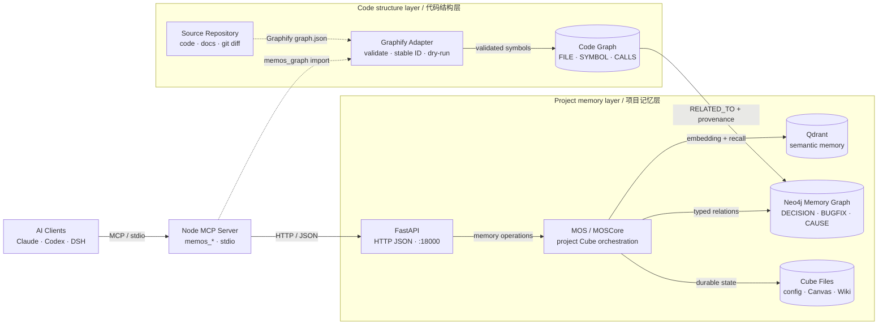

# Changelog

All notable changes to the MemOS project will be documented in this file.

The format is based on [Keep a Changelog](https://keepachangelog.com/en/1.1.0/),
and this project adheres to [Semantic Versioning](https://semver.org/spec/v2.0.0.html).

## [3.1.7] - 2026-08-27

仅 MCP server（npm `oh-memos-mcp`）。Python 包与容器镜像无改动，仍为 3.1.5。
<!-- en: MCP server only (npm `oh-memos-mcp`). Python package and container image unchanged at 3.1.5. -->

### 🏷️ 修复：`open` 报出的画布名，`list` 找不到
<!-- en: 🏷️ Fix: the canvas name open reported was not the one list would show -->

goal 足够长时，`actionOpen` 报出的名字比磁盘上真实存在的多一个字符：`open` 报
61 字符，`list` 显示 60 字符，磁盘上是后者。`actionOpen` 先 `slugify(goal)` 拿到最多
`SLUG_MAX`（60）字符，再拼 `${prefix}-`，总长可达 64；`saveCanvas` → `canvasPath`
在落盘路上又 slugify 一次，砍回 60。**前缀那 4 个字符的预算从来没被算进去。**
<!-- en: With a long enough goal, the name actionOpen reported was one character longer than
     the file that actually existed: open said 61 characters, list showed 60, and the 60 was
     what sat on disk. actionOpen slugified the goal to at most SLUG_MAX (60) and then
     prepended `${prefix}-`, reaching 64; saveCanvas → canvasPath slugified again on the way
     to disk and cut it back to 60. The prefix's four characters were never part of the
     budget. -->

`canvasPath` 里那处「slug 与原名不同就拒绝」的检查本该拦住它，但它只在名字「像路径」
（含 `/`、`\` 或 `..`）时抛错 —— 截断不像路径，于是静默放过。
<!-- en: The check in canvasPath that refuses a name whose slug differs from the original
     should have caught this, but it only throws when the name looks like a path (containing
     `/`, `\` or `..`). A truncation does not look like a path, so it passed silently. -->

影响是**报错的句柄，不是损坏的数据**：前缀仍让每个画布互不相同，两个前 60 字符相同的
长 goal 得到 `000-`/`001-` 两个独立文件，各自节点都在；`update`/`delete` 传 `open`
报的长名字也照样能用，因为 `canvasPath` 的截断是幂等的。坏的只有一件事：调用方拿到的
名字，`list` 永远不会显示，磁盘上也不存在。
<!-- en: The damage was a wrong handle, not corrupted data: the numeric prefix still kept every
     canvas distinct, so two long goals sharing their first 60 characters became separate
     000-/001- files with their own nodes intact, and update/delete still worked when handed
     the long name open had reported, because canvasPath truncates idempotently. Exactly one
     thing was broken: the name the caller was given is a name list will never show and the
     filesystem never had. -->

修法是把名字组装收进 `canvas-format.ts` 的新函数 `canvasName(prefix, goal)` —— 让它紧挨着
自己必须遵守的那个上限，而不是让 handler 去做预算算术。`slugify` 因此多一个可选的
`maxLength`，**向内钳制到 `SLUG_MAX`**：调用方能收紧上限，不能放宽它，否则「每个画布
文件名都装得进 `SLUG_MAX`」这个不变量就成了各调用点的自选项。截断后仍走一次尾部连字符
清理，所以 `000-abc-.mmd` 这种名字不会出现。
<!-- en: The fix moves name composition into a new canvasName(prefix, goal) in
     canvas-format.ts, next to the cap it has to respect, rather than leaving the budget
     arithmetic in the handler. slugify gains an optional maxLength that is clamped inward to
     SLUG_MAX: a caller may narrow the cap but never widen it, or the invariant that every
     canvas filename fits in SLUG_MAX would become each call site's option. The trailing-hyphen
     trim still runs after truncation, so a name like 000-abc-.mmd cannot occur. -->

canvas-format 单测 41 → 50，canvas e2e 34 → 40 项。核心断言是**不动点**而不是长度：
`slugify(canvasName(p, g)) === canvasName(p, g)`，跨 3 个前缀 × 6 种 goal（超长、纯 CJK、
尾部连字符诱饵、前 60 字符相同的两个变体）。长度只是症状 —— `canvasPath` 会再 slugify
一次，任何不是不动点的名字都是「告诉了调用方、但文件系统从没见过」的名字。
<!-- en: Canvas-format unit tests went 41 → 50 and canvas e2e 34 → 40. The central assertion is
     a fixed point rather than a length: slugify(canvasName(p, g)) === canvasName(p, g), across
     3 prefixes × 6 goals (over-long, purely CJK, trailing-hyphen bait, and two variants sharing
     their first 60 characters). Length is only the symptom — canvasPath slugifies again, so any
     name that is not a fixed point is a name the caller was told but the filesystem never saw. -->

e2e 补的 5 项跨 open/list/show/delete 与磁盘。反向验证还原实现后 3 项变红（长度 64、
磁盘上无此名、`list` 显示另一个名字）。另两项在修复前后都通过 —— `canvasPath` 截断幂等
使然 —— **保留但改名如实**：它们守的是「如果有人改用『让 `canvasPath` 对有损名字抛错』
来修这个缺陷，这条回归会被抓到」，不是这次的不变量。门禁：vitest 520 passed、tsc、
canvas e2e 40 项、pack 契约 104 文件、schema budget +0.8%、semantic 快照 17 工具、
protocol legacy + v2、lite smoke、host-env smoke、spread smoke。
<!-- en: The five new e2e checks span open/list/show/delete and the disk. Reverting the
     implementation turns three of them red (length 64, no such name on disk, list showing a
     different name). Two pass either way — canvasPath truncates idempotently — and are kept but
     renamed honestly: they guard against someone "fixing" this defect by making canvasPath throw
     on a lossy name, not this release's invariant. Gates: vitest 520 passed, tsc, canvas e2e 40
     checks, pack contract 104 files, schema budget +0.8%, semantic snapshot 17 tools, protocol
     legacy + v2, lite smoke, host-env smoke, spread smoke. -->

---

## [3.1.6] - 2026-08-26

仅 MCP server（npm `oh-memos-mcp`）。Python 包与容器镜像无改动，仍为 3.1.5。
<!-- en: MCP server only (npm `oh-memos-mcp`). Python package and container image unchanged at 3.1.5. -->

### 🔤 修复：`memos_canvas` 的 ref 里引号读不回来
<!-- en: 🔤 Fix: quotes in a memos_canvas ref did not survive the round trip -->

`ref` 走 JSON 转义而非标签转义，因为 Windows 路径的反斜杠必须逐字返回，否则锚点失效。
但 `renderRef` 在 `JSON.stringify` 之后又替换了一次裸引号：`JSON.stringify` 已经把 `"`
写成 `\"`，那个 `replace(/"/g, ...)` 只匹配裸引号，**JSON 留下的反斜杠还在前面**，
于是落盘成 `\\u0022`；`parseRef` 走 `JSON.parse`，`\\` 解成一个字面反斜杠，
取回的是 `"` 这串字符而不是引号。少匹配了一个反斜杠。
<!-- en: A ref is JSON-escaped rather than label-escaped, because a Windows path's backslashes
     must come back byte-identical or the anchor stops resolving. But renderRef replaced bare
     quotes *after* JSON.stringify had already written `"` as `\"`: the replace matched only the
     bare quote and left JSON's backslash in front of it, writing `\\u0022` to disk. parseRef
     runs JSON.parse, where `\\` decodes to one literal backslash — so it read back the
     characters `"` instead of a quote. One backslash short in the pattern. -->

现在匹配 `\"` 整体。引号仍须离开标签 —— `"` 会提前终止它所在的 Mermaid `["..."]` ——
但这次是**替换**已转义的序列，不是在它上面再叠一层。反斜杠一侧一直是对的：
`\\` 就是 JSON 在磁盘上的正确表示，`parseRef` 会解回单反斜杠。只有引号这一条路径坏了。
<!-- en: The pattern now matches the whole `\"`. The quote still has to leave the label — `"`
     would terminate the Mermaid ["..."] it sits in — but this is now a substitution inside the
     already-escaped string rather than another layer on top of it. The backslash side was always
     correct: `\\` is JSON's proper on-disk form, and parseRef decodes it back to one backslash.
     Only the quote path was broken. -->

### 🗑️ `memos_canvas` 新增 `delete` 动作
<!-- en: 🗑️ memos_canvas gains a delete action -->

此前只有 open/update/show/list，清理必须手动删 `.mmd`。而画布的定位是**短期**状态，
注定会产生废弃文件 —— 加之全局规则禁止手工改动记忆文件，等于没有合法的清理路径。
<!-- en: Until now the actions were open/update/show/list, so cleanup meant deleting the .mmd by
     hand. But a canvas is by definition short-term state and will accumulate dead files — and
     with a global rule against hand-editing memory files, there was no legitimate cleanup path. -->

`action="delete"` 在有未完成节点（doing/todo/blocked）时**拒绝**并给出 `confirm=true`
的逃生口，全 done 或空画布直接删。**没有套用 `MEMOS_ENABLE_DELETE`**：那道门是保护
长期记忆的（走 API、有 embedding 成本、Lite 模式下整个禁用），而画布是本地文件、不走 API，
且 Lite 模式下它恰恰是少数可用功能之一 —— 套上那道门等于在最需要清理的模式里砍掉清理能力。
`confirm` 这种「拒绝并给出下一步」与 `MAX_NODES`、非法 status 是同一个既有模式。
<!-- en: action="delete" refuses when unfinished nodes remain (doing/todo/blocked) and names
     confirm=true as the escape hatch; an all-done or empty canvas deletes outright. It
     deliberately does not reuse MEMOS_ENABLE_DELETE: that gate protects long-term memories,
     which go through the API, cost an embedding, and are disabled entirely in Lite mode. A
     canvas is a local file that touches no API, and in Lite mode it is one of the few features
     that still works — putting it behind that gate would remove cleanup from precisely the mode
     that needs it most. The refuse-and-name-the-next-step shape matches the existing MAX_NODES
     and invalid-status handling. -->

删除是硬删，不做回收站：画布存在的意义就是任务收尾后被丢弃，回收站只会攒下它本该清掉的文件。
`deleteCanvas` 复用 `canvasPath`，遍历防护自动继承。
<!-- en: The delete is hard, with no trash directory: a canvas exists to be discarded once its
     task closes, and a trash dir would just accumulate the files this is meant to remove.
     deleteCanvas reuses canvasPath, so traversal protection is inherited. -->

### 🔢 修复：`delete` 破坏了「画布前缀永不复用」
<!-- en: 🔢 Fix: delete broke the never-reissue-a-canvas-prefix invariant -->

加上 delete 之后有两个 e2e 断言失败。**不是断言写错** —— `nextPrefix` 用现存文件算
`max+1`，在只增不减的世界里「前缀永不复用」自动成立，delete 打破了这个不变量：
删掉最高前缀的画布后，那个前缀会被重新发放。后果正是 `nextPrefix` 自己注释里警告过的：
前缀嵌在它铸出的每个节点 id 里，commit message 或记忆正文引用的 `001-N3`
会变得指向两个不同画布的节点。
<!-- en: Adding delete made two e2e assertions fail — and the assertions were not the thing that
     was wrong. nextPrefix derives max+1 from the files that exist, so "a prefix is never
     reissued" held automatically in an append-only world; delete broke that invariant, because
     removing the highest-prefixed canvas makes its prefix available again. The consequence is
     the one nextPrefix's own comment warns about: a prefix is embedded in every node id it
     minted, so a `001-N3` cited from a commit message or a memory body would come to point at
     nodes in two different canvases. -->

修法是 `{cube}/canvas/.prefix-hwm` 水位线文件，`saveCanvas` 与 `deleteCanvas` 都抬升它，
只增不减。delete 侧必须抬升：文件是该前缀唯一的记录，删掉后若水位线仍低于它，就会被重新发放。
旧 cube 没有这个文件时（`readPrefixHwm` 返回 -1）从现存文件恢复下限，
所以升级不会因为水位线缺失而复用前缀。水位线损坏或不可读时退回扫描文件，与 `parseCanvas` 一致 ——
画布是恢复态，读取时机正是刚丢失上下文的那一刻，抛异常是最坏的选择。
<!-- en: The fix is a {cube}/canvas/.prefix-hwm watermark file that both saveCanvas and
     deleteCanvas advance, monotonically. The delete side must advance it: the file was the only
     record of that prefix, so a watermark left below it would hand the prefix out again. A cube
     predating the watermark has no such file (readPrefixHwm returns -1) and recovers its floor
     by scanning the files that remain, so upgrading cannot reissue a prefix for want of a
     watermark. A corrupt or unreadable watermark falls back to scanning, matching parseCanvas: a
     canvas is recovered state, read at the moment context was just lost, which is the worst
     possible moment to throw. -->

canvas 单测 41 → 45（format）、28 → 44（store），canvas e2e 18 → 34 项。两个修复都做了
反向验证，还原实现后对应用例确实变红：转义 3 项、水位线 1 项。e2e 补了「旧 cube（无水位线）
删除后不复用前缀」这条真实升级路径 —— 它跨 store 与 handler，单测碰不到。顺带改掉一个
自己写坏的用例：名字叫 "does not free the prefix it used"，断言却在验证前缀被释放了。
<!-- en: Canvas unit tests went 41 → 45 (format) and 28 → 44 (store); canvas e2e 18 → 34 checks.
     Both fixes were verified in reverse — reverting each implementation does turn the matching
     cases red: three for the escaping, one for the watermark. The e2e adds the real upgrade
     path, "a legacy cube with no watermark does not reissue a prefix after a delete", which
     spans store and handler and no unit test can reach. It also fixes a test I had written
     badly: named "does not free the prefix it used" while asserting that the prefix *was*
     freed. -->

`memos_canvas` 的 schema 改了（action enum 加 `delete`，新增 `confirm`），两处冻结的哈希
同步重算：`schema-semantic-baseline.json` 与 `protocol-contract.test.ts` 的
`EXPECTED_SCHEMA_HASHES`。门禁：vitest 511 passed、tsc、canvas e2e 34 项、pack 契约 104 文件、
schema budget +0.8%（限 5%）、semantic 快照 17 工具、protocol v2、lite smoke。
<!-- en: The memos_canvas schema changed (delete added to the action enum, plus a new confirm),
     so both frozen hashes were recomputed: schema-semantic-baseline.json and
     EXPECTED_SCHEMA_HASHES in protocol-contract.test.ts. Gates: vitest 511 passed, tsc, canvas
     e2e 34 checks, pack contract 104 files, schema budget +0.8% (5% allowed), semantic snapshot
     17 tools, protocol v2, lite smoke. -->

---

## [3.1.5] - 2026-08-26

3.1.1～3.1.4 都是「仅 MCP server」的版本，Python 包与容器镜像一直停在 3.1.0。
**本版两侧同时有改动**：Python 侧 7 个文件（重排换型 4 个 + 可观测性 3 个），
MCP 侧 4 个文件加 1 个新守卫模块。三个版本串（`pyproject.toml`、
`src/oh_memos/__init__.py`、`mcp-server-node/package.json`）因此重新对齐到 3.1.5 ——
`docker-publish.yml` 的 `version-check` 要求 tag 与前两者逐字一致，
而它只在 commit 触及 `src/**` / `docker/**` / `pyproject.toml` 时才会被触发，
所以这是第一个会真正过这道检查的 tag。
<!-- en: 3.1.1 through 3.1.4 were MCP-server-only releases, with the Python package and
     container image pinned at 3.1.0. This version changes both sides: seven files on the
     Python side (four for the reranker switch, three for observability) plus four files and
     one new guard module on the MCP side. All three version strings (pyproject.toml,
     src/oh_memos/__init__.py, mcp-server-node/package.json) are therefore realigned to
     3.1.5 — docker-publish.yml's version-check requires the tag to match the first two
     verbatim, and it only fires when a commit touches src/**, docker/** or pyproject.toml,
     so this is the first tag that will actually go through that check. -->

### 🔧 重排模型换成 `BAAI/bge-reranker-v2-m3`（修复检索只返回 WorkingMemory）
<!-- en: 🔧 Reranker model switched to BAAI/bge-reranker-v2-m3 (fixes search returning only WorkingMemory) -->

`POST /search` 对 5 个 cube 恒定返回同一批 `WorkingMemory`、`relativity` 全为 `0.0`。
根因是供应商停用了 `netease-youdao/bce-reranker-base_v1`（HTTP 403 `{"code":30003,"message":"Model disabled."}`），
而 `HTTPBGEReranker.rerank` 的 `@timed_with_status(fallback=...)` 把异常吞成全 `0.0` 分数，
且**控制台一个字都不出**（fallback 分支本身无日志；装饰器 `finally` 里那条带 `status: FAILED` 的
`logger.info` 只落日志文件——控制台 handler 等级是 WARNING，详见下一条）。
分数全部相等后 `_sort_and_trim` 的稳定排序退化为保留插入顺序，`_retrieve_paths` 又是 Path A（WorkingMemory）
先 append，于是短期副本按位置而非相关度占满全部 `top_k`。
<!-- en: POST /search returned an identical batch of WorkingMemory items with relativity 0.0 for five
     cubes. Root cause: the vendor disabled netease-youdao/bce-reranker-base_v1 (HTTP 403, code 30003
     "Model disabled."), and the @timed_with_status(fallback=...) decorator on HTTPBGEReranker.rerank
     swallowed the exception into all-0.0 scores, printing nothing to the console: the fallback branch
     itself logged nothing, and the status: FAILED logger.info in the decorator's finally block only
     reached the file handler, since the console handler sits at WARNING (see the next entry).
     With every score tied,
     the stable sort in _sort_and_trim degenerated into insertion order, and _retrieve_paths appends
     Path A (WorkingMemory) first — so short-term copies filled every top_k slot by position, not
     relevance. -->

改动全部指向 `BAAI/bge-reranker-v2-m3`（568M，8K 上下文）：

- **cube 配置**（5 个）：`.text_mem.config.reranker.config.model` — `claude_cube` / `ddsp_svc_6_3_cube` /
  `memos_cube` / `new_api_cube` / `oh_memos_cube`。其余 36 个 cube 用本地 `rrf` 后端，从未受影响。
- **env 文件**（8 个）：`MOS_RERANKER_MODEL`。其中两个模板此前写的是缺 `BAAI/` 前缀的
  `bge-reranker-v2-m3`（siliconflow 上无效），一并补全。
- **代码兜底默认值**（3 处）：`configs/env_loader.py:249`、`:402`、`oh-memos-cli/oh_memosctl/init_wizard.py:114`
  硬编码的仍是被停用的模型 —— 没有显式设 `MOS_RERANKER_MODEL` 的新部署会原地复现这个 bug。
- **裸名兜底**（7 处）：`api/config.py:385`、`:411`、`reranker/factory.py:43`、`:69`、
  `reranker/http_bge.py:81`、`reranker/http_bge_strategy.py:81`、`examples/basic_modules/reranker.py:156`
  写的是不带 `BAAI/` 前缀的裸名，只在自建 vLLM 且显式 `--served-model-name` 改名时才成立，
  换成全限定名后 siliconflow 和自建两边都对。
- **用户文档**（3 处）：`docs/Free API/Free api.md`、`docs/DB/EMBEDDER_CONFIG_CN.md`、
  `docs/DB/CUBE_CONFIG_CN.md` —— 这些是会被照抄的配置样例。停用的模型在模型表里标注保留作为警示。

<!-- en: Everything now points at BAAI/bge-reranker-v2-m3 (568M params, 8K context):
     - Cube configs (5): .text_mem.config.reranker.config.model in claude_cube, ddsp_svc_6_3_cube,
       memos_cube, new_api_cube, oh_memos_cube. The other 36 cubes use the local rrf backend and were
       never affected.
     - Env files (8): MOS_RERANKER_MODEL. Two templates carried bge-reranker-v2-m3 without the BAAI/
       prefix (invalid on siliconflow) and were corrected.
     - Hardcoded code defaults (3): configs/env_loader.py:249, :402 and
       oh-memos-cli/oh_memosctl/init_wizard.py:114 still named the disabled model — any fresh
       deployment without an explicit MOS_RERANKER_MODEL would have reproduced the bug.
     - Bare-name fallbacks (7): api/config.py:385, :411, reranker/factory.py:43, :69,
       reranker/http_bge.py:81, reranker/http_bge_strategy.py:81,
       examples/basic_modules/reranker.py:156 used the unprefixed name, which only resolves on a
       self-hosted vLLM with an explicit --served-model-name. The fully qualified name works both on
       siliconflow and self-hosted.
     - User docs (3): docs/Free API/Free api.md, docs/DB/EMBEDDER_CONFIG_CN.md,
       docs/DB/CUBE_CONFIG_CN.md — these are copy-pasted config samples. The disabled model stays in
       the model table, annotated as a warning. -->

**验证方式**：两个语义无关的查询打同一个 cube。修复前逐字节返回相同的 id 序列；修复后 id 序列不同，
`relativity` 是 0.91 → 0.05 的单调递减真实分数，命中也从清一色 WorkingMemory 变为
LongTermMemory / UserMemory。容器环境变量在启动时固定，改 env 文件后必须 `up -d --force-recreate`，
`docker restart` 不重读 env。
<!-- en: How it was verified: two semantically unrelated queries against the same cube. Before the fix
     they returned byte-identical id sequences; after it the sequences differ, relativity carries real
     monotonically decreasing scores (0.91 down to 0.05), and hits shifted from all-WorkingMemory to
     LongTermMemory/UserMemory. Container env vars are fixed at start, so editing the env file requires
     up -d --force-recreate; docker restart does not re-read it. -->

### 🔊 静默 fail-open 退化改为可观测（上一条的上游根因）
<!-- en: 🔊 Silent fail-open degradation is now observable (upstream root cause of the entry above) -->

换模型只是止血：把异常转成全 `0.0` 的那条通路本身没变，下一个模型下线时会以完全相同的方式
无声退化。这次补上三处告警，退化行为一律保持原样（仍返回 fallback、不改变任何返回值），
只是不再无声。

- **`src/oh_memos/utils.py:54`** — `timed_with_status` 的 fallback 分支在调用 `fallback(...)` 前
  打 `logger.warning`，带函数名、异常类型与 `repr`，并点明「返回的是降级结果，下游排序/打分可能无效」。
- **`src/oh_memos/reranker/http_bge.py:243`** — 响应 schema 不符的 `else` 分支。这条路 HTTP 调用是
  **成功**的、不抛异常，因此装饰器的 fallback 永远不会触发，必须自己上报；日志带 `data` 的顶层键名
  （非 dict 时带类型名），便于直接判断对方返回了什么。
- **`.../retrieve/searcher.py:779`** — `_sort_and_trim` 在排序前检测「候选数 >1 且分数全为 `0.0`」，
  这是降级通路的正向指纹：RRF 下界是 `1/(60+rank)`，0 不可达。命中即告警"结果是检索顺序、不是相关度顺序"。

**为什么原先看不到**：`fallback` 分支本身确实一行日志都没有，但装饰器 `finally` 里那条
`logger.info` 是带 `status: FAILED` + `error_type` 的 —— 问题在等级。`log.py:29`
`selected_log_level = DEBUG if settings.DEBUG else WARNING` 决定控制台 handler 等级，
而 `MEMOS_DEBUG` 在 `.env` / `.env.example` / `docker/.env.migration` / `docker/.env.docker.example`
四处一致为 `false`，于是那条 INFO 只落日志文件，控制台一个字都不出。现在三条都是 WARNING，两边都到。

**影响面**：`src/` 里传 `fallback=` 的只有 `http_bge.py:126` 一处；另外三个
`timed_with_status` 调用点（`embedders/universal_api.py:33`、`llms/openai.py:55`、`:100`）
不传 fallback，异常照常 `raise`，走的是 `else` 分支，不受影响。

**验证**：装饰器路径实测触发 —— 修复前控制台 0 行、修复后 1 行 WARNING 且带异常类型，
fallback 返回值与异常不外传的行为均未变。退化判定跑了 7 个用例 0 误报（全零 5 项/2 项→告警；
健康 RRF、健康 reranker、真实分数里夹一个合法 `0.0`、单项 `0.0`、空集→均不告警）；
单项与空集刻意不告警，避免把正常边界当故障。`tests/` 98 passed。
<!-- en: Switching models only stopped the bleeding: the code path that turns an exception into
     all-0.0 scores was untouched, so the next model retirement would degrade in exactly the same
     silent way. Three warnings were added. Degradation behaviour is unchanged — the fallback is
     still returned and no return value differs — it is simply no longer silent.
     - src/oh_memos/utils.py:54 — the fallback branch of timed_with_status now logs a warning before
       calling fallback(...), naming the function, exception type and repr, and stating that the
       result is degraded so downstream ranking/scoring may be invalid.
     - src/oh_memos/reranker/http_bge.py:243 — the unexpected-schema else branch. Here the HTTP call
       SUCCEEDS and raises nothing, so the decorator's fallback never fires and this branch must
       report itself; the log carries the top-level keys of data (or its type name when not a dict).
     - .../retrieve/searcher.py:779 — _sort_and_trim now detects "more than one candidate and every
       score exactly 0.0" before sorting. That is a positive fingerprint of the degraded path: RRF is
       floored at 1/(60+rank), so 0 is unreachable. On a hit it warns that results are in retrieval
       order, not relevance order.
     Why it was invisible before: the fallback branch itself had no log line at all, but the
     logger.info in the decorator's finally did carry status: FAILED plus error_type — the problem was
     the level. log.py:29 sets selected_log_level = DEBUG if settings.DEBUG else WARNING for the
     console handler, and MEMOS_DEBUG is false in all four env files (.env, .env.example,
     docker/.env.migration, docker/.env.docker.example), so that INFO record only reached the log file
     and never the console. All three new lines are WARNING, so they reach both.
     Blast radius: http_bge.py:126 is the only site in src/ passing fallback=. The other three
     timed_with_status call sites (embedders/universal_api.py:33, llms/openai.py:55 and :100) pass no
     fallback and still raise, taking the else branch, so they are unaffected.
     Verification: the decorator path was triggered for real — 0 console lines before, 1 WARNING with
     the exception type after, with the fallback return value and the non-propagation of the exception
     both unchanged. The degeneracy guard was run against 7 cases with 0 false positives (all-zero
     with 5 and 2 items warn; healthy RRF, healthy reranker, a legitimate 0.0 among real scores, a
     single 0.0 item, and an empty set do not). Single-item and empty sets deliberately do not warn,
     so normal boundaries are not reported as failures. tests/ 98 passed. -->

### 🔒 分层过滤的强制机制
<!-- en: 🔒 Structural enforcement for tier filtering -->

同一个缺陷已复发 7 次：新增一条检索路径，忘了把 `WorkingMemory` 短期副本过滤掉，
于是把一个几分钟后就失效的 id 交给了 agent。每次都靠 review 抓到。这次改成结构性拦截。
<!-- en: The same defect has recurred seven times: a new retrieval path forgets to filter out
     WorkingMemory short-term copies and hands the agent an id that expires within minutes.
     Every time it was caught by review. This change makes it structurally impossible instead. -->

**为什么普通单测拦不住**：实测把所有层级过滤切断后，319 项 vitest 依然全绿。
单测问的是"过滤函数算得对不对"，而缺陷形态是"过滤函数没被调用" —— 两个问题不同。
<!-- en: Why ordinary unit tests cannot catch it: with every tier filter cut, all 319 vitest
     specs still passed. Unit tests ask whether the filter function computes correctly, while
     the defect is that the function is never called. Those are different questions. -->

新增 `mcp-server-node/src/memory-tier-boundary.ts`（清单）与同名 `.test.ts`（守卫，18 项，
经 `ci.yml` 的 `npm test` 自动执行）。清单把 `handlers/index.ts` 的 28 条分派路由逐条分类，
每条附实测证据；守卫扫描源码与分派表做双向比对。
<!-- en: Adds mcp-server-node/src/memory-tier-boundary.ts (the manifest) and its .test.ts
     (the guard, 18 assertions, run by npm test in ci.yml). The manifest classifies all 28
     dispatch routes in handlers/index.ts with measured evidence for each; the guard scans the
     sources and compares manifest against dispatch table in both directions. -->

四条 fail-closed 棘轮，均以变异测试验证过确实会红：
<!-- en: Four fail-closed ratchets, each verified by mutation testing to actually go red: -->

- 分派表新增路由却没在清单里分类 → 失败；清单有而分派表已无（陈旧条目）→ 也失败
- 静默新增已知缺口 → 失败（`KNOWN_GAPS` 为冻结集合，计数上限硬编码）
- 修好缺口却忘了从 `KNOWN_GAPS` 移除 → 失败，否则集合会膨胀成一张无人清理的豁免名单
- `CYPHER_PROJECTION_BASELINE` 按严格相等断言，修好了不调基线同样失败 —— 棘轮只能往紧的方向走
<!-- en:
     - A new dispatch route that is not classified in the manifest fails the build; so does a
       manifest entry whose route no longer exists (a stale entry).
     - Silently adding a known gap fails: KNOWN_GAPS is a frozen set with a hardcoded ceiling.
     - Fixing a gap without removing it from KNOWN_GAPS also fails, otherwise the set grows
       into an exemption list nobody ever prunes.
     - CYPHER_PROJECTION_BASELINE is asserted by strict equality, so fixing an entry without
       lowering the baseline fails too. The ratchet only turns in the tightening direction. -->

**覆盖了第二种复发形态**：过滤接上了，但构造 metadata 时漏掉 `memory_type`，
判定函数恒读到 `undefined` 并判为可见。`search.ts` 曾因此让四个调用点的过滤同时空转，
而没有任何测试失败。守卫现在会检查投影记忆的 Cypher `RETURN` 是否带出该字段。
<!-- en: Covers the second recurrence shape: the filter is wired, but the constructed metadata
     omits memory_type, so the predicate always reads undefined and judges the row visible.
     In search.ts this left four call sites' filters silently inert with no test failing. The
     guard now checks that Cypher RETURN clauses projecting a memory also carry that field. -->

**已记录但尚未修的缺口**（`memos_think`、`memos_graph` 的三条路由）：
`think.ts` 上朴素过滤会把语义召回从 15 条砍到 5 条，正确解法是按 `metadata.key`
换成持久层孪生节点的 id，而不是加过滤。不变式的准确表述是"永不把易失 id 交给 agent"，
"过滤掉 WorkingMemory" 只是其中一种（有损的）满足方式。
<!-- en: Gaps recorded but not yet fixed (memos_think and three memos_graph routes): on think.ts
     naive filtering would cut semantic recall from 15 evidences to 5. The correct fix is to
     substitute the persistent twin's id, matched by metadata.key, rather than to filter. The
     invariant is better stated as "never hand an ephemeral id to the agent"; filtering out
     WorkingMemory is only one — lossy — way to satisfy it. -->

门禁：vitest 491 通过（新增 18），`tsc --noEmit` 无输出。
<!-- en: Gates: vitest 491 passed (18 new), tsc --noEmit clean. -->

### 🐳 `.dockerignore` 的裸模式只匹配顶层 —— 密码文件进了 build context，8.4 MB 陈旧字节码进了镜像
<!-- en: 🐳 Bare .dockerignore patterns match the top level only — a password file reached the build context and 8.4 MB of stale bytecode reached the image -->

重建镜像时发现的。`.dockerignore` 的模式若不含 `/`，Docker 只用它匹配**顶层**路径，
不递归。原文件里 `__pycache__`、`*.py[cod]`、`.env.*`、`*.pem`、`*.key` 全是这种裸模式，
于是嵌套路径一个都没被排除。最小实验证实：裸模式下 `pkg/sub/__pycache__/nested.pyc`
进入 context，改成 `**/__pycache__` 后为空。
<!-- en: Found while rebuilding the image. A .dockerignore pattern without a slash is matched
     against the top level only — it does not recurse. The original file used bare patterns for
     __pycache__, *.py[cod], .env.*, *.pem and *.key, so nothing nested was ever excluded. A
     minimal experiment confirms it: with the bare pattern pkg/sub/__pycache__/nested.pyc enters
     the context; with **/__pycache__ the context is empty. -->

两个实际后果：
<!-- en: Two concrete consequences: -->

- **`docker/.env.migration` 一直在被上传到 Docker daemon**。该文件含真实 Neo4j 密码与
  7 个 API 键，已 gitignore，但 `.env.*` 这条裸模式覆盖不到 `docker/` 子目录。
  它没进镜像 —— Dockerfile 只 COPY 五个明确路径 —— 但离泄漏只差一行 `COPY . .`，
  且远程 builder / CI 场景下密钥本就不该出现在 context 里。
- **`src/oh_memos` 下 46 个 `__pycache__` 被 COPY 进了镜像**：8.4 MB，占该目录 66%，
  其中 288 个是 `cpython-312` 字节码 —— 而基础镜像是 `python:3.11`，永远加载不了。
  更糟的是每个 `.pyc` 内嵌编译时的绝对 `co_filename`，实测某个文件里是
  `G:\test\MemOS\src\memos\...\searcher.py`，把构建机路径和项目改名前的旧结构一起发了出去。
<!-- en:
     - docker/.env.migration was being uploaded to the Docker daemon on every build. It holds a
       real Neo4j password and seven API keys and is gitignored, but the bare .env.* pattern
       never covered the docker/ subdirectory. It did not reach the image — the Dockerfile COPYs
       five explicit paths — but it was one `COPY . .` away, and on a remote builder or in CI a
       secret has no business being in the context at all.
     - 46 __pycache__ directories under src/oh_memos were copied into the image: 8.4 MB, 66% of
       that directory, including 288 cpython-312 files that a python:3.11 base can never load.
       Worse, every .pyc embeds the absolute co_filename it was compiled from — one of them read
       G:\test\MemOS\src\memos\...\searcher.py, publishing both the build host's path and the
       project's pre-rename layout. -->

**不是正确性问题**，这一点实测过：运行时从 `site-packages` 导入（`pip install --no-deps .`
装的那份），`/app/src` 下的 pyc 一个都没被加载 —— 抽查的 `searcher.cpython-311.pyc`
其 header 记录的源文件 mtime 与 size 都与容器内实际值不符，Python 判为 stale；
且 `PYTHONDONTWRITEBYTECODE=1`，不会就地重写。所以是纯粹的死重量加路径泄漏。
<!-- en: This was not a correctness bug, and that was verified: the runtime imports from
     site-packages (the copy installed by pip install --no-deps .), and none of the .pyc files
     under /app/src were ever loaded — the sampled searcher.cpython-311.pyc records a source
     mtime and size that do not match the actual file in the container, so Python treats it as
     stale, and PYTHONDONTWRITEBYTECODE=1 means it is never rewritten in place. Pure dead weight
     plus a path leak. -->

修法是给该递归的模式加 `**/`，并把白名单从 `!.env.example` 放宽到 `!**/.env*.example`
（否则 `.env.windows.example`、`docker/.env.migration.example` 等模板会被一起排除）。
**`data`、`runtime`、`logs` 等目录名刻意保持顶层限定** —— `src/oh_memos/data` 与
`src/oh_memos/data/runtime` 是包内真实目录，加 `**/` 会把源码排除掉。
<!-- en: The fix adds **/ to the patterns that should recurse, and widens the allow-list from
     !.env.example to !**/.env*.example (otherwise templates such as .env.windows.example and
     docker/.env.migration.example would be excluded too). The directory names data, runtime and
     logs deliberately stay top-level-only: src/oh_memos/data and src/oh_memos/data/runtime are
     real package directories, and **/ would exclude source. -->

**验证**：7 项断言全过（密码文件排除、四个 `*.example` 模板保留、嵌套 pyc 排除、源码 `.py`
保留、裸 `.env` 排除）。重建后镜像内 `__pycache__` 与 `*.pyc` 均为 0，
`src/oh_memos` 从 12572 KB 降到 4204 KB，镜像 2.22 GB → 2.21 GB。
`docker-publish.yml` 的 5 步 smoke test 原样跑过：`pip check` 无破损、
`torch.version.cuda is None`、`from oh_memos.api.start_api import app` 成功、
无 `nvidia-*`/`triton`/`pytest`、`uid=10001` 非 root、entrypoint 正常播种 `dev_cube`。
<!-- en: Verification: all seven assertions pass (password file excluded, four *.example
     templates kept, nested pyc excluded, source .py kept, bare .env excluded). After the
     rebuild the image contains zero __pycache__ directories and zero .pyc files, src/oh_memos
     drops from 12572 KB to 4204 KB, and the image from 2.22 GB to 2.21 GB. The five-step smoke
     test from docker-publish.yml passes verbatim: pip check clean, torch.version.cuda is None,
     the api import succeeds, no nvidia-*/triton/pytest, uid=10001 (non-root), and the
     entrypoint seeds dev_cube. -->

### 🐛 待修：`graph.ts` 三条路由的 Cypher 未带出层级字段
<!-- en: 🐛 Open: three graph.ts routes do not project the tier field -->

守卫首次运行即发现 `graph.ts` 有 4 处 `RETURN` 投影了记忆但未带 `memory_type`
（`graph.ts:273` path、`407`/`419` default、`688` impact），与 `search.ts` 已修的形态相同。
这 4 处已作为冻结基线记入 `CYPHER_PROJECTION_BASELINE`，新增一处会立即失败。
<!-- en: On its first run the guard found four RETURN clauses in graph.ts that project a memory
     without memory_type (graph.ts:273 path, 407/419 default, 688 impact) — the same shape
     already fixed in search.ts. The four are recorded as a frozen baseline in
     CYPHER_PROJECTION_BASELINE; adding a fifth fails immediately. -->

`memos_graph` 的默认模式另有一个功能性缺陷：实测 172 个 `WorkingMemory` 节点之间共 0 条边，
其种子查询恒空，永远静默退化到关键词兜底。这不只是 id 外泄，是召回失效。
<!-- en: The default memos_graph mode has a separate functional defect: measured, the 172
     WorkingMemory nodes have zero edges between them, so its seeded query is always empty and
     silently degrades to the keyword fallback. That is not just id leakage but broken recall. -->


## [3.1.4] - 2026-08-24

仅 MCP server（npm `oh-memos-mcp`）。Python 包与容器镜像无改动，仍为 3.1.0。
<!-- en: MCP server only (npm `oh-memos-mcp`). Python package and container image unchanged at 3.1.0. -->

### 🐛 修复：同源节点列表混入 scheduler 短期副本
<!-- en: 🐛 Fix: the sibling-nodes list included scheduler short-term copies -->

3.1.3 上线后实测：同源列表里每个 `key` **成对出现** —— 一条被切成 6 段的记忆
列出了 12 条同源。
<!-- en: Measured after 3.1.3 shipped: every key in the sibling list appeared twice —
     a memory split into 6 fragments listed 12 siblings. -->

后端对每条抽取结果写两个节点：一个 `WorkingMemory` 短期副本 +
一个 `LongTermMemory`（少数为 `UserMemory`）持久节点，`key` 与 `created_at` 逐字相同。
`findSiblings` 没有滤层级，于是短期副本一并列出。
<!-- en: The backend writes two nodes per extracted fragment: a WorkingMemory short-term copy
     plus a LongTermMemory (sometimes UserMemory) persistent node, with identical key and
     created_at. findSiblings did not filter tiers, so the copies were listed too. -->

**这不是新决策，是 3.1.0 已经做过的决定**（`memory-tier.ts`）。`memos_search` 与
`memos_list_v2` 早已在滤，`findSiblings` 是 3.1.2 新增的路径 —— 又漏了一处。
同一形态在本项目已出现五次：**新写的检索路径必须继承既有的分层过滤决定。**
<!-- en: This was not a new decision but one already made in 3.1.0 (memory-tier.ts).
     memos_search and memos_list_v2 already filtered; findSiblings was a path added in 3.1.2
     and missed it. The same shape has now occurred five times in this project: a newly
     written retrieval path must inherit the existing tier-filter decision. -->

逃生开关 `MEMOS_SHOW_WORKING_MEMORY=true` 时不滤，与 `filterEphemeralTier` 语义一致。
缺 `memory_type` 视为可见 —— Lite 的 JSONL 不写该字段。
<!-- en: With MEMOS_SHOW_WORKING_MEMORY=true no filtering happens, matching
     filterEphemeralTier. A missing memory_type counts as visible: Lite's JSONL omits it. -->

### 🧪 测试
<!-- en: 🧪 Tests -->

新增 5 项分层断言（共 48 项），三个变异全部被捕获：不滤层级（回到本次缺陷）、
忽略逃生开关、忽略 limit。其中「limit 在滤层级之后生效」用交错排列的候选集断言 ——
顺序反了会让 limit 被随即隐藏的副本吃掉，只返回一半。
<!-- en: Five new tier assertions (48 total); all three mutations caught: no tier filter
     (reproduces this defect), ignoring the escape hatch, and ignoring limit. The
     "limit applies after tier filtering" case uses an interleaved candidate list — with the
     order reversed, limit would be consumed by copies that are then hidden, returning half. -->

门禁：vitest 447 passed、tsc、pack 契约、schema budget +0.0%、semantic 快照 17 工具、
protocol v2、lite smoke、host-env smoke。
<!-- en: Gates: vitest 447 passed, tsc, pack contract, schema budget +0.0%, semantic snapshot
     17 tools, protocol v2, lite smoke, host-env smoke. -->

## [3.1.3] - 2026-08-24

仅 MCP server（npm `oh-memos-mcp`）。Python 包与容器镜像无改动，仍为 3.1.0。
<!-- en: MCP server only (npm `oh-memos-mcp`). Python package and container image unchanged at 3.1.0. -->

### 🐛 修复：同源碎片区块从不出现 —— `sources` 有两种线上形态
<!-- en: 🐛 Fix: the sibling-fragments section never appeared — sources has two wire shapes -->

3.1.2 上线后实测：原文能正确返回，但「同源碎片」区块**从不出现**。
<!-- en: Measured after 3.1.2 shipped: the original text came back correctly, but the
     sibling-fragments section never appeared. -->

根因是同一个字段在两个端点上形态不同：
<!-- en: Root cause: the same field has different shapes on the two endpoints. -->

| 端点 | `sources[0]` 的形态 |
|---|---|
| `GET /memories/{cube}/{id}`（单条） | **对象** `{type, role, chat_time, content}` |
| `GET /memories`（列表） | **JSON 字符串** `'{"type":...,"content":"..."}'` |

`verbatimOf` 初版只处理对象形态。单条取回走对象 → 原文正常；同源查找的候选集来自
列表端点 → 全部返回 null → 永远匹配不到。**原文层可用，配对层静默失效。**
<!-- en: The first verbatimOf handled only the object shape. Single get uses objects, so the
     original worked; sibling candidates come from the list endpoint and all returned null,
     so nothing ever matched. The verbatim layer worked while pairing silently failed. -->

单测没抓住的原因很直接：fixture 只造了对象形态，两种形态里只测了一种。
<!-- en: The unit tests missed it for a plain reason: the fixture only built the object shape,
     so only one of the two wire shapes was ever exercised. -->

修法：抽出 `contentOf(entry)` 同时接受对象与 JSON 字符串。非 JSON 字符串返回 null
而**不猜它是裸原文** —— 否则任意字符串都会被当原文，把无关记忆归成同源。
坏 JSON 按无 content 处理不抛异常：这是展示层，脏数据不该让 `memos_get` 失败。
<!-- en: Fix: extract contentOf(entry) accepting both objects and JSON strings. A non-JSON
     string returns null rather than being guessed as a raw original — otherwise any string
     would be treated as one, grouping unrelated memories. Malformed JSON is treated as
     missing content and never throws: this is presentation, and bad data must not break
     memos_get. -->

### 🧪 测试
<!-- en: 🧪 Tests -->

新增 6 项断言与一个 list 形态 fixture（共 43 项）。三个变异全部被捕获，
其中「不处理字符串形态」即回到本次修复前的行为，另两个覆盖「非 JSON 当裸原文」
与「坏 JSON 抛异常」。跨形态指纹一致性单独断言 —— 否则单条与列表永远配不上。
<!-- en: Six new assertions plus a list-shape fixture (43 total). All three mutations caught:
     "does not handle the string shape" reproduces the pre-fix behavior, the other two cover
     "treats non-JSON as a raw original" and "throws on malformed JSON". Cross-shape
     fingerprint equality is asserted separately, since otherwise single-get and list can
     never pair up. -->

门禁：vitest 442 passed、tsc、pack 契约、schema budget +0.0%、semantic 快照 17 工具、
protocol v2、lite smoke、host-env smoke。
<!-- en: Gates: vitest 442 passed, tsc, pack contract, schema budget +0.0%, semantic snapshot
     17 tools, protocol v2, lite smoke, host-env smoke. -->

## [3.1.2] - 2026-08-23

仅 MCP server（npm `oh-memos-mcp`）。Python 包与容器镜像无改动，仍为 3.1.0。
<!-- en: MCP server only (npm `oh-memos-mcp`). Python package and container image unchanged at 3.1.0. -->

### 📄 `memos_get` 返回原文，不再只返回 LLM 概括
<!-- en: 📄 memos_get returns the verbatim original, not just the LLM summary -->

开启 LLM 抽取（`MOS_TYPED_SAVE_FAST=false`）时，后端把一次写入拆成多条细粒度记忆：
每条的 `memory` 字段是 LLM 概括，而**逐字原文完整保留在 `metadata.sources[0].content`**。
实测一条 1056 字的写入被拆成 5 条，每条 `memory` 约 244 字，5 条共享同一份原文。
`memos_get` 此前只读 `memory`，于是完整上下文取不回来。
<!-- en: With LLM extraction enabled (MOS_TYPED_SAVE_FAST=false) the backend splits one
     write into several fine-grained memories: each memory field holds an LLM summary,
     while the verbatim original is preserved in metadata.sources[0].content. Measured:
     one 1056-char write became 5 memories of ~244 chars each, all sharing one original.
     memos_get read only the memory field, so the full context was unreachable. -->

这不是取舍问题 —— 库里本来就是两份数据，各有各的用途：
<!-- en: This is not a tradeoff: the store already holds both, each with its own purpose. -->

| 层 | 内容 | 用途 |
|---|---|---|
| `memory` | LLM 概括（细粒度） | 向量化输入、建边对象 → 决定图谱节点与联想质量 |
| `metadata.sources[].content` | 逐字原文 | `memos_get` 的完整上下文来源 |

因此图谱拿细粒度节点、`memos_get` 拿原文，两者不冲突。
<!-- en: So the graph gets fine-grained nodes and memos_get gets the original; no conflict. -->

**新输出结构**（有原文时）：原文作为 `### Content` 正文；LLM 概括降级到
`### 抽取概括` 区块并保留 —— 它是向量化与建边的实际输入，看得见才能判断图谱节点切得对不对；
`### 同源碎片` 列出由同一次写入抽出的其他记忆（id + key），从而能看出 LLM 的切分方式。
无原文时（fast-path 写入）输出与此前完全一致。
<!-- en: New output when a verbatim original exists: the original becomes the Content body;
     the LLM summary moves to an "extraction summary" section and is kept, since it is the
     actual input to embedding and edge building — visible so node granularity can be judged;
     a "sibling fragments" section lists the other memories from the same write (id + key),
     revealing how the LLM split it. Without an original (fast-path writes) output is unchanged. -->

同源判定用原文全文，不用 `session_id` —— 同一会话里的无关写入会被错误归组。
<!-- en: Sibling grouping keys on the full original text, not session_id: unrelated writes
     in the same session would otherwise be grouped together. -->

新增 `src/verbatim-source.ts`：`verbatimOf` / `sourceFingerprint` / `findSiblings` /
`renderVerbatimSections`，四个纯函数，handler 与测试调用同一份实现。
Full 与 Lite 两条路径都已接线（Lite 的 JSONL 无同源概念，列表恒空）。
同源查询失败时返回空列表，不影响原文返回。
<!-- en: New src/verbatim-source.ts with four pure functions shared by handler and tests.
     Both Full and Lite paths are wired (Lite's JSONL has no sibling concept, so the list is
     always empty). A failed sibling lookup returns an empty list and never blocks the original. -->

### 🧪 测试
<!-- en: 🧪 Tests -->

新增 `src/verbatim-source.test.ts`（37 项）。**变异验证抓出三个断言缺乏判别力**，
每一个都是「测试写了但等于没写」的形态：
<!-- en: New src/verbatim-source.test.ts (37 cases). Mutation testing exposed three
     assertions with no discriminating power — each a "written but vacuous" test: -->

- 接线守卫数两条路径**合计**调用次数 `>= 2`，而 Lite 路径自身就有 2 次，
  砍掉 Full 路径那次仍然通过。改为按路径分别断言。
- 「原文不截断」用 30 字测试原文，而变异截断到 200 字 —— 改不动它。
  测试原文改为 600+ 字并加尾部标记。**这条正是本次要修的缺陷，却最后才抓住。**
- `"not-an-array"[0]` 是字符 `"n"`、无 `.content`，宽松实现也返回 null。
  改用伪装成数组的对象才有判别力。
<!-- en: - The wiring guard counted combined call sites (>= 2) while the Lite path alone had 2,
       so removing the Full path's call still passed. Now asserted per path.
     - "does not truncate" used a 30-char original while the mutation truncated at 200 —
       unreachable. The fixture is now 600+ chars with a tail marker. This was the very defect
       being fixed, yet the last one caught.
     - "not-an-array"[0] is the character "n" with no .content, so a lax implementation also
       returned null. An object masquerading as an array was needed. -->

顺带删除 `sourceFingerprint` 的长度前缀：变异验证时构造不出它能防住的碰撞，
无测试支撑的防御代码比没有更糟。
<!-- en: Also removed the length prefix from sourceFingerprint: mutation testing could not
     construct a collision it prevents, and unbacked defensive code is worse than none. -->

12 个变异被捕获（W1「Full 路径不读原文」即回到本次修复前的行为）。
门禁：vitest 436/436、tsc、pack 契约、schema budget +0.0%、semantic 快照 17 工具、
protocol v2、lite smoke。
<!-- en: 12 mutations caught (W1 "Full path does not read the original" reproduces the
     pre-fix behavior). Gates: vitest 436/436, tsc, pack contract, schema budget +0.0%,
     semantic snapshot 17 tools, protocol v2, lite smoke. -->

## [3.1.1] - 2026-08-22

仅 MCP server（npm `oh-memos-mcp`）。Python 包与容器镜像无改动，仍为 3.1.0。
<!-- en: MCP server only (npm `oh-memos-mcp`). Python package and container image unchanged at 3.1.0. -->

### 🐛 修复：`memos_context_resume` 每条记忆成对出现
<!-- en: 🐛 Fix: memos_context_resume showed every memory twice -->

3.1.0 装好后 `memos_search` 与 `memos_list_v2` 都已正确隐藏 `WorkingMemory` 短期副本，
但 `memos_context_resume` 仍成对显示（10 条 = 5 对，内容逐字相同、UUID 不同）。
<!-- en: After 3.1.0, memos_search and memos_list_v2 correctly hid WorkingMemory copies,
     but memos_context_resume still showed pairs (10 items = 5 pairs, identical content, different UUIDs). -->

**根因不止是漏接一条路径。** temporal 查询的 Cypher 不返回 `memory_type`，
构造出的 metadata 只有 `relativity`/`temporal_rank`/`source` —— 于是分层判定永远
读到 undefined 并判为可见，**下游任何过滤对 temporal 记忆都是空转**。
<!-- en: Root cause was deeper than one missed call site: the temporal Cypher never
     returned memory_type, so tier checks always read undefined and any downstream
     filter was a no-op for temporal memories. -->

受影响的是四个调用点，不只是 `memos_context_resume`：
<!-- en: Four call sites were affected, not just memos_context_resume: -->

| 路径 | 3.1.0 的状态 |
|---|---|
| `memos_context_resume` | 成对显示（用户实测发现） |
| `memos_search` temporal intent（两处） | 有过滤代码，但读不到字段 |
| `memos_think` | 同上 |

后三处一直漏着且不易察觉 —— 过滤代码存在且看起来合理，只是作用对象缺字段。
<!-- en: The latter three were silently affected: the filter code exists and looks
     correct; the objects it filtered simply lacked the field. -->

修法：在 Cypher 里排除 `WorkingMemory` 并返回 `memory_type`。这是唯一对四处
都成立的做法，且 `LIMIT` 在过滤之后 —— 要 N 条就得 N 条真记忆，无需超额取数。
`memos_context_resume` 的 API 回退路径由服务端施加 limit，无法先过滤，故超额取 3 倍。
<!-- en: Fix: exclude WorkingMemory in the Cypher and return memory_type. This is the
     only fix that covers all four sites, and LIMIT applies after the filter — N rows
     means N real memories. The API fallback path over-fetches 3× since its limit is
     server-side. -->

逃生开关 `MEMOS_SHOW_WORKING_MEMORY=true` 仍然有效：为真时不加排除条件，
但仍返回 `memory_type` —— 开关只关过滤，不关可观测性。
<!-- en: The MEMOS_SHOW_WORKING_MEMORY=true escape hatch still works: it drops the
     exclusion but still returns memory_type — the switch gates filtering, not visibility. -->

### 🧪 测试
<!-- en: 🧪 Tests -->

新增 `src/context-resume.test.ts`（22 项），**9 个变异全部被捕获**，
其中 W1「API 路径不过滤」即回到本次报告的原缺陷。
<!-- en: New src/context-resume.test.ts (22 cases); all 9 mutations caught, including
     W1 "API path does not filter" which reproduces the reported defect. -->

新增 `npm run test:host-env-smoke`：用 MCP host 配置里的**原样环境**驱动 server，
且不继承外层环境变量。已有的 spread smoke 自带硬编码 Neo4j 凭据兜底，
因此「host 读不到凭据」这一失败形态它测不出来 —— 实测该形态下检索照常返回记忆、
但联想标注为 0，属静默降级。
<!-- en: New npm run test:host-env-smoke drives the server with the MCP host's verbatim
     env and does not inherit the outer environment. The existing spread smoke supplies
     hardcoded Neo4j credentials, so it cannot detect "the host cannot read credentials" —
     a silent degradation where retrieval still returns memories but spreading is absent. -->

门禁：vitest 416/416、tsc、pack 契约、schema budget +0.0%、semantic 快照 17 工具、
protocol v2、lite smoke、spread smoke、host-env smoke。
<!-- en: Gates: vitest 416/416, tsc, pack contract, schema budget +0.0%, semantic
     snapshot 17 tools, protocol v2, lite smoke, spread smoke, host-env smoke. -->

## [3.1.0] - 2026-08-22

### 🧠 检索排序：衰减、强化、分档去重与图扩散联想
<!-- en: 🧠 Retrieval ranking: decay, reinforcement, tiered dedupe, spreading activation -->

本轮源自一次「LLM agent 能否像人脑那样记忆」的文献调研与随后的实现审计。结论不是
「该换成全息架构」——全息叠加的容量与干扰是硬约束（arXiv 2606.24948），且**做不到
删除单条记忆**——而是把 localist 路线该有的机制补全。设计文档
`docs/design/memory-retrieval-optimization.md`（831 行，含全部实测数据与修正记录）。

#### 衰减与强化

旧的 `freshness` 是 `max(0.55, 1 - age/3650)`：**十年才掉 45% 且永不归零**，
一年的时间差在总分里只值 0.0027，实际等于不衰减。实测后果是 400 天的 PROGRESS
压过全新的 GOTCHA。

改为按 `memory_type` 分档的指数衰减 `0.5^(age/halfLife)`：PROGRESS 14 天、
CONFIG 180、BUGFIX·ERROR_PATTERN 365、FEATURE·MILESTONE 540、
DECISION·GOTCHA·CODE_PATTERN·SYNTHESIS 1095，floor 从 0.55 降到 0.05。

新增访问强化（ACT-R base-level activation 的简化形式）：有效年龄取
`min(距上次更新, 距上次访问)`，强化项对数饱和、20 次达满。写入方是**本地侧车日志**
`<cube>/access-log.jsonl`——不碰记忆存储，Full/Lite 行为一致，只追加不与
`withLock` 交互。**只在 `memos_get` 记账、不在 search 记账**：否则形成
「高分→更常返回→更多计数→分数更高」的正反馈，新记忆永远追不上。

权重：semantic .50 / confidence .15 / freshness .14 / reinforcement .06 /
三个惩罚各 .05，和为 1.0。**惩罚项刻意不动**——它们编码产品策略
（auto-capture 不可信、archived 已退役），不应因新增信号被稀释。

#### 近重复折叠（按类型分档）

原有去重只在 Python 侧按 `memory` 文本**精确匹配**，措辞略异的同义记忆全部返回、
挤占 top_k。新增字符 4-gram Jaccard 折叠，在 node 层 quality policy 内做，
一次覆盖全部检索路径。

**用字符 n-gram 而非分词是 CJK 的关键**：中文没有词边界，按空格分词会退化成
「整段一个 token」，Jaccard 恒为 0 或 1。

阈值按类型分档：PROGRESS 0.70（进度汇报本就重复）、MILESTONE·FEATURE 0.78、
BUGFIX·ERROR_PATTERN·CONFIG 0.82、DECISION·GOTCHA·CODE_PATTERN·SYNTHESIS 0.88
（原理性内容差一个字可能差很多）。不跨 `memory_type` 折叠；被折叠 id 记入
`duplicates_folded`，信息不丢。

#### 一跳图扩散联想（`MEMOS_SPREAD_ACTIVATION`，默认关闭）

命中后沿 `CAUSE`/`CONDITION`/`RELATE` 边扩散一跳，把强关联记忆并入候选集。
这是 localist 存储实现「联想」的方式——避开叠加容量瓶颈，同时保留逐条删除能力。

实现前量过五项（jincaizhaopin_cube，6534 节点 / 9133 条 typed 边）：边覆盖 98.4%、
一跳候选中位 10 / p90 33、跨业务类型边 28%、**邻居专属率 72%**、最强 hub 仅被
61/3039 源共享。随机抽 6 个 fact 邻居集**完全零重叠**——否决了实现前的 hub 稀释担忧。

上界 12（覆盖中位到 p90 之间）、边类型优先级 `CAUSE` > `CONDITION` > `RELATE`、
同类型内按度数升序（低度数更专属）。扩散节点带 `spread_via` / `spread_from` 标记，
不参与二次扩散。仅 Full 模式（Lite 无图）。

**「联想绝不压过直接命中」在排序层强制，而非靠压低 relativity。** 后者做不到：
`quality_score` 是六项加权和，联想节点 `updated_at` 来自邻居、可能是今天，
freshness 拿满分就能反超陈旧命中（实测 0.8400 > 0.7030）。修法是排序时先按
「是否扩散」分层、组内再按分数。

#### 记忆层级：`WorkingMemory` 默认隐藏

API 每条记忆写**两个节点**：`LongTermMemory` 图节点 + 内容逐字相同的
`WorkingMemory` 短期副本（scheduler FIFO 淘汰）。两者都必需，但同时呈现会让
`memos_list_v2` 看起来每条记忆出现两次。

检索与 list 路径现在隐藏 `WorkingMemory`（`MEMOS_SHOW_WORKING_MEMORY=true` 可开）。
**这是分层泄漏而非双写**——按「去重」去修会删掉短期记忆整层。
`handlers/wiki-export.ts` 早已做同样过滤，本次只是铺到 search 与 list。

缺 `memory_type` 视为可见（Lite 不写该字段，误判会清空整个 cube）；
全是 `WorkingMemory` 时原样返回而非返回空。

#### 检索期注解

quality policy 算出的信号此前**算完就丢**——`duplicates_folded` 写了却无人读，
文档声称的「可用 `memos_get` 展开」是假的。现在 ID 行按需附加：
`access_count N` / `stale` / `expired` / `folded N: ids` / `via CAUSE from xxx`。
干净且未被读过的记忆无任何附加。compact 模式（>15 条时）同样带出——
它走 `toMinimal`，而那里原本丢掉整个 metadata。

#### graph schema 四处缺陷修复

`memos_graph(mode="schema")` 报 `Avg Connections 0.00 / Max 0 / Orphan 0`，
而同一 cube 实测 25781 条边、6430 个带边节点；健康评估同时输出「连接良好」与
「平均连接过低」，自相矛盾。

- `avg_connections` / `max_connections` / `orphan_nodes` / `memory_types` /
  `time_range` 从初始化的 0 起**从未被赋值**——不是算错，是根本没算；
- 查询是裸 `MATCH (n:Memory)`，**不按 cube 过滤** → 返回全库合计
  （某 cube 6534 节点却报 7878）；
- `/product/graph/schema` 调用不存在的 `handle_get_graph_schema`，**恒返回 500**；
- `start_api.py` 与 `graph_handler.py` 各有一份逐行重复的实现，两份**各自**漏掉
  同样的东西——已收敛为 handler 层一份（110 行 → 10 行委托）。

MCP 侧另有**五个字段名读错**（`avg_connections_per_node` 等），读不到就 `?? 0`
静默兜零；`total_nodes` / `max_connections` 恰好同名，**部分正确正是它难被发现的
原因**。修复后实测 6534 / 6.83 / 151 / 104，与真值吻合，健康评估改为
「连接良好 + 关系丰富」。

#### 新增配置

| 变量 | 默认 | 说明 |
|------|------|------|
| `MEMOS_SPREAD_ACTIVATION` | `false` | 一跳图扩散联想（仅 Full 模式） |
| `MEMOS_SHOW_WORKING_MEMORY` | `false` | 显示 scheduler 管理的短期层（调试用） |

新增 `docker/docker-compose.dev.yml`：把 `src/` 以 `:ro` 挂进容器，
改 Python 只需 `restart` 而非 rebuild。放 override 而非主 compose——
生产从 GHCR 拉镜像时挂宿主源码是错的。

#### 测试

新增 `memory-quality-baseline.test.ts`（60）、`access-tracker.test.ts`（19）、
`memory-tier.test.ts`（18）、`spreading-activation.test.ts`（40）、
`formatters.test.ts`（16）、`schema-report.test.ts`（15）、
`list-memories.test.ts`（8）、`tests/test_graph_schema_stats.py`（18）。
新增 `scripts/spread-smoke-test.mjs`（8 项，打真实 Neo4j）。

全量 **vitest 394 / pytest 98**，每一处逻辑都做过变异验证——含「回到原缺陷状态」
形态的变异，确认守卫真的守住了修掉的 bug。


### 🔁 新增 `memos_import_wiki`：Markdown Wiki 往返回灌
<!-- en: 🔁 New `memos_import_wiki`: round-trip Markdown wiki back into memory -->

此前 `memos_export_wiki` 是单向的——导出的 Markdown 只能读，人工修正无法回到记忆库，
记忆一旦写错就只能删除重写。本次补上反方向，导出目录成为可编辑、可 review、可回灌的镜像。

#### 新增文件

| 文件 | 说明 |
|------|------|
| `mcp-server-node/src/wiki-import-format.ts` | Wiki 页解析器，导出格式 `renderPage()` 的逆运算：front-matter 字段、H1 标题、正文、`## 关联` 段落分离；纯函数无 IO |
| `mcp-server-node/src/wiki-import-format.test.ts` | 15 个用例，覆盖完整页/最小页/中文/转义 tag/缺 id/非法类型/空正文/无 front-matter、外来文件与畸形页的分类，以及 `[TYPE]` 前缀往返恒等性 |
| `mcp-server-node/src/handlers/wiki-import.ts` | `memos_import_wiki` 处理器：扫描 `pages/`、逐页与 cube 比对、按策略回灌、生成统计报告 |

#### 回灌语义

按页 front-matter 里的 `id` 与 cube 比对，四种结果：

- **id 不存在** → 以 `[TYPE] 内容` 写入 `POST /memories`，命中 `core.py` 的 `MOS_TYPED_SAVE_FAST`
  快速路径，原文直存、不触发 LLM 抽取；
- **内容一致** → 跳过，不产生 embedding 调用（基于 id 的持久去重，区别于 `memos_save` 的 60 秒内存去重）；
- **内容被编辑** → 默认跳过并报告；`on_edit="version"` 时另存为新版本，旧记忆保留；
- **`status` 非 activated** → 跳过并计入归档统计。

`dry_run=true` 只输出差异预览，不写任何东西。

#### 安全与幂等

- 只读取 `pages/` 下 front-matter 带 `generator: oh-memos-wiki-export` 标记的文件；
  外来 `.md` 计数忽略，**任何情况下都不删除文件**。
- 已版本化的页记入 `docs/memory-wiki/.wiki-import-ledger.json`（页 id → 内容 SHA-256），
  避免重复导入把同一次编辑反复版本化；台账写失败会在报告中显式告警。
- 类型必须匹配 `^[A-Z][A-Z_]{2,23}$`，比服务端快速路径的正则严一格，
  防止畸形类型退化成 LLM 抽取路径。
- 解析结果带类型化的 `foreign` 标志，把「用户自己的笔记」（静默忽略）与
  「带导出标记但畸形的页」（报出明细）分开，不靠匹配错误消息文本判断归属。
- 写入内容仍走 `start_api.py` 的凭据脱敏，与 `memos_save` 同一边界。

#### 已知限制

- `tree_text` 后端不支持原地更新（`MOSCore.update` 对该后端只打警告不执行），
  因此编辑页只能另存版本，无法覆盖原记忆。原地更新需先在 Python 侧补齐更新路径。
- `tags`、`confidence`、`created` 与关联边不回灌，当前 `POST /memories` 没有对应字段。

#### 配套改动

- `wiki-export.ts`：`cleanGenerated()` 跳过点文件（台账不再被报为「非生成文件」）；
  `index.md` 的「只读镜像」提示改为往返说明。
- `schema-baseline.json` 重新冻结：12 → 13 个工具，14820 B（≈4631 tokens）。
- 设计方案与后续分期见 `docs/plans/2026-08-16-wiki-round-trip-and-memsearch-gap.md`。

### 🧭 架构感知图谱与 Graphify 适配层
<!-- en: 🧭 Architecture-aware graph and Graphify adapter layer -->

- 新增统一 provenance 合同：`EXTRACTED / INFERRED / AMBIGUOUS / UNKNOWN`、置信度、证据引用、源码文件和位置。
- `memos_graph` 的 related/path/impact 输出现在解释关系或节点证据；新增 `mode="import"`，严格校验 Graphify node-link JSON 并生成无写入 dry-run 计划。
- 新增稳定代码节点 ID、重复节点/悬空边/危险路径/超限输入检查；代码结构图与长期记忆图保持独立命名空间。
- README、中文 README、架构说明和本 Changelog 使用同一份受测试保护的分层拓扑：

<!-- architecture-aware-memory:start -->

<!-- architecture-aware-memory:end -->

### 🧠 自动捕获、检索质量层、Lite 策略与 Skill 候选
<!-- en: 🧠 Auto-capture, retrieval quality layer, Lite policy, and skill candidates -->

- 新增默认关闭的 `oh_memos_auto_capture.js`：PreCompact 有界 checkpoint、低置信度、服务端脱敏、失败开放、session/event 哈希去重；`MEMOS_MODE=lite` 强制关闭。
- 搜索保留现有向量/BM25/全文/图谱召回，在 MCP 结果层增加 freshness、confidence、source 和 lifecycle 质量评分；自动捕获降权，Lite 默认过滤，跨 cube 统一排序。
- `MEMOS_MODE=full|lite` 作为运行策略加入 Node MCP：Lite 不分叉存储，不改变现有 cube，只限制检索上限并减少噪音。
- 新增 `memos_distill_skill` / `memos_list_skill_candidates`：候选只写入项目 `skill-candidates/`，带来源 memory IDs，必须人工 review，不自动安装。
- Wiki parser 归一化 Windows CRLF，并拒绝未知 lifecycle status。

### 🧾 写入 ID 与元数据闭环
<!-- en: 🧾 Write-back contract: created IDs and metadata round-trip -->

- `POST /memories` 现在返回 `data.memory_ids` 与 `data.warnings`，旧客户端可继续忽略新增 data。
- 写入请求支持并校验 `memory_type`、`tags`、`confidence`、`status`、`created_at`、`updated_at`、`source`、`session_id` 和 `source_ref`。
- `MOSCore.add()` 汇总 tree_text 已创建的长期记忆 ID；typed fast path 继续免 LLM，并透传 Wiki 元数据。
- Wiki ledger 保存内容哈希、导入时间和新 ID；旧 ledger 格式仍可读取。

### 🛡️ 一致性与部署硬化
<!-- en: 🛡️ Consistency and deployment hardening -->

- `POST /memories` 详细结果现在包含 `created_ids`、`queued`、`backend`、`warnings`；非 tree 或无法确认 ID 时明确报告 `ids_unavailable`，async 不再伪装成已持久化。
- Wiki 回灌增加 duplicate ID 预检、损坏 ledger 拒绝、跨进程锁、原子 ledger 替换、递归总量上限和 uncertain write 保护，并传播 API warnings。
- 自动捕获支持 `PreCompact`、`Stop`、`SessionEnd`，过滤未知事件和 Stop 重入，解析 API JSON envelope 后才创建去重 marker；canonical/deploy hooks 与 settings 同步。
- Skill 候选改为原子创建，拒绝覆盖已有候选和 symlink，列表只显示合法 generator/status 文件。

### ✅ 审核生命周期与能力边界硬化
<!-- en: ✅ Review lifecycle and capability-boundary hardening -->

- Skill 候选现在支持显式 approve/reject/install 状态机；安装仅写项目 `.claude/skills/<slug>/SKILL.md`，拒绝覆盖、symlink 和未审批候选。
- tree_text update 对外显式失败（`TREE_TEXT_UPDATE_UNSUPPORTED`），避免静默成功；待 ID-preserving 图/向量事务合同后再实现。
- 自动发现的 `.env` 不再覆盖继承环境变量；`MEMOS_ENV_FILE` 显式指定的文件仍为权威配置源。

### 🗂️ True Lite provider
<!-- en: 🗂️ True Lite provider -->

- `MEMOS_PROVIDER=local` 或 `MEMOS_MODE=lite` 现在可在没有 Python API 的情况下运行 Node JSONL provider。
- 每个 cube 写入 `memories.jsonl` 与 `manifest.json`，支持 fsync append、跨进程锁、typed metadata、get/list/recent 和确定性词法 search。
- Lite 下 graph/think/wiki/admin/delete 返回 `LOCAL_PROVIDER_UNSUPPORTED`，不冒充有图谱后端；迁移边界是导出的 Wiki Markdown，不读取 Python cube 内部。

### 🔗 Wiki 关系边回灌
<!-- en: 🔗 Wiki relation edges written back to the graph -->

- Wiki `## 关联` wikilinks 现在在导入时写入 Neo4j 图谱边，不再仅作报告。
- 新增 `POST /product/graph/relation`（Python API）与纯函数 wiki-relations（Node），支持 `CAUSE`、`CONDITION`、`RELATE`、`CONFLICT`、`FOLLOWS`、`PARENT`。
- 关系类型在 Pydantic `Literal`、MOSCore `ALLOWED_RELATION_TYPES` 和 Neo4j 驱动层三处校验，防止 Cypher 注入（类型直接插值进 MERGE 语句）。
- 写入前校验两端 memory 存在于同一 cube/user，拒绝自环；未解析/失败的 wikilinks 显示到导入报告。
- 边标签统一在 `wiki-relations.ts EDGE_LABELS`，export 和 import 共用，避免标签漂移。

### 🧠 Lite 本地语义检索
<!-- en: 🧠 Local semantic retrieval for Lite -->

- Lite provider 支持可选语义排序：本地 Ollama `/api/embeddings` 提供 embedding，无新增 npm 依赖。
- embedding 随 JSONL 记录持久化，但永不离开 provider（get/list/search 返回前剥离）；写入时 embedding 失败不阻塞保存。
- 检索为混合排序：语义余弦（截断到 [0,1]）0.6 + 词法 0.4；维度不匹配的存量记录按词法参与；Ollama 不可用时自动回退纯词法。
- 配置：`MEMOS_LITE_EMBED_URL`（默认 `http://127.0.0.1:11434`）、`MEMOS_LITE_EMBED_MODEL`（默认 `bge-m3`）、`MEMOS_LITE_EMBED=off` 显式关闭。

## [3.0.1] - 2026-08-19

### 🩹 修复 3.0.0 打包出的多余依赖与失效仓库链接

3.0.0 的 npm 包声明了两个与运行时无关的依赖，并且 npm 页面上的仓库链接全部指向一个不存在的仓库。
功能没有受影响，但每个用户都要多下载约 17 MB，且 issue/homepage 链接是死链。

#### 修复

- **移除 `ci@^2.3.0` 与 `npm@^11.19.0`**。两者都不被 `dist/` 里的任何代码 import，属纯安装期膨胀：
  `npm` 是完整的 npm CLI（16 MB），`ci` 是无关的第三方工具（17 KB）。安装体积从约 30 MB 回到约 13 MB。
  根因是发布前工作区里未提交的依赖漂移被打进了 tarball；仓库提交本身一直只有三个依赖。
- **`repository` / `bugs` / `homepage` 从 `github.com/xigou/oh-memos` 改为 `github.com/lsg1103275794/oh-memos`**。
  前者返回 404，导致 npm 页面上的仓库、issue 和主页链接全部失效。`mcp-server-node/README.md`
  里的 clone 命令与仓库链接同步修正。

#### 不变

运行时行为、工具名、输入 schema、协议协商和持久化格式与 3.0.0 完全一致，仅包元数据与依赖清单变化。
从 3.0.0 升级只需重新安装，无需任何迁移。

## [3.0.0] - 2026-08-19

### 💥 BREAKING — Node MCP 升级到 SDK v2 与双时代协议，运行时最低 Node.js 20

本次发布把此前分叉的版本号统一：npm `oh-memos-mcp`、`pyproject.toml` / `src/oh_memos/__init__.py`、
GHCR 镜像 tag 与 git tag 从本版起同为 `3.0.0`。
（注意：本文件早期的 `[3.0.0] - 2026-08-02` 属于旧的「仅文档」编号线，与本条不是同一次发布。）

#### 破坏性变更

- **Node.js 20 是新的最低运行时**。仍在 Node 18 的用户请固定 `npx -y oh-memos-mcp@2`，升级运行时后再切回 `latest`。入口在动态加载 SDK/config 之前先检查 Node 主版本，以退出码 1 输出可执行的升级提示，而不是抛出难以定位的模块错误。
- MCP 运行时从单体 `@modelcontextprotocol/sdk` v1 + Zod 3 换为角色拆分的 `@modelcontextprotocol/server@2` + Zod 4。

#### 新增

- **同一个 stdio 包同时服务两个协议时代**：通过 `serveStdio(..., { legacy: "serve" })`，既接受 legacy 2025-era 的 initialize 客户端，也接受固定到 MCP `2026-07-28` 的客户端。
- 字符串化的 `tools/call` arguments 在时代分类和 schema 校验之前归一化，保留既有客户端兼容路径。
- 发布门禁扩展为协议、生命周期、语义 schema 与包边界四类，覆盖 legacy/auto/modern 客户端、Full 与 Lite provider、16/17 工具面、大请求、probe 回退和进程优雅关闭。

#### 迁移与兼容

- **不需要数据迁移**。记忆、cube 与 Lite JSONL 的格式、工具名和输入 schema 全部不变，Agent 配置只需把包引用改成 `npx -y oh-memos-mcp`（或固定 `oh-memos-mcp@3.0.0`）。
- 仍协商 2025-era 的客户端无需任何改动即可继续工作；采用 3.0 不要求客户端先迁移协议。
- `2.x` 仍可从 npm 安装，本次发布不 unpublish、不 deprecate。

#### 回滚

- 把 Agent 配置固定回 `npx -y oh-memos-mcp@2.1.0` 即可；持久化格式未变，无需回滚数据。
- 镜像可回退到 `ghcr.io/lsg1103275794/oh-memos:2.1.0`。

## [3.2.0] - 2026-08-15

### 🐳 Docker 化、GHCR 镜像发布与 Windows→Docker 全量数据迁移

#### 运行架构变更

oh-memos 的**生产部署方式从 Windows 进程切换为 Docker 容器**。迁移前后功能完全等同，所有第三方接入（MCP server、API 调用）继续使用 `localhost:18000`，无需改动。

Windows 进程部署方式**保留**，但定位调整为开发/调试备用，不再是推荐的运行方式。详见 `README_CN.md` 中的「Windows 侧部署」章节。

---

#### 🆕 新增文件

**Docker 镜像**

| 文件 | 说明 |
|------|------|
| `docker/Dockerfile` | 生产 CPU 镜像，基于 `python:3.11-slim-bookworm`，正确入口 `oh_memos.api.start_api:app:18000`，非 root uid 10001，read-only 根文件系统 |
| `docker/requirements.txt` | API + tree_text + Qdrant 运行依赖；torch 从 PyTorch CPU index 单独安装，避免 PyPI 拉入 CUDA wheel |
| `docker/entrypoint.sh` | 首次启动时仅当 dev_cube 缺失时创建，绝不覆盖已有 cube；cube 名白名单校验（只允许 `[A-Za-z0-9_-]`，防止 sed 渲染被 `&` 等字符破坏） |
| `docker/dev_cube.config.template` | 无凭证 seed 模板，仅含 placeholder；`apply_env_overrides()` 在加载时以环境变量覆盖 |

**Compose 与配置**

| 文件 | 说明 |
|------|------|
| `docker/docker-compose.yml` | 生产栈：API + Neo4j 5.26.4 + Qdrant v1.16.3，真实健康检查，端口默认绑定 `127.0.0.1` |
| `docker/docker-compose.host-db.yml` | 叠加覆盖：让容器 API 直连 Windows 宿主 Neo4j/Qdrant，迁移过渡期使用 |
| `docker/docker-compose.migration.yml` | 迁移专用覆盖：Neo4j 固定同版本（5.15.0→已升级至 5.26.4），防止迁移与 store 升级同时发生 |
| `docker/.env.docker.example` | 标准部署配置模板 |
| `docker/.env.host-db.example` | 宿主数据库直连模式配置模板 |
| `docker/.env.migration.example` | 迁移专用配置模板 |

**GHCR 发布**

| 文件 | 说明 |
|------|------|
| `.github/workflows/docker-publish.yml` | 公开镜像发布到 `ghcr.io/lsg1103275794/oh-memos`，PR 只构建，`main` push 发 `edge`，`v*.*.*` tag 发完整 semver + `latest`，含 SBOM/provenance，8 个 Action SHA 固定验证 |
| `.dockerignore` | 排除 `.env`、`data/`、`.venv`、`src/bin`、`node_modules` 等；`COPY src ./src` 曾把 1.9 GB src/bin 带进构建上下文，已改为 `COPY src/oh_memos ./src/oh_memos` |

**迁移工具**

| 文件 | 说明 |
|------|------|
| `scripts/migrate/migrate_win_to_docker.ps1` | 分阶段迁移编排：`preflight` / `backup` / `restore` / `verify` / `cleanup`，默认不删数据，`cleanup` 需 `-ConfirmWindowsPurge` |
| `scripts/migrate/build_migration_env.ps1` | 从 `src/.env` 自动生成 `docker/.env.migration`，`localhost:XXXX` 自动改为 `host.docker.internal:XXXX` |
| `scripts/migrate/verify_migration.ps1` | 迁移验证：对账 Neo4j 节点/关系数、Qdrant collection 列表、SQLite 用户/cube/关联数 |
| `scripts/local/start_api_no_bg.bat` | Windows 侧双运行时安全启动脚本：禁用后台归档/重组任务，让 `POST /archive/run` 返回 409，防止双侧并发写入 |

---

#### 🔧 修改

**功能修复**

- `docker/docker-compose.yml` Qdrant 版本 `v1.15.3` → `v1.16.3`（与 Windows 源版本一致；Qdrant 不保证旧版本能打开新版本 storage）
- `src/oh_memos/api/start_api.py` 新增 `MEMOS_DISABLE_BACKGROUND_WRITERS` 开关：在 `load_dotenv(override=True)` 之后强制置 `MEMOS_AUTO_ARCHIVE=false` 和 `MOS_ENABLE_REORGANIZE=false`，解决 `src/.env` 会覆盖 bat 里 `set` 命令的问题

**安全**

- 修复 Neo4j healthcheck 把密码插值进 shell 命令的问题（特殊字符密码会破坏命令边界）：改为通过 `$$OH_MEMOS_HC_PASSWORD` 延迟到容器 shell 展开
- `.env.docker.example` 的 `NEO4J_PASSWORD` 改为留空（原来的占位值是可直接运行的已知弱密码）
- workflow `if: always() && needs.version-check.result != 'failure'` 改为只允许 `success/skipped`，防止 cancelled/超时时仍发布
- CPU torch 检查从 `torch.cuda.is_available()`（无 GPU runner 上 CUDA wheel 也返回 False）改为 `torch.version.cuda is None`

**文档**

- `README_CN.md` 新增「Docker 部署（推荐）」章节：标准启动、host-db 模式、迁移期直连、端口冲突排查
- `README_CN.md` 保留「Windows 侧部署」章节，注明需自行配置 `.env`

---

#### 📦 数据迁移记录（2026-08-15）

从 Windows 进程迁移至 Docker 容器，迁移结果（verify 两次通过）：

| 数据 | 量 | 方法 |
|------|----|------|
| Neo4j 图谱 | 7708 节点 / 25781 关系 | `neo4j-admin database dump/load`（5.15.0 → 5.15.0 同版本，再升级至 5.26.4） |
| Qdrant 向量 | 17 collection / 9517 向量点 | 离线 storage 目录复制（1.16.3 → 1.16.3） |
| SQLite 注册表 | 3 用户 / 69 cube / 82 关联 | 文件复制至 runtime volume 的 `/data/runtime/.memos/memos_users.db` |
| cube/canvas | 19 文件 | 文件复制，路径回归原有 `data/oh-memos_cubes/` |

Windows 源数据已永久删除，备份保留在 `D:\oh-memos-migration\`。

---


### ✨ 新增 `memos_canvas` —— 符号化短期任务记忆

此前所有记忆都是**跨会话**的长期事实，会话**内部**的任务状态无人管：上下文一压缩，「我做到哪一步了」就只能靠翻历史重建。`memos_canvas` 补的是这一层。

一个画布是一个 Mermaid 文件（`{cube}/canvas/{NNN}-{slug}.mmd`），节点带可 grep 的 id（`000-N1`）和一个指向证据的 `ref`：

| ref 形式 | 指向 | 打开方式 |
|---------|------|---------|
| `mem:<memory_id>` | Neo4j 图谱里的一条记忆 | `memos_get(memory_id=...)` |
| `file:<path>` | 任意文件（含 harness 卸载的大工具结果） | Read |
| `note:<text>` | 内联短说明 | — |

`memos_canvas(action=open/update/show/list)`。`memos_context_resume` 现在会先列出**未完成**的画布（仅标题+计数，几十 token），压缩后第一眼看到的是待办任务而非记忆流水。

**灵感来自 [TencentDB-Agent-Memory](https://github.com/TencentCloud/TencentDB-Agent-Memory) 的「符号化记忆」，但刻意没有照搬**，因为两个实测约束让照搬无从下手：

1. **Claude Code 的 PostToolUse hook 不能改写工具输出** —— 只能追加 `additionalContext`。腾讯的 −61% token 依赖 OpenClaw 的 `after-tool-call` patch 拦截并替换工具结果；官方 hooks 文档确认 PreToolUse 有 `updatedInput` 可改写**输入**，PostToolUse 无任何改写**输出**的字段。
2. **harness 本身已在做卸载** —— 超阈值的工具结果自动落盘 `<session>/tool-results/*.json` 并只返回路径。

**所以本功能不承诺 token 节省**，那个数字复制不了。它承诺的是跨压缩的任务状态存续，以及从摘要回到证据的可追证路径。

三个设计决策（均有测试钉住）：

- **node_id 与 canvas prefix 只 max+1，绝不填补空洞** —— 删掉的 `000-N2` 可能仍被 commit message、记忆正文或另一个节点的 ref 引用，复用该 id 会静默重指向所有这些引用。id 很便宜，花掉而不回收。
- **`ref` 必须带 scheme** —— 这是相对腾讯设计的改进：他们的 `result_ref` 只能指向本地 `refs/*.md`，我们的 `mem:` 能指进知识图谱（他们没有这一层）。不校验存在性（`mem:` id 在图里不在盘上，`file:` 可能下一刻才写）。
- **`parseCanvas` 永不抛异常** —— 画布是在「模型刚丢失上下文」这一刻被读取的，那是最不该收到异常的时刻。损坏的 header 只丢 goal，损坏的行只丢那一行。

**画布不进 Neo4j/Qdrant**：它一小时内改数次，为一次 `doing→done` 付 embedding 往返不合理。长期事实仍走 `memos_save`，画布用 `mem:` 指过去。

安全：`canvasPath` 是唯一把调用方文本变成文件路径的地方，用**白名单** `[a-z0-9-]` 而非危险字符黑名单（黑名单总会漏一个）。`.` 不在白名单内，故 `..` 结构上无法存活——遍历是不可能而非「被检查到」；之外还有 resolve 后的 containment 二次校验。`cube_id` 同样视为不可信输入（它由调用方给的 `project_path` 推导）。

### 🧪 首次引入测试基础设施

`mcp-server-node` 此前**零测试**（无 test script、无 `*.test.ts`）。新增 vitest 3.2.4 + `vitest.config.ts` + `npm test`，本轮 65 个单测覆盖 parse/render 往返、node_id 分配、Mermaid 注入转义、路径遍历拒绝、原子写。

`tsconfig.json` 加 `exclude: src/**/*.test.ts` —— 否则测试文件会编入 `dist` 并被 `npm publish` 一起发出去。

另有 `scripts/canvas-e2e.mjs`：18 项检查跑在**真实 MCP stdio** 上（含遍历拒绝、schemeless ref 拒绝、`node_id` 就地编辑不产生新 id、文件确实落盘为 Mermaid），而非 mock。

### 🐛 图谱时间字段序列化（双向）

- **`_parse_node()` 只转换 `created_at` / `updated_at` 两个字段**（`030bc42`）。任何后加的时间属性仍是驱动对象，出站时炸在序列化：`400 Unable to serialize unknown type: <class 'neo4j.time.DateTime'>`。`archived_at` 正是这样一个字段——**任何含已归档记忆的 cube，`GET /memories` 一律 400**（测试 cube 中 6392 节点里有 7 个），而同数据上 `POST /search` 正常，因为它不走这条路径。状态码来自全局 ValueError handler，日志里没有任何一行指向序列化。改为**按能力判断**而非名字白名单，新增时间字段无法再复现此问题；三个后端（neo4j、neo4j_community、polardb）同时修复——`neo4j_community` 是文档默认后端，带有完全相同的潜在 bug。
- **`update_node()` 的写入方向同病**（`a09c6c9`）：只有 `created_at` / `updated_at` 被包进 Cypher 的 `datetime()`，其他时间字段以纯字符串落库，对 datetime 范围比较完全不可见。改为按 `_at` 后缀判断。**既有数据未受影响**——`archived_at` 由 `archiver.py` 经 Cypher 端 `datetime()` 写入，从不走 `update_node`，故 32 个已归档节点本就是原生 DateTime；此修复关闭潜在路径而非修补存量行。

### 🐛 PPR 种子查询未按图投影过滤

`search_by_ppr()` 用 scope/status/user_name 构建节点过滤器投影内存图，却用裸 `MATCH (n:Memory) WHERE n.id IN $seed_ids` 解析种子 id（`1a53d01`）。任何落在过滤器之外的种子——不同 `memory_type`、非 activated 节点、共享库多租户下别的 cube 命名空间——都不在投影里，`gds.pageRank.stream` 直接拒绝整次调用：

```
sourceNodes nodes do not exist in the in-memory graph: [7371]
```

而 except 块把它吞掉返回 `[]`，**PPR 静默退化为「没有联想结果」而非显式失败**：检索质量下降，除一行日志外毫无痕迹。现对种子查询施加同样三个条件，且改用参数化而非字符串插值。

### 🐛 Windows 原生下 cube 路径被改写成 /mnt

`toLocalPath()` 无条件把 `G:/...` 转成 `/mnt/g/...`（`d658b42`）。该映射只在 WSL 内成立；原生 Windows Node 下 `/mnt/g/...` 不是绝对路径，会相对当前驱动器解析，于是**每一次 cube 写入都落进幻影目录树**（`C:\mnt\g\...` 或 `G:\mnto\g\...`，取决于 cwd），而 API 仍在读真实路径。

实际后果：`C:\mnt` 与 `G:\mnt` 下 6 个 `text_mem` 为空的 stub `config.json`，时间戳比真身更新；当 server 由 cwd 不在项目根的客户端启动时，`listAvailableCubes()` 返回 0 个 cube。注册报告成功（`POST /mem_cubes` 200），随后 `/search` 与 `/memories` 400——因为载入的 cube 没有记忆后端。win32 下原样返回路径。Python 版 server 从无此转换。

### ✨ `MEMOS_ENV_FILE`：显式指定 .env 位置

两个 server 此前只靠位置猜测 `.env`：cwd、包上两级、dotenv 向上搜索（`f4a61d3`）。从 checkout 运行时有效，**经 npx 安装时永远无效**——包根在 npm 缓存里，所有候选路径全部落空，一个变量都加载不到。cube 构建随即死在第一个必填变量上（`MOS_CHAT_MODEL is required to build a fallback cube config`），对用户表现为「注册成功但立刻自报未注册」，因为目录压根没被创建。

新增 `MEMOS_ENV_FILE`（Node server 另有 `--memos-env-file`）作为最高优先级来源。**路径不存在时在 stderr 告警而非静默穿透**——那里的拼写错误否则看起来与它要修的故障一模一样。变量未设时位置回退逻辑不变。

**验证:** 65 单测全绿；`tsc` 干净；schema budget 12488 B → 13680 B（+9.5%，超 +5% 阈值，已 `--write` 重新冻结——新增工具的正常成本，非描述漂移；描述已从 1333 B 压到 1192 B）；`scripts/canvas-e2e.mjs` 18 项全过；真实客户端跑通 `open → update×3 → show → list → context_resume`，`mem:` ref 经 `memos_get` 解引用回原记忆；`dist/` 确认无 `*.test.js` 泄漏。图谱三项修复各自的验证见对应 commit message（6392 节点零残留时间对象、archived_at 往返被 datetime 范围谓词命中、36 个 cube 在 cwd 外被正确发现）。

### 📖 文档：清掉整条已删除的 Python 路线

`mcp-server/memos_mcp_server.py` **早已不在仓库里**，但文档仍在全面教用户配置它：

- **`docs/MCP_GUIDE.md`（1231 行）整份都指向那个不存在的文件** —— 6 个平台配置、WSL wrapper 脚本、`conda_venv/python.exe`、旧的 `data/memos_cubes` 路径，以及一份含 1.x 已移除工具（`memos_list`、`memos_get_graph`）的工具参考。而 README_CN 正把它作为「完整配置导航」推荐给用户。**照这份文档操作的用户，没有一条路能走通。** 已按 npx 路线重写为 296 行：平台段落收敛成一张「配置文件位置」表（配置内容只有一份，不再六份各自漂移），新增故障排查表、cube 路由说明、画布说明。
- **README_CN 的配置示例**同样是 Python 路线，已改为 npx。
- **删除 `docs/images/architecture-mindmap.png`（1.5 MB）** —— 它不只是大，内容也已过期：标题写着旧项目名 `MemOSLocal-SM`，模式名写 `general_text`（实为 `naive_text`），工具列 1.x 的 `memos_get_graph`。它本就是一张思维导图，改用 Mermaid `mindmap` 内联渲染，可随代码一起 diff。`docs/images/` 从 2.3 MB 降到 816 K。

### 🐛 文档中的失效配置

- **`mcp-server-node/README.md` 的 `alwaysAllow` 列表有两处实际错误**：`memos_search` 重复出现；以及 `memos_admin(action=list_cubes)` 这类**调用形式**条目——`alwaysAllow` 匹配的是**工具名**，这些条目永远匹配不上任何东西，用户以为已免确认，实际每次仍会被拦。已改为裸工具名，并去掉 `memos_delete`（该示例同时设了 `MEMOS_ENABLE_DELETE=true`，等于默许无提示删除记忆）。
- 该 README 的 `.env` 提示仍称「工作目录下的 .env 自动以最高优先级加载」，在 `npx` 场景下是错的（包根在 npm 缓存里，位置猜测全部落空）。已补 `MEMOS_ENV_FILE` 行与说明。
- 三份文档的 `alwaysAllow` 与工具表补上 `memos_canvas`。

> 仍有遗留：`.env*.example`、`docs/DEPLOY_*.md`、`docs/DB/*.md`、`VENV_scripts/README.md` 等文件里还有 `conda_venv` / 旧 `data/memos_cubes` 之类的陈旧引用。本轮未处理——其中部分涉及 Python **后端**（那是 API，不是 MCP），需要分开判断。

**Commits:** `d658b42` · `1a53d01` · `f4a61d3` · `030bc42` · `a09c6c9`（+ 本轮 canvas 与文档提交）

## [3.0.0] - 2026-08-02

### 💥 BREAKING — MCP 工具面 18 → 10，分发统一走 npx

`oh-memos-mcp` 发布 **2.0.0**。上一轮把 11 个工具合并进 3 个派发工具，**没有兼容层**——MCP SDK 只派发已注册的工具，旧名一律返回 `Unknown tool`。若你的客户端配置里锁了工具名（如 Claude Code 的 `alwaysAllow`），升级前必须先改。

| 1.x 工具 | 2.0 替代 |
|---------|---------|
| `memos_search_context` | `memos_search`，传 `context` 数组 |
| `memos_get_graph` / `memos_trace_path` / `memos_impact` / `memos_export_schema` | `memos_graph(mode=related/path/impact/schema)` |
| `memos_list_cubes` / `memos_register_cube` / `memos_create_user` / `memos_validate_cubes` / `memos_get_stats` / `memos_calendar` | `memos_admin(action=list_cubes/register_cube/create_user/validate_cubes/stats/calendar)` |

不变：`memos_context_resume`、`memos_search`、`memos_save`、`memos_list_v2`、`memos_get`、`memos_suggest`、`memos_delete`。

- **版本号从 1.0.1 提到 2.0.0** — 此前以 patch 号躺在盘上，发出去会让所有 `npx -y oh-memos-mcp` 用户在无感知的情况下被打断
- **新增 `mcp-server-node/CHANGELOG.md`** — 完整迁移表（旧工具名从 registry 上的 1.0.0 tarball 实读，非凭记忆）

### 🔀 分发路线冲突修复

两份 README 全篇宣传 `npx -y oh-memos-mcp`，而 `scripts/bundle/configure_mcp.*` 生成的配置指向 `$BUNDLE_ROOT/mcp-server-node/dist/index.js`——一个没有任何 bundle 脚本会构建、打包或校验的路径，且 `command: "node"` 无 PATH 检查。同时 npm 上的 latest 仍是 3-04 的 1.0.0，早于 `memos_think` / `memos_export_wiki` / 合并后的 `memos_graph`、`memos_admin`。**两条路各缺最后一块，哪条都走不通。**

- `configure_mcp.sh/.bat` 改为生成 `command:"npx", args:["-y","oh-memos-mcp"]`，`MEMOS_CUBES_DIR` 仍指 BUNDLE_ROOT（数据留在 bundle 内），并前置探测 npx 而非等到 MCP 启动才失败
- `config/mcp-config.template.json` **此前仍是已废弃的 Python 路线**（`memoslocal` / `.venv/Scripts/python.exe` / `mcp-server/memos_mcp_server.py` / 旧的 `data/memos_cubes`），改为 npx 路线
- 被跟踪的模板是死路线、可用的 Node 版反被 `.gitignore` 的通配 `*.json` 挡在外面未跟踪——已对调，并把硬编码的 `G:/test/oh-memos` 换成 `${BUNDLE_ROOT}` 占位符
- **`mcp-server-node/schema-baseline.json` 纳入版本控制** — 它是 `npm run schema:budget --check` 的对比基线，不入库则该 token 预算纪律只在作者本机成立

### 🪝 Hooks 配置全链路失效修复

- **`settings-template.json` 的 9 条 hook 路径全部指向不存在的文件** — 脚本实名 `oh_memos_*.js`，模板写的是 `memos_*.js`。CLAUDE.md 正是让用户照此配置，等于所有按文档操作的用户 hook 从来就是坏的
- **删除 `project-memory/hooks/bash/`** — 内含 4 个 `.sh`，其 shebang 却是 `#!/usr/bin/env node`，即放在 `bash/` 目录里的 JavaScript，`bash -n` 必然失败；且是 `node/` 版的陈旧副本（`user_prompt` 13 行 vs node 版 145 行）
- **删除 node/ bash/ powershell/ 三个 `settings.json`** — 硬编码 `/mnt/g/test/MemOS`、`G:/test/MemOS`（旧项目名，目录已不存在），且同样缺 `oh_` 前缀。它们从未被 git 跟踪（`*.json` 通配），而旧 `hooks/README.md` 却在教用户 `cp` 这些仓库里根本没有的文件。现统一以 `settings-template.json` 为唯一入口
- 重写 `hooks/README.md`（原标题仍为 "MemOS Hooks"，目录树写每目录 4 个文件而 node/ 实有 10 个）
- 修正 CLAUDE.md 与 README.md 共 12 处 `oh-memos_*.js` 连字符误写（实名为下划线）

### 🔧 行尾规范化

`scripts/bundle/*.sh` 与 `evaluation/scripts/*.sh` 共 11 个文件**以 CRLF 提交入库**，在 Linux/macOS 上完全无法执行：bash 把 `\r` 并进 token，`BUNDLE_ROOT` 解析成 `scripts/bundle\r/../..`，heredoc 结束标记变 `EOF\r` 永不匹配，最终在文件末行报 `syntax error: unexpected end of file`——而真正的原因在开头。`bash -n` 对 11 个文件全部失败。

仓库既无 `.gitattributes` 也未设 `core.autocrlf`，CRLF 原样存储并落到每一个 Unix 检出。**整条 Unix bundle 安装路径从来没能跑起来。**

- 新增 `.gitattributes`：`*.sh` 锁 LF，`*.bat`/`*.cmd`/`*.ps1` 锁 CRLF，二进制不转换
- `memory-admin.bat` 由 LF 改回 CRLF

### 🐛 其他

- **MCP `serverInfo` 硬编码** — `server.ts` 写死 `{name:"memos-memory", version:"1.0.1"}`，名字与包名 `oh-memos-mcp`、客户端 server key `oh-memos` 三者皆不一致，且版本随发版静默漂移（2.0.0 发布后握手仍自报 1.0.1）。改为启动时从 `package.json` 读取。发布为 **2.0.1**

**验证:** tsc 干净；schema budget 12488 B（+0.0% vs 基线）；`npm pack` 产出 48 文件；`configure_mcp.sh` 实跑生成可解析 JSON；npx 探测两分支均实测；对已发布包执行 stdio `initialize` + `tools/list` 返回正好 10 个工具，`memos_delete` 正确隐藏。

**Commits:**
- `98450d8` - chore: normalize line endings and add .gitattributes
- `81982aa` - feat(mcp)!: release 2.0.0 and unify distribution on npx
- `5ff1572` - fix(hooks): repair hook paths and drop the stale bash/ variant
- `5918579` - fix(mcp): read serverInfo from package.json instead of hardcoding it

## [2.9.0] - 2026-08-01

### 🧠 memos_think — 证据包 + 缺口分析

只读工具。`/search` 语义检索与最近 72h 时序召回双路去重，输出编号证据（`[n]` + id + 类型 + 日期 + 700 字符截断）、证据间图关系、矛盾/演进候选、过期候选、缺口分析，以及回灌为 `SYNTHESIS` 的指引。

**合成刻意留给调用方模型，服务端不产散文**——这是与 GBrain `think` 的关键差异决策。矛盾检测为查询时规则级，不依赖 `CONFLICT` 边（那些边只由默认关闭的 reorganizer 创建）。

### 📖 memos_export_wiki — 导出互链 markdown wiki

`/product/graph/data` 分页拉全量 → 过滤 WorkingMemory 层级与非 activated → 每条记忆一页（YAML frontmatter 含 generator 标记 / id / type / tags / confidence）+ `[[wikilink]]` 关联段 + `index.md` + `graph.md`（mermaid，>80 节点跳过）。默认输出 `<project_path>/docs/memory-wiki`。

**安全:** 仅删除带 generator 标记的文件，外来文件保留并告警。文件 IO 必须在 Node 侧——Python API 跑在 Windows 解释不了 WSL 路径。

### ✂️ MCP 工具面 token 优化：19 → 10

`tools/list` payload 22.9 KB（≈5850 tokens）→ 11.2 KB（≈2856 tokens），**降 51%**。schema budget 基线由 27078 B 重冻结为 12488 B（-53.9%）。

- **合并** — `memos_search_context` 并入 `memos_search`（传 `context` 即走原上下文感知路径）；graph 四件套 → `memos_graph(mode=...)`；admin 六件套 → `memos_admin(action=...)`。派发在 `handlers/index.ts` 就地 switch，原 handler 函数一个没动
- **参数去重** — `project_path`/`cube_id` 短版描述用于除 `save`/`search` 外全部工具，完整路由说明只讲一次
- **`memos_admin` 的 `cube_id` 去掉 default** — 否则 `register_cube` 漏传会静默注册 default cube
- **运行时文案同步** — handler 错误提示里的旧工具名全部改为新调用形式，否则模型会照提示调用已不存在的工具

### 🆕 新增 memory_type: SYNTHESIS

用于从检索证据合成的答案。Node 侧 7 处改动；Python 不校验类型故零改动。

### 🔒 记忆写入侧凭证脱敏（运行期）

承接 `c47eefa` 的提交期拦截，这次是运行期。

- `src/oh_memos/security/redact.py` — 13 条模式，按结构前缀锚定（`AKIA` / `sk-` / `sk-ant-` / `ghp_` / `github_pat_` / `eyJ` / `xox.` / `AIza` / `BEGIN PRIVATE KEY` 等）而非熵值，避免误伤普通代码与散文。顺序敏感：`sk-ant-` 必须在裸 `sk-` 之前
- `start_api.py` 接入两条写路径：`POST /memories` 与 `PUT /memories/{cube}/{id}`（后者此前完全没覆盖）
- 日志只记录凭证**种类**不记录值，否则告警本身就是泄漏
- `tests/test_redact.py` — 63 项，含检测、模式顺序、误报防护、幂等、开关
- 开关 `MEMOS_REDACT_SECRETS=false`

端到端验证：LLM 提炼出的正文只写「以 `sk-pro` 开头的密钥」，证明模型自始至终未见明文——脱敏确实发生在提炼与向量化之前。

**范围:** 仅覆盖写入侧，存量旧记忆不做读取侧脱敏或扫描清洗。

**Commits:**
- `1321e89` - feat(security): runtime credential redaction on memory write paths
- `f468b54` - feat(mcp): memos_think + wiki export + SYNTHESIS; consolidate tool surface 19→10
- `3e3c004` - chore: dogfood memory-wiki export of oh_memos_cube (82 pages)

## [2.8.0] - 2026-07-29

### 🖥️ Memory Admin GUI

FastAPI + 单页 UI，直连 Neo4j/Qdrant/文件系统，**主 API(18000) 宕掉也能用**。

- 浏览/搜索记忆、单条删除、整 cube 删除（三个存储一并清理）、批量删除、备份管理
- 三重删除防护：键入确认、dry-run 预览、自动备份
- 入口 `memory-admin.bat`

### 🐛 MCP 读写路径审计修复

**正确性:**
- `mem_reader` 兜底键写作 `memory_list` 而读取方用 `memory list`，导致 LLM 解析失败时记忆被静默丢弃而非存储
- MCP 时序查询按 `MEMOS_USER` 过滤，但节点存的是 `user_name = cube_id`，`context_resume` 的 24h 召回**永远为空**
- 关系检测器把含 `<think>` 推理的 LLM 原始输出直接存为记忆（清理了 1847 个被污染节点）
- `list_v2` 按类型过滤时拉取整个 cube 且渲染未截断结果，`limit=5` 的请求能撑到约 180 万 tokens

**一致性/泄漏:**
- `remove_oldest_memory` 删 Neo4j 节点却不删对应 Qdrant 向量，泄漏的孤儿仍占用 search top_k
- `add_node` 在图写入失败时回滚其向量
- `add_node`/`add_nodes_batch` 按内容去重（DB 级幂等）

**性能:**
- `_parse_node` 不认 `include_embedding` 标志，逐节点一次请求拉向量（N+1，在 Windows 上耗尽套接字：WinError 10022）

### 🔐 提交期密钥与运行产物拦截

`.gitignore` 只能防止误 `git add`，挡不住 `git add -f`，也认不出新起的文件名。新增 pre-commit 钩子检查**实际暂存内容**并拒绝：

- env 文件及其备份、`data/*_cubes/` 下的 cube 数据、`*/backups/` 下的 GUI 导出、密钥材料（`.pem`/`.key`/`id_rsa`）
- 粘进普通文件的凭证内容（`sk-*`、`github_pat_*`、`ghp_*`、`AKIA*`、`API_KEY/SECRET/TOKEN/PASSWORD = ...`）

拦截信息中的密钥本身会被脱敏，否则告警自身就会把它泄漏进终端与 CI 日志。示例/模板文件豁免。启用：`git config core.hooksPath .githooks`

同时会在 remote URL 内嵌 token 时告警。

**Commits:**
- `82e65b1` - feat: memory admin GUI + MCP read/write hardening
- `c47eefa` - chore: block secrets and runtime artifacts at commit time

## [2.7.2] - 2026-05-09

### 🐛 LLM 瞬时连接错误恢复 (WinError 10053)

Windows 上被上游代理/VPN 静默关闭的 keep-alive TCP 连接，在复用时抛 WinError 10053。OpenAI SDK 将其呈现为 `APIConnectionError`，而 `_safe_generate` 只对子串 `bad_response_status_code` 重试，**单次 socket abort 就会让整个 mem_reader 调用失败**。

- `_safe_generate` 改为对 `APIConnectionError` / `APITimeoutError` / `RateLimitError` / `InternalServerError` 以及 WinError 10053/10054 字符串重试；重试次数 2 → 3，指数退避
- `OpenAILLM` 注入 `httpx.Client`（`keepalive_expiry=10s` + 显式超时），SDK `max_retries` 提到 3，以便在复用前淘汰陈旧套接字

**Commits:**
- `458d50c` - fix(llm): recover from transient APIConnectionError (WinError 10053)

## [2.7.1] - 2026-03-14

### ⚡ 启动性能：cube 按需注册

此前 `startup_auto_register` 顺序加载**全部** cube（11+），每个都要初始化 Neo4j driver、Qdrant collection、LLM 客户端与 embedder，API 启动极慢。

现在启动时只注册 default cube，其余在 MCP server 调用 `/mem_cubes` 时按需注册。新增 `MEMOS_STARTUP_CUBES`：空/未设 = 仅 default（快速启动），`"cube1,cube2"` = 指定，`"all"` = 旧行为。并加入 per-cube 计时日志。

### 🐛 启动与运行时阻塞修复

- **事件循环阻塞** — 记忆 CRUD 与搜索端点由 `async def` 改为 `def`，交由 FastAPI 线程池执行。此前 `register_mem_cube` 与 `mos_instance.add/search` 会阻塞事件循环，冻结整个 API（含 `/health`）
- **HuggingFace tokenizer 下载阻塞启动** — 文本分块的 gpt2 HF tokenizer 换成 chonkie 内置 `character` 模式，流式处理的 `AutoTokenizer.from_pretrained` 换成 tiktoken，消除 hf-mirror.com 超时导致的启动延迟

### 🐛 cube 自动注册

- 移除 `ensure_cube_registered` 中过早的模板 cube 检查（Python 与 Node 两侧），让 `_build_fallback_cube_config` 能从环境变量创建 cube
- `handle_memos_register_cube` 支持自动创建
- 访问未注册 cube 此前返回 500；现在 API 从 default cube 模板自动创建目录并按需注册，仍失败才返回 404
- `startup_auto_register` 加入 Neo4j 就绪检查以免阻塞；降低启动期 Neo4j 连接拒绝与 Nacos 缺配置的日志噪音

**Commits:**
- `4d3afac` - fix: cube auto-registration without template and startup resilience
- `c9437f3` - perf: only register default cube at startup, others on-demand
- `bdf3bab` - fix: auto-register cubes on-demand across all API endpoints with 404 error handling
- `8a12568` - fix: use sync handlers for memory endpoints to prevent event loop blocking
- `c211336` - fix: remove HuggingFace tokenizer downloads that block startup

## [2.7.0] - 2026-03-04

### 📦 oh-memos-mcp — Node.js MCP Server on npm

发布独立 npm 包，彻底消除 Python 环境依赖。

- **`oh-memos-mcp@1.0.0`** 发布至 [npm registry](https://www.npmjs.com/package/oh-memos-mcp)
  - 纯 Node.js 实现，18 个工具，与 Python MCP server 功能对等
  - 任意环境通过 `npx -y oh-memos-mcp` 直接启动，无需安装步骤
  - **`.env` 加载优先级修复** (`mcp-server-node/src/config.ts`)
    - 旧逻辑: 从 `__dirname/../..` 查找（npx 时指向 npm 缓存目录，必然失败）
    - 新逻辑: `process.cwd()/.env` → 包目录 `.env` → dotenv 默认搜索
  - **`package.json` 补全元数据**: `repository`, `bugs`, `homepage`, `.env.example` 加入 `files`
  - **新增 `.env.example`**: 列出所有必需/可选环境变量及默认值注释

- **Claude Code 配置迁移**
  - `~/.claude/settings.json` 两处 `oh-memos` MCP 配置从 `bash run_mcp.sh` 替换为 `npx -y oh-memos-mcp`
  - `~/.codex/config.toml` 同步更新为 npx 方式 + TOML `[env]` 子节
  - `alwaysAllow` 新增 `memos_delete`（`MEMOS_ENABLE_DELETE=true` 时激活）

**Commits:**
- `f483bd5` - feat: publish oh-memos-mcp npm package and rename memos → oh_memos

### 🔄 项目重命名: memos → oh_memos

全面将内部模块名从 `memos` 更名为 `oh_memos`，避免与上游 MemOS 混淆。

- **`src/memos/` → `src/oh_memos/`** — 所有核心模块完整迁移
- **Hooks 重命名** — `memos_*.sh/js/ps1` → `oh_memos_*.sh/js/ps1`（`.claude/hooks/` 及 `project-memory/hooks/` 两处）
- **CLI & Deploy 目录** — `memos-cli/` → `oh-memos-cli/`，`memos-deploy/` → `oh-memos-deploy/`
- **MCP Server 文件** — `memos_mcp_server.py` → `oh_memos_mcp_server.py`

### 🐛 start.bat 热重载循环修复

- **问题**: `start.bat` 先将 `.env` 复制到 `src\.env`，WatchFiles 检测到文件变化立即触发 reload，worker 不断重启导致 API 永远不可用
- **修复**: 移除 `copy /y ".env" "src\.env"` 操作；移除 `--reload` 标志（生产环境不需要热重载）

### 📝 文档更新

- **`README.md` MCP 配置章节**
  - 内嵌完整 `npx oh-memos-mcp` JSON 配置示例（含 `alwaysAllow`）
  - 新增三平台路径折叠表（Linux/macOS · Windows · WSL2）
  - MCP Tools 表格工具名从 `oh-memos_*` 更正为实际的 `memos_*`，补全全部 18 个工具
- **`mcp-server-node/README.md`** — 全新编写：Prerequisites、Quick Start、四平台配置示例、env 变量完整说明、`.env` 加载原理
- **文档项目名全量替换**: `MemOSLocal-SM` → `oh-memos`（6 个文件，10 处）
- **README 乱码修复** — 重命名收尾，同时清理残留的 `oh-memosLocal-SM` 写法

**Commits:**
- `e90199e` - docs: rename MemOSLocal-SM → oh-memos across all documentation
- `f42fec6` - fix: repair garbled chars and rename oh-memosLocal-SM in README


### 🔍 Knowledge Graph Intelligence — Fixed & Supercharged

This release fixes **three silently broken graph tools** and adds new graph intelligence capabilities.

**Root Cause**: The `tree_text` LLM extractor strips `[TYPE]` prefixes from memory text during processing, but the MCP layer was reading type from memory text only — causing all 942+ memories to appear as PROGRESS. Similarly, `memos_get_graph` used full multi-word query strings for Neo4j `CONTAINS` matching (never matches Chinese), and `memos_trace_path` had wrong API path and field names.

- **`extract_mcp_type()` — Unified Type Detection Engine** (`mcp-server/query_processing.py`)
  - Four-level detection: memory prefix → sources parsing (double-JSON decode) → reasoning node → PROGRESS
  - Used by all tools: stats, list, get, search — single source of truth
  - Correctly identifies BUGFIX/DECISION/MILESTONE etc. from `sources[0].content`

- **`INFERRED` Type** (`mcp-server/models.py`)
  - Neo4j auto-generated reasoning nodes (`type: reasoning`, `key: InferredFact:CAUSE`) now classified as `INFERRED` (🔗)
  - No longer pollute PROGRESS statistics
  - Enum, icon map, and stats health report updated

- **`memos_get_graph` Fix** (`mcp-server/handlers/graph.py`)
  - **Bug**: Cypher `CONTAINS $keyword` with full multi-word query never matches
  - **Fix**: Uses MemOS vector search IDs to query Neo4j neighbor edges (language-agnostic)
  - Now correctly returns CAUSE/RELATE/CONDITION/FOLLOWS relationships

- **`memos_trace_path` Fix** (`mcp-server/handlers/graph.py`)
  - **Bug**: Wrong API endpoint (`/graph/` → `/product/graph/`), wrong field name (`found` → `path_found`)
  - **Fix**: Correct endpoint + field + fallback to direct Neo4j `shortestPath` when API returns empty nodes

- **`memos_get_stats` Fix** (`mcp-server/handlers/memory.py`)
  - **Bug**: All memories displayed as PROGRESS (100%)
  - **Fix**: Reads type from `metadata.sources` with double-JSON decode fallback
  - New: Per-type emoji icons (🐛🎯✨📋), INFERRED vs PROGRESS distinction, user-typed count

- **`memos_list_v2` Filter Fix** (`mcp-server/handlers/memory.py`)
  - **Bug**: `memory_type=BUGFIX` filter ignored (API filters by MemOS internal type)
  - **Fix**: Client-side filtering using `extract_mcp_type()` after fetching all memories

**Commits:**
- `60627ef` - fix: fix memory type classification and add stop/unregister scripts
- `07a1aea` - fix: fix memos_get_graph and memos_trace_path broken queries

### 🧠 PreToolUse Auto Memory Injection (GitNexus-Inspired)

Inspired by [GitNexus](https://github.com/abhigyanpatwari/GitNexus)'s PreToolUse hook pattern.

- **`memos_context_inject.js`** (`project-memory/hooks/node/`)
  - Intercepts Grep/Glob/Read/Edit/Write tool calls
  - Extracts meaningful search keyword from tool input (regex cleaning for Grep, extension filtering for Glob, filename extraction for Read/Edit/Write)
  - Searches MemOS API, formats top 3 results as concise `additionalContext` (max 800 chars)
  - Derives cube_id from CWD automatically (same routing as MCP server)
  - Graceful failure: if API down or no results, silently suppresses (never blocks tool execution)
  - 4-second timeout, well within Claude Code's 5-second hook limit

- **Settings template updated** (`project-memory/hooks/settings-template.json`)
  - New PreToolUse matcher: `Grep|Glob|Read|Edit|Write` → `memos_context_inject.js`

**Commit:** `ec08ec3` - feat: add PreToolUse hook for automatic memory context injection

### ⚡ RRF Local Reranker

Eliminates dependency on external HTTP reranker API (SiliconFlow BGE).

- **`RRFReranker`** (`src/memos/reranker/rrf.py`)
  - Implements Reciprocal Rank Fusion (Cormack, Clarke & Buettcher, 2009)
  - Formula: `score(d) = 1 / (k + rank)`, k=60 (standard literature value)
  - Same approach used by Elasticsearch, Pinecone, and GitNexus
  - Zero HTTP calls, pure Python math (<1ms vs 200-400ms for HTTP reranker)
  - Implements `BaseReranker` interface, uses `@timed` decorator

- **Factory registration** (`src/memos/reranker/factory.py`)
  - New backend: `"rrf"` with configurable `k` parameter

- **Default config updated** (`data/memos_cubes/dev_cube/config.json`, `audiocraft_studio_cube/config.json`)
  - Changed from `"backend": "http_bge"` to `"backend": "rrf"`

**Commit:** `c2a9cfb` - feat: add RRF local reranker to eliminate HTTP reranker dependency

### 💥 `memos_impact` — Forward Blast Radius Analysis

New MCP tool for understanding the downstream impact of a memory.

- **`memos_impact`** (`mcp-server/tools_registry.py`, `handlers/graph.py`)
  - Input: `memory_id` + optional `max_depth` (1-6, default 3)
  - Traverses CAUSE and FOLLOWS edges forward from source node
  - Groups results by hop depth: Direct Impact (1 hop) → Indirect (2 hops) → Downstream (3+)
  - Shows blast radius summary: "N downstream memories across M hops"
  - Caps display at 8 items per depth group
  - Uses Neo4j `shortestPath` for accurate hop calculation

**Commit:** `8768f41` - feat: add memos_impact tool for forward blast radius analysis

### 🛠️ Windows Scripts

- **`stop.bat`** (`scripts/local/`) — One-click stop for API + Qdrant + Neo4j
- **`unregister_autostart.bat`** (`scripts/local/`) — Remove autostart scheduled task with UAC self-elevation
- **`register_autostart.bat`** — Fixed: added UAC self-elevation (was flashing on double-click)

### 🗜️ Context Compression (Phase 1 - Beads Inspired)

借鉴 [beads](https://github.com/steveyegge/beads) 项目的上下文工程模式，实现 Token 高效使用。

- **分层内存模型** (`mcp-server/models.py`)
  - `MemoryMinimal`: 列表视图 (~80% token 减少)，仅包含 id、type、summary
  - `MemoryBrief`: 标准搜索结果，包含 key、tags、relevance
  - `MemoryFull`: 完整详情 (仅 memos_get 返回)
  - `CompactedSearchResult`: 大结果集包装器，返回预览 + 摘要

- **自动压缩逻辑** (`mcp-server/handlers/memory.py`, `search.py`)
  - **阈值**: 结果 >15 条时自动压缩
  - **预览**: 显示 Top 5 条 (id + type + 摘要)
  - **提示**: 引导使用 `memos_get(memory_id="<id>")` 获取完整详情
  - **Token 节省**: 560 条记忆从 ~10,000 tokens → ~300 tokens (~97% 减少)

- **新增 MCP 工具: `memos_get`** (`mcp-server/handlers/memory.py`, `tools_registry.py`)
  - 通过 ID 获取单条记忆的完整详情
  - 与压缩结果配合使用，实现渐进式详情检索
  - 使用直接 API 端点: `GET /memories/{cube_id}/{memory_id}`

- **API 修复** (`src/memos/api/start_api.py`)
  - 修复 `/memories/{cube_id}/{memory_id}` 端点返回 Pydantic 验证错误
  - 问题: 返回 `TextualMemoryItem` 对象而非字典
  - 解决: 调用 `model_dump()` 转换为字典

- **工具清理**
  - 移除已废弃的 `memos_list` (v1)，统一使用 `memos_list_v2`
  - 添加 `compact` 参数到 `memos_search` 和 `memos_list_v2` (默认 true)

- **Skill 更新** (`.claude/skills/project-memory/SKILL.md`)
  - 添加 `memos_get` 工具说明
  - 添加上下文压缩功能文档
  - 更新工作流图

**Commits:**
- `733ba99` - feat(mcp): add context compression for efficient token usage
- `aeac160` - fix(mcp): use direct API for memos_get instead of search
- `bbeeac1` - fix(api): convert TextualMemoryItem to dict in /memories/{cube_id}/{memory_id}
- `d1ad465` - docs(skill): add memos_get tool and context compression feature

### 🏥 Health Check & Observability

- **`/health` 健康检查端点** (`src/memos/api/start_api.py`)
  - **Feature**: 返回服务整体状态 (`up` / `degraded` / `down`)
  - **组件检查**: Neo4j (核心), Qdrant (核心), Ollama (非核心)
  - **状态逻辑**:
    - 所有核心组件 healthy → `up`
    - 核心组件均可用但有非核心组件失败 → `degraded`
    - 任一核心组件失败 → `down`
  - **无需认证**: 便于监控系统 (Prometheus/Kubernetes) 调用

- **`/health/detail` 详细健康检查端点** (`src/memos/api/start_api.py`)
  - **Feature**: 返回每个组件的详细状态、响应时间、错误信息
  - **超时控制**: 每个组件独立 5 秒超时
  - **响应模型**: `HealthResponse`, `HealthDetailResponse`, `ComponentHealth` (`product_models.py`)

- **Health Handler 备份实现** (`src/memos/api/handlers/health_handler.py`)
  - 用于 `server_router.py` 的健康检查处理器类
  - 组件状态检测方法 (`_check_neo4j`, `_check_qdrant`, `_check_ollama`)

### 🛡️ Unified MCP Error Handling

- **标准化错误码** (`mcp-server/handlers/utils.py`)
  - 10 个错误码: `API_UNREACHABLE`, `API_ERROR`, `CUBE_NOT_FOUND`, `CUBE_REGISTRATION_FAILED`, `PARAM_MISSING`, `PARAM_INVALID`, `MEMORY_SAVE_FAILED`, `MEMORY_DELETE_FAILED`, `SEARCH_FAILED`, `GRAPH_QUERY_FAILED`
  - **统一错误格式**:
    ```
    ❌ [ERROR_CODE] Error message

    💡 Suggestions:
    - actionable suggestion 1
    - actionable suggestion 2
    ```
  - **辅助函数**: `cube_registration_error()`, `api_error_response()`

- **Handler 更新** (`mcp-server/handlers/`)
  - `memory.py`: 保存/删除错误使用 `MEMORY_SAVE_FAILED` / `MEMORY_DELETE_FAILED`
  - `search.py`: 搜索错误使用 `SEARCH_FAILED`
  - `graph.py`: 图查询错误使用 `GRAPH_QUERY_FAILED`
  - `admin.py`: Cube 操作错误使用 `CUBE_NOT_FOUND` / `CUBE_REGISTRATION_FAILED`

- **顶层异常处理** (`mcp-server/memos_mcp_server.py`)
  - 全局 try-catch 返回统一格式错误
  - 区分 API 不可达 vs 其他异常

### 🗄️ PROGRESS Auto-Archive

- **归档配置** (`.env.example`)
  - `MEMOS_AUTO_ARCHIVE=true` - 启用自动归档
  - `MEMOS_ARCHIVE_TTL_DAYS=7` - 归档阈值 (天)
  - `MEMOS_ARCHIVE_INTERVAL=3600` - 扫描间隔 (秒)
  - `MEMOS_ARCHIVE_TYPES=PROGRESS` - 需要归档的类型 (逗号分隔)

- **归档逻辑模块** (`src/memos/mem_scheduler/archiver.py`)
  - `archive_expired_memories_sync()` - 将过期记忆状态改为 `archived`
  - `get_archive_stats_sync()` - 获取各状态记忆数量统计
  - `restore_archived_memory_sync()` - 恢复被归档的记忆
  - `periodic_archive_task()` - 后台定期归档任务

- **归档 API 端点** (`src/memos/api/start_api.py`)
  - `POST /archive/run` - 手动触发归档
  - `GET /archive/stats` - 查询归档统计
  - `POST /archive/restore/{memory_id}` - 恢复被归档记忆

- **后台任务** (`src/memos/api/start_api.py`)
  - API 启动时自动创建后台归档任务
  - 默认 1 小时扫描一次
  - 支持通过环境变量配置

- **设计文档**
  - `docs/design/phase1_health_check.md` - 健康检查详细设计
  - `docs/design/phase3_auto_archive.md` - 自动归档详细设计

### 🚀 Technical Evolution (Paper-Inspired)

We have introduced significant architectural upgrades inspired by the latest 2025-2026 RAG and Memory research papers (EverMemOS, MAGMA, HippoRAG 2).

- **🔍 Multi-Graph View Routing (Inspired by MAGMA)** (`query_processing.py`, `handlers/search.py`)
  - **Feature**: Automatically detects query intent (causal, temporal, conflict, related) and routes the search to specific sub-graphs in Neo4j.
  - **Impact**: Reduces token consumption and significantly improves precision by filtering irrelevant relationship types (e.g., "Why" queries only traverse `CAUSE` and `CONDITION` edges).
  - **Mapping**:
    - `causal` → `CAUSE`, `CONDITION`
    - `temporal` → `FOLLOWS`
    - `conflict` → `CONFLICT`
    - `related` → `RELATE`

- **🧠 HippoRAG 2 PPR Retrieval (Inspired by HippoRAG 2)** (`src/memos/storage/graph_db/neo4j.py`, `recall.py`)
  - **Feature**: Integrated **Personalized PageRank (PPR)** algorithm via Neo4j GDS plugin.
  - **Impact**: Beyond simple vector similarity, it allows the AI to discover multi-hop causal chains (e.g., tracing from "Java not installed" to "API timeout").
  - **Workflow**: Vector search finds "seed nodes" → PPR propagates scores along relationship edges → Returns top-ranked contextual memories.

- **📅 Temporal Graph Enhancement (Inspired by MAGMA)** (`mcp-server/handlers/graph.py`)
  - **Feature**: Direct Neo4j temporal queries via MCP, supporting natural language time windows (e.g., "recently", "today", "this week").
  - **Impact**: Efficiently retrieves chronologically linked memories using the `FOLLOWS` relationship.

### ⚠️ BREAKING CHANGES

- **🚨 `memos_save` 强制要求 `memory_type` 参数** (`mcp-server/tools_registry.py`, `handlers/memory.py`)
  - `memory_type` 从可选参数变为**必填参数**
  - 移除 `default: "PROGRESS"` 默认值
  - 不带 `memory_type` 的保存请求会被立即拒绝，并返回类型选择决策树
  - 移除自动检测降级逻辑（`detect_memory_type` 不再作为保存时的 fallback）
  - **迁移指南**：
    ```python
    # ❌ 旧用法（不再支持）
    memos_save(content="修复了登录问题")

    # ✅ 新用法（必须指定类型）
    memos_save(content="修复了登录问题", memory_type="BUGFIX")
    ```
  - **背景**：历史数据中 532 条记忆全部为 PROGRESS 类型（100%），导致知识图谱语义分类缺失。此变更从 Schema 层和 Handler 层双重强制分类，防止无效记忆堆积

### Added

- **🪝 Claude Code Hooks 增强** (`.claude/hooks/`)
  - `memos_auto_save.js/sh` (新增): PostToolUse 智能保存建议
    - 检测配置文件编辑 → 建议 CONFIG
    - 检测项目文件更新 → 建议 MILESTONE
    - 检测命令失败 → 建议搜索 ERROR_PATTERN
    - 检测依赖安装 → 建议 CONFIG
  - `memos_block_sensitive.js/sh` (增强): 四级敏感度检测
    - 🚨 CRITICAL: SSH 密钥、证书、云凭证
    - ⚠️ HIGH: .env、密码、secrets
    - ⚙️ MEDIUM: 配置文件（带保存提醒）
    - 📦 LOW: 自动生成文件（覆盖警告）
  - Hooks 全局部署：WSL `~/.claude/hooks/node/` + Windows `AppData/Roaming/Claude/hooks/node/`

- **📄 README.md 重构** (主页)
  - 从 1400+ 行精简至 ~210 行
  - 添加架构思维导图、特性展示等可视化图片 (`docs/images/`)
  - 详细内容链接至 docs/ 目录

### Changed

- **📄 CLAUDE.md 精简 + SKILL.md 增强** (架构优化)
  - **CLAUDE.md**: 372 行 → 122 行 (减少 67%)
    - 保留：项目概述、核心记忆规则（简化版）、项目配置、服务端口表、API Endpoints
    - 移除重复内容：决策树、错误/正确示范、详细触发规则、Graph Tools 说明
    - 新增指向 `/project-memory` skill 的引用
  - **SKILL.md**: 365 行 → 524 行 (增加 44%)
    - 新增：置信度机制说明、健康检查说明
    - 新增：Auto-Registration & Auto-Creation 说明
    - 新增：完整的 MCP Server Environment Variables 表
  - **职责划分**：
    - `CLAUDE.md`: 项目配置兜底 (~100行)，快速上下文
    - `SKILL.md`: MCP 操作规则详解 (~500行)，按需加载
  - **收益**：随着项目发展，CLAUDE.md 可继续添加项目规则而不会因 MCP 操作规则过多导致模型"迷失"

- **📝 README_CN.md 重构** (project-memory/)
  - 新增：Skill 安装方式（从 MemOS 项目复制 vs 独立安装）
  - 新增：CLAUDE.md 配合使用说明
  - 新增：MCP 模式 vs Skill 模式对比
  - 更新：目录结构反映当前架构

### Added

- **🔄 Embedder 自动降级方案** (`src/memos/embedders/fallback.py`)
  - 当云端嵌入服务(SiliconFlow/OpenAI)失败时，自动回退到本地 Ollama
  - **错误分类**: `classify_error()` 区分瞬态错误(timeout/429/503)和永久错误(401/404)
  - **重试策略**: `RetryPolicy` 实现指数退避 + 随机抖动 (可配置 max_retries, initial_delay, backoff_multiplier)
  - **维度适配**: `DimensionAdapter` 支持三种策略处理主备 embedder 维度不匹配
    - `error`: 报错 (默认，保证数据一致性)
    - `warn_and_continue`: 警告但继续
    - `pad_or_truncate`: 填充或截断
  - **FallbackEmbedder**: 装饰器模式无侵入包装主 embedder
  - **新增异常类型** (`src/memos/exceptions.py`):
    - `TransientEmbedderError`: 可重试错误 (timeout, 429, 500-504)
    - `PermanentEmbedderError`: 立即降级错误 (401, 403, 404)
    - `EmbeddingDimensionMismatchError`: 维度不匹配错误
  - **新增配置类** (`src/memos/configs/embedder.py`): `FallbackConfig`
  - **新增环境变量** (`src/memos/configs/env_loader.py`): 11 个 fallback 相关配置
  - **启用方式**:
    ```bash
    MOS_EMBEDDER_FALLBACK_ENABLED=true
    MOS_EMBEDDER_FALLBACK_MODEL=nomic-embed-text:latest
    ollama pull nomic-embed-text:latest
    ```
  - **重试时序示例**:
    ```
    T=0ms:    Try 1 → 失败 (timeout)
    T=1000ms: Try 2 → 失败 (delay 1s)
    T=3000ms: Try 3 → 失败 (delay 2s)
    T=7000ms: Fallback to Ollama → 成功
    ```

- **🛡️ MCP Fallback Tools for Isolated Projects** (`mcp-server/memos_mcp_server.py`)
  - `memos_register_cube`: Manual cube registration when auto-registration fails
    - Parameters: `cube_id` (required), `cube_path` (optional, auto-detected from MEMOS_CUBES_DIR)
    - Use case: "Cube not found" or "Cube not registered" errors
  - `memos_create_user`: Create user account for "user does not exist" errors
    - Parameters: `user_id` (required), `user_name` (optional, defaults to user_id)
    - Use case: "User 'xxx' does not exist" errors
  - Updated SKILL.md Troubleshooting section with MCP-only recovery steps (no Bash/curl required)
  - Added Quick Recovery Flowchart for common error scenarios
  - **Impact**: Models in completely isolated projects can now self-recover from errors using only MCP tools

- **🔍 Keyword Query Enhancement Module** (`mcp-server/keyword_enhancer.py`)
  - **Extended Stopwords Library**: 1300+ stopwords (816 English + 484 Chinese)
    - Programming terms: function, class, import, return, module, etc.
    - Chinese stopwords from Baidu, HIT, SCU comprehensive lists
  - **Fuzzy Matching**: Levenshtein distance algorithm for typo tolerance
    - Example: "configration" matches "configuration" (92% similarity)
    - Example: "databse" matches "database" (88% similarity)
    - Configurable threshold (default: 0.75)
  - **Structured Field Weighting**: Prioritize matches in metadata fields
    - `key` field match: +5.0 score
    - `tags` match: +3.0 score
    - Text exact match: +2.5 score
    - Text substring: +1.5 score
    - Fuzzy match: +1.0 × similarity
  - **Smart Cube Detection**: Auto-derive cube_id from project path
    - `/mnt/g/test/MemOS` → `memos_cube`
    - `C:\Projects\WebApp` → `webapp_cube`
    - Cross-platform support (Windows/Linux/WSL)

- **🧪 Keyword Enhancer Tests** (`tests/test_keyword_enhancer.py`)
  - Stopwords library validation (1300+ words)
  - Keyword extraction with stopword filtering
  - Levenshtein distance calculation
  - Fuzzy match finding
  - Structured field scoring
  - Smart cube detection (Unix and Windows paths)

- **📋 Keyword Optimization Planning Docs** (`docs/plans/`)
  - `keyword-query-optimization.md` - Task plan with phases
  - `keyword-optimization-findings.md` - Technical research
  - `keyword-optimization-progress.md` - Progress tracking

### Changed

- **⚡ Enhanced MCP Keyword Processing** (`mcp-server/memos_mcp_server.py`)
  - `extract_keywords()` - Now uses extended stopwords library when available
  - `keyword_match_score()` - Added metadata field weighting and fuzzy matching
  - `apply_keyword_rerank()` - Now passes metadata for structured scoring
  - `get_default_cube_id()` - Uses enhanced path detection
  - Backward compatible: Falls back to basic implementation if enhancer unavailable

### Technical Details

**Keyword Scoring Algorithm:**
```
Final Score = base_relativity + keyword_bonus

Where keyword_bonus =
  + 5.0 × (matches in key field)
  + 3.0 × (matches in tags)
  + 2.5 × (exact word boundary matches)
  + 1.5 × (substring matches)
  + 1.0 × similarity (fuzzy matches above threshold)
  + 1.5 × (matched_count / total_keywords)
```

**Fuzzy Matching Example:**
```
Query: "configration error"
Text: "Configuration error in database"

Levenshtein distance("configration", "configuration") = 1
Similarity = 1 - (1/13) = 0.92 > 0.75 threshold
→ Match found with 0.92 score bonus
```

### Fixed

- **🔧 Import Error: parse_json_result and detect_lang** (`mem_reader/utils.py`, `retrieve_utils.py`)
  - **Issue**: `ImportError: cannot import name 'parse_json_result' from 'memos.mem_reader.utils'`
  - **Root Cause**: Functions were defined in `read_multi_modal/utils.py` but imported from parent modules
  - **Fix**: Added re-exports in `memos/mem_reader/utils.py` and `retrieve/retrieve_utils.py`
  - **Impact**: API startup and all memory operations now work correctly

---

### Added

- **🔗 Graph API Endpoints** (start_api.py)
  - **`/graph/trace_path`**: Trace causality paths between two memory nodes (supports max_depth up to 10 hops)
  - **`/graph/schema`**: Export knowledge graph statistics including node/edge counts, relationship distribution, tag frequency, health metrics
  - **`/search` enhancement**: Added `enable_context_analysis` and `chat_history` parameters for LLM-powered context-aware search
    > ⚠️ **2026-08-25 更正**：这条记载不成立，当时就写错了。`start_api.py` 的
    > `SearchRequest` 从未声明这两个字段 —— `enable_context_analysis` 在整个 `src/`
    > 里没有任何定义，`chat_history` 只属于 `server_api.py` 的 `APISearchRequest`。
    > Pydantic 静默丢弃模型上不存在的字段，所以传了也不报错、只是不生效。
    > <!-- en: Correction 2026-08-25: this entry was wrong when written. start_api.py's
    >      SearchRequest never declared either field — enable_context_analysis has no
    >      definition anywhere under src/, and chat_history belongs only to
    >      server_api.py's APISearchRequest. Pydantic silently drops unknown fields, so
    >      sending them raises no error and has no effect. -->

- **🧠 New MCP Tools** (memos_mcp_server.py)
  - **`memos_export_schema`**: Export graph structure with health assessment (orphan ratio, connectivity)
  - **`memos_search_context`**: Context-aware search using conversation history for smarter results
  - **`memos_trace_path`**: Trace reasoning paths between memories to understand causality chains

- **🔒 智能项目感知 (Smart Project Awareness)** (project-memory/SKILL.md, memos_mcp_server.py)
  - **Auto-Derivation**: Claude skills now automatically derive `cube_id` from the project directory name (e.g., `MemOS` -> `memos_cube`).
  - **Zero-Config Isolation**: Users only need to copy the skill to `.claude/skills/` to enable isolated memory space for any project.
  - **Mandatory Triggers**: Updated `SKILL.md` with strict rules for when AI MUST use `memos_search` or `memos_get_graph`.
  - **Deployment Docs**: Added step-by-step guides for deploying Claude skills in both English and Chinese READMEs.

- **📊 Enhanced MCP Server Tools** (memos_mcp_server.py)
  - **Mermaid Graph Support**: `memos_get_graph` now generates Mermaid diagrams for visual relationship exploration.
  - **Smart Filtering**: `memos_list` now supports `memory_type` filtering (e.g., list only DECISIONS or ERRORS).
  - **Memory Statistics**: New tool `memos_get_stats` to show memory distribution by type in a cube.
  - **Improved Display**: Search results are now grouped by memory type with automatic code block detection.
  - **Robust Registration**: Enhanced auto-registration logic with forced retry on tool call failure.

### Fixed

- **🔧 Neo4j Cypher Query Syntax** (neo4j.py)
  - **Issue**: `get_schema_statistics()` generated invalid Cypher with duplicate WHERE clauses
  - **Root Cause**: When `user_clause` existed, queries like tag_query and time_query had `WHERE ... WHERE ...`
  - **Fix**: Use conditional WHERE/AND logic to avoid duplicate WHERE clauses
  - **Impact**: `memos_export_schema` now works correctly for multi-tenant mode

- **🔧 MCP Server Robustness & Save Failures** (memos_mcp_server.py)
  - **Issue**: Encountered 502 (Bad Gateway) and 400 (Cube not loaded) errors during memory saving.
  - **Path Healing**: Optimized `ensure_cube_registered` to correctly resolve physical paths for default cubes (e.g., `dev_cube`).
  - **Aggressive Retry**: Implemented automatic cache clearing and re-registration retry logic for `memos_search`, `memos_get_stats`, and `memos_get_graph`.
  - **Reliability**: Server now automatically recovers from backend restarts or cube unloads without user intervention.

- **🔧 MCP Search Result ID Truncation** (memos_mcp_server.py)
  - **Root Cause**: Search results showed truncated IDs (`4a7ddcf7...`) but Neo4j requires full UUID for deletion
  - **Fix**: `format_memories_for_display()` and `memos_get_graph` now return complete UUIDs
  - **Impact**: `memos_delete` can now correctly delete memories using IDs from search results
  - Collaboration: Claude Opus + Gemini (API endpoint fix + multi-DB sync verification)

- **🔧 WSL Environment Variable Passing** (run_mcp.sh, memos_mcp_server.py)
  - **Issue**: Claude Code's `env` config doesn't pass through to Windows Python via WSL bash
  - **Fix**: Added CLI argument parsing (`--memos-enable-delete`, etc.) as fallback
  - **Default**: `MEMOS_ENABLE_DELETE=true` for dev environment in run_mcp.sh
  - All timeout and config variables now support both env vars and CLI args

- **📊 README Architecture Diagrams Update** (README.md)
  - Updated main architecture diagram with complete `tree_text` mode data flow
  - Added **Memory Save Flow**: LLM Extraction → Neo4j + Qdrant → Reorganizer (async)
  - Added **Memory Search Flow**: Qdrant semantic + Neo4j graph traverse → merged results
  - Added **LLM Usage Summary**: Dual LLM use (extraction + relationship detection)
  - Updated Privacy Architecture to include Neo4j local storage
  - Updated MCP tools table: 8 tools (added `memos_list_v2`, `memos_get_stats`, `memos_delete`)

- **🗑️ Memory Deletion & Synchronization Optimization**
  - **API Correction**: Fixed memory deletion endpoint format to `/memories/{mem_cube_id}/{memory_id}` to resolve 500 errors.
  - **Multi-DB Sync**: Verified end-to-end deletion sync across MemCube list, Qdrant (Vector DB), and Neo4j (Graph DB).
  - **Graph Integrity**: Confirmed Neo4j `DETACH DELETE` logic correctly removes nodes and all associated relationships/edges.
  - **Verification Suite**: Developed `verify_mems.py` for automated cross-database deletion verification.
  - **MCP Tool Safety**: Validated `memos_delete` tool with `MEMOS_ENABLE_DELETE` safety flag and batch deletion (`memory_ids`) support.

- **🔗 Knowledge Graph Relationship Query** (NEW - memos_get_graph)
  - New MCP tool `memos_get_graph` for querying memory relationships
  - Returns CAUSE, RELATE, CONFLICT, CONDITION relationships from Neo4j
  - Direct Neo4j HTTP API integration for relationship queries
  - Example: Query "Neo4j" shows `[Java 17 required] ──CAUSE──> [Neo4j startup failed]`
  - Updated SKILL.md with trigger rules for dependency queries
  - Triggers: "依赖关系", "root cause", "为什么失败", "冲突", "关联"

- **📝 MCP Configuration Examples** (README.md)
  - Added `alwaysAllow` array examples for automatic tool invocation
  - Includes all 5 MCP tools: `memos_search`, `memos_save`, `memos_list`, `memos_suggest`, `memos_get_graph`
  - Added examples for both WSL and pure Windows environments
  - Added Chinese MCP configuration section with full example

- **📄 CLAUDE.md Project Context** (NEW)
  - Created `CLAUDE.md` for project-specific Claude Code context
  - Includes: Memory system behaviors, memory types, configuration, key files
  - Claude reads this at conversation start for better context awareness
  - Added documentation links in README

- **🪝 Claude Code Hooks System** (NEW)
  - Created `.claude/hooks/` directory with 4 hook scripts:
    - `memos_user_prompt.sh` - Confirms memory system active on user input
    - `memos_block_sensitive.sh` - Warns when editing .env/credentials
    - `memos_log_commands.sh` - Logs bash commands to history file
    - `memos_notify_milestone.sh` - Suggests saving milestones for important files
  - Added `.claude/settings.json` with hooks configuration
  - Added `.claude/hooks/README.md` with usage documentation

- **🎬 Cross-Project Memory Demo** (README.md)
  - Added "Scenario 3: Cross-Project Memory Retrieval" with real demo
  - Shows AI searching MemOS memories from different project (DDSP-SVC)
  - Screenshots archived at `docs/ScreenShot/`

- **📊 Optimization Plan v2.0** (`.memos/优化方案.md`)
  - Updated with verification results
  - Architecture evolution diagram (v0.1 → v0.4)
  - Success metrics and next steps

- **🔒 Privacy-First Architecture Section** (README.md)
  - Added visual architecture diagram showing data flow
  - Highlights that original text stays local (Ollama embedding)
  - Only numerical vectors uploaded to Qdrant Cloud
  - Comparison table: "What Stays Local" vs "What Goes to Cloud"
  - Added corresponding Chinese version in 中文文档 section

- **🧠 Neo4j Knowledge Graph Memory Mode** (v0.4.0 preview)
  - Upgraded from `general_text` to `tree_text` memory backend
  - Added Neo4j Community Edition support for graph storage
  - Memory nodes now include: key, memory, background, tags, confidence
  - Dual storage: WorkingMemory + LongTermMemory
  - LLM-powered memory extraction (auto tags, key extraction)
  - Visual graph exploration via Neo4j Browser
  - Configuration: `dev_cube/config.json` with `tree_text` backend

### Fixed

- **🔧 MCP Cube Registration LLM Trigger** (reorganizer.py)
  - Fixed unnecessary LLM calls when loading existing cube
  - Changed `_reorganize_needed` initial value from `True` to `False`
  - Reorganizer now only triggers when new memories are actually added
  - Before: Every `init_from_dir()` → immediate LLM cluster/summarize call
  - After: LLM only called after `handle_add()` processes new nodes
  - Significantly reduces API costs and startup time

- **🔧 Relationship Detection Parser**
  - Fixed `_parse_relation_result()` to extract only first word from LLM response
  - LLM returns `RELATE\n\n**Reasoning:**...` but parser expected single word
  - Now correctly detects CAUSE, RELATE, CONFLICT, CONDITION relationships

- **🔧 Neo4j SourceMessage Serialization**
  - Fixed `build_summary_parent_node()` returning `SourceMessage` objects
  - Neo4j packstream doesn't support custom Python objects
  - Changed to return serializable dicts instead

- **🔧 Neo4jCommunityGraphDB Compatibility**
  - Added missing `status` and `user_name_flag` parameters to `get_by_metadata()`
  - Fixed search API 500 error when using tree_text mode with Neo4j Community Edition

### Changed

- **⚙️ Reorganizer Configuration**
  - Added `MOS_REORGANIZE_MIN_GROUP` env var (default: 10, was hardcoded 20)
  - Added `MOS_REORGANIZE_TIMEOUT` env var (default: 1800s for slow LLM APIs)
  - Allows relationship detection to trigger with fewer candidate nodes

- **📝 SKILL.md Updates**
  - Added `memos_get_graph` to Quick Reference table
  - Added "When to Get Graph" trigger rules section
  - Updated workflow diagram with dependency checking flows

- **📝 README.md Major Update**
  - Added "Two Memory Modes" comparison table
  - Updated architecture diagram showing Neo4j + Qdrant dual storage
  - Added "Knowledge Graph Memory Mode" section with setup guide
  - Added "Enhance with CLAUDE.md" section
  - Updated Requirements table with Neo4j
  - Added Neo4j badge and related link
  - Updated Chinese documentation section

- **📝 Enhanced .env Documentation**
  - Added detailed comments explaining LLM usage in tree_text mode
  - LLM is used for: memory extraction (key, tags, background), confidence scoring, memory categorization
  - Updated `docker/.env.example` with tree_text mode documentation

## [0.3.2] - 2026-01-26

### Changed

- **📝 Simplified SKILL.md** - Refactored from 769 lines to 237 lines
  - Now focuses on **MCP tool usage** instead of script execution
  - Removed detailed CLI script documentation (kept as "Legacy Scripts")
  - Added quick reference table for MCP tools
  - Added clear workflow diagram for MCP-based memory management
  - Kept memory type format templates (ERROR_PATTERN, DECISION, etc.)

- **📦 Archived Legacy Scripts** - Moved to `scripts/legacy/`
  - `memos_init_project.py` → Replaced by MCP auto-registration
  - `memos_save.py` → Replaced by `memos_save` MCP tool
  - `memos_search.py` → Replaced by `memos_search` MCP tool
  - Kept `memos_utils.py` in main scripts folder (utility functions)
  - Added `legacy/README.md` explaining archive reason

### Technical Details

**Old Architecture (Script-based):**
```
User → /project-memory → SKILL.md → Execute Python scripts → API
```

**New Architecture (MCP-powered):**
```
User → /project-memory → SKILL.md → Guide to use MCP tools → MCP Server → API
```

**New Directory Structure:**
```
.claude/skills/project-memory/
├── SKILL.md              # MCP usage guide (237 lines)
└── scripts/
    ├── memos_utils.py    # Utility functions (kept)
    └── legacy/           # Archived scripts
        ├── README.md
        ├── memos_init_project.py
        ├── memos_save.py
        └── memos_search.py
```

**Benefits:**
- Unified interface: MCP handles all memory operations
- Auto-registration: No need to run init scripts
- Simpler maintenance: One codebase (MCP Server) instead of two
- Better UX: AI uses tools directly without shell execution

---

## [0.3.1] - 2026-01-26

### Added

- **🔄 Auto-Register Cube** (`mcp-server/memos_mcp_server.py`)
  - MCP tools now automatically register cubes on first use
  - No more manual `curl` commands needed to create cubes
  - Added `ensure_cube_registered()` unified function
  - Added `_registered_cubes` cache to avoid repeated registration attempts

- **New Environment Variable** `MEMOS_CUBES_DIR`
  - Configurable cube storage directory
  - Default: `G:/test/MemOS/data/memos_cubes`
  - Used for auto-registration path

### Changed

- **Simplified `memos_save`** - Removed duplicate registration logic, now uses shared function
- **Updated `run_mcp.sh`** - Added `MEMOS_CUBES_DIR` export

---

## [0.3.0] - 2026-01-26

### Added

- **🚀 MCP Server for Proactive Memory** (`mcp-server/`)
  - New MCP (Model Context Protocol) Server enabling Claude Code to **proactively** use memory functions
  - No longer need to wait for user to manually call `/project-memory` commands
  - AI can now automatically search memories when encountering errors or making decisions

- **MCP Tools** (`mcp-server/memos_mcp_server.py`)
  - `memos_search` - Search project memories with intelligent triggers
    - Auto-triggers when: encountering errors, user says "之前/上次", modifying code
    - Searches: `ERROR_PATTERN`, `DECISION`, `GOTCHA`, `CODE_PATTERN`, `CONFIG`
  - `memos_save` - Save memories with auto-type detection
    - Auto-triggers when: solving bugs, making decisions, completing tasks
    - Detects memory type from content keywords
  - `memos_list` - List all memories in a project cube
  - `memos_suggest` - Get smart search suggestions based on context

- **MCP Configuration Guide** (`docs/MCP_GUIDE.md`)
  - Complete setup instructions for Claude Code integration
  - Tool reference with parameters and examples
  - Troubleshooting guide
  - Architecture diagram

- **MCP Installation Tools** (`mcp-server/`)
  - `install.py` - Auto-configure Claude Code settings.json
  - `test_server.py` - Verify MCP server functionality
  - `pyproject.toml` - Package configuration for pip install
  - **`run_mcp.sh`** - WSL wrapper script for path translation

### Changed

- **Architecture**: Project now supports two integration modes
  - **Skill Mode (Passive)**: User manually calls `/project-memory` commands
  - **MCP Mode (Proactive)**: AI automatically uses memory tools when appropriate

- **Documentation Structure**: Updated to include MCP documentation
  - Added MCP Guide link to main README
  - Updated Quick Navigation table

### Fixed

- **🐛 WSL MCP Startup Failure** - Critical fix for MCP server not starting in WSL environment
  - **Problem**: Windows Python couldn't process WSL paths (`/mnt/g/...` → `G:\mnt\g\...`)
  - **Solution**: Added `run_mcp.sh` wrapper script that:
    - Uses WSL path to invoke Windows Python: `/mnt/g/.../python.exe`
    - Passes Windows-format path to script: `G:/test/.../script.py`
  - **Config Change**: Use `bash` as command with wrapper script as argument
    ```json
    "command": "bash",
    "args": ["/mnt/g/test/MemOS/mcp-server/run_mcp.sh"]
    ```

### Technical Details

**MCP Server Architecture:**
```
User Input -> Claude Code -> Context Analysis -> MCP Tool Decision
                                                       |
                            +-------------+------------+
                            |                          |
                            v                          v
                  memos_search (proactive)   memos_save (proactive)
                            |                          |
                            v                          v
                       MemOS API (:18000)         MemOS API
                            |                          |
                            v                          v
                  Embedding + Qdrant            Embedding + Qdrant
```

**WSL Path Translation (run_mcp.sh):**
```
Claude Code (WSL bash)
        | runs
        v
    run_mcp.sh
        | invokes (WSL path)
        v
    /mnt/g/.../python.exe
        | with (Windows path)
        v
    G:/test/.../memos_mcp_server.py
        | connects
        v
    MemOS API (localhost:18000)
```

**Proactive Trigger Scenarios:**

| Scenario | Tool Called | Search/Save Type |
|----------|-------------|------------------|
| Error encountered | `memos_search` | `ERROR_PATTERN {type}` |
| User says "之前" | `memos_search` | Related history |
| Code modification | `memos_search` | `GOTCHA`, `CODE_PATTERN` |
| Bug solved | `memos_save` | `ERROR_PATTERN` |
| Decision made | `memos_save` | `DECISION` |
| Task completed | `memos_save` | `MILESTONE` |

---

## [0.2.0] - 2026-01-26

### Added

- **Environment variable priority for cube configs** (`src/memos/mem_cube/utils.py`, `general.py`)
  - New `apply_env_overrides()` function that applies .env settings to cube configs
  - Ensures .env takes priority over hardcoded config.json values
  - Supports all key configurations:
    - Qdrant: `QDRANT_URL`, `QDRANT_HOST`, `QDRANT_PORT`, `QDRANT_API_KEY`, `QDRANT_PATH`
    - Embedder: `MOS_EMBEDDER_BACKEND`, `MOS_EMBEDDER_MODEL`, `OLLAMA_API_BASE`
    - LLM: `MOS_CHAT_MODEL`, `OPENAI_API_KEY`, `OPENAI_API_BASE`, `MOS_CHAT_TEMPERATURE`
  - Logs all overrides for debugging: `[ENV Override] Qdrant URL: xxx -> yyy`

- **Cube ID resolution and caching** (`.claude/skills/project-memory/scripts/memos_utils.py`)
  - `resolve_cube_id()` - Maps project names to full cube paths automatically
  - `load_cube_cache()`, `save_cube_cache()`, `update_cube_cache()` - Persistent cache management
  - `get_registered_cubes()` - Query API for all registered cubes
  - Cache stored at `~/.memos_cube_cache.json`

- **Comprehensive troubleshooting guide** (`.claude/skills/project-memory/SKILL.md`)
  - Cube ID format issues and solutions
  - WSL path recognition problems
  - API connection errors
  - HuggingFace clone errors
  - Qdrant connection priority
  - Debug mode instructions

- **Cross-platform path utilities** (`src/memos/mem_cube/utils.py`)
  - `is_valid_huggingface_repo()` - Validates HuggingFace repository name format
  - `normalize_path()` - Normalizes paths across Windows/Linux/WSL
  - `path_exists()` - Cross-platform path existence check
  - `looks_like_local_path()` - Detects if string looks like a file path
  - `get_wsl_distro_name()` - Detects current WSL distribution name

- **WSL to Windows UNC path conversion**
  - `/home/user/...` paths now convert to `\\wsl$\Ubuntu\home\user\...` on Windows
  - Automatically tries common distro names (Ubuntu-24.04, Ubuntu-22.04, etc.)

- **Enhanced error messages** for cube registration failures
  - Clear distinction between local path errors and HuggingFace repo errors
  - Specific guidance for WSL path issues when running MemOS on Windows
  - Helpful suggestions for resolving common issues

- **Error pattern documentation** (`docs/ERROR_PATTERN_2026-01-25_HuggingFace_Qdrant_WSL.md`)
  - Detailed bug analysis and solutions for future reference

### Changed

- **Unified configuration via .env** - All infrastructure configs now use environment variables
  - Config priority: `.env` > `config.json` > code defaults
  - Single source of truth for Qdrant, Embedder, LLM settings

- **Improved project-memory skill scripts** (`.claude/skills/project-memory/scripts/`)
  - `memos_save.py`: Now auto-resolves cube names to full paths before API calls
  - `memos_search.py`: Now auto-resolves cube names to full paths before API calls
  - `memos_init_project.py`: Caches cube ID mapping after successful registration
  - All scripts now provide better error messages and hints
  - Default embedder model updated to `nomic-embed-text-v2-moe:latest`

- **Improved cube registration logic** (`core.py`, `product.py`)
  - No longer incorrectly treats local paths as HuggingFace repository names
  - WSL paths (`/mnt/c/...`) now properly converted to Windows paths when needed
  - Windows paths (`C:\...`) now properly converted to WSL paths when needed

### Fixed

- **Critical Bug**: Cube registration no longer attempts `git clone` for invalid inputs
  - Previously: Any non-existent path would trigger a HuggingFace clone attempt
  - Now: Only valid `username/repo-name` format triggers remote clone
  - Example: `DDSP-SVC-6.3` no longer becomes `https://huggingface.co/datasets/DDSP-SVC-6.3`

- **WSL Path Handling**: Fixed path recognition in WSL environment
  - `/mnt/g/test/project` now correctly detected as local path on Windows
  - Automatic path format conversion between WSL and Windows

- **Qdrant Cloud Priority Bug**: Fixed config loading when both local and cloud settings exist
  - Previously: `QDRANT_HOST=localhost` would override `QDRANT_URL` in some code paths
  - Now: If `QDRANT_URL` is set, `host` and `port` are automatically set to `None`
  - This ensures cloud database is used when configured

- **Cube ID Format Issue**: Scripts now auto-resolve project names to full paths
  - Previously: Had to manually use full paths like `G:/test/MemOS/data/memos_cubes/dev_cube`
  - Now: Just use `dev_cube` and it auto-resolves

- **Embedder Backend Validation**: Fixed env override applying wrong fields to Ollama backend
  - Only applies `api_base` for Ollama
  - Only applies `base_url`, `api_key`, `provider` for universal_api

- **Pydantic Serialization Warning**: Fixed type annotation in `ParserConfigFactory`
  - `config` field now correctly typed as `Union[dict, BaseParserConfig]`
  - Eliminates `PydanticSerializationUnexpectedValue` warning

- **Startup Warnings**: Suppressed harmless warnings during API startup
  - PyTorch/TensorFlow not found (not needed when using Ollama)
  - Pydantic serialization warnings for known edge cases

### Security

- Added validation to prevent arbitrary git clone commands from untrusted input

---

## Version History

### Path Handling Fix (2026-01-25)

**Problem:**
When registering a memory cube, the system would incorrectly interpret:
1. Simple names like `DDSP-SVC-6.3` as HuggingFace repos
2. WSL paths like `/mnt/f/CyberAI/SVC/project` as HuggingFace repos

This caused `git clone` failures with cryptic error messages.

**Root Cause:**
```python
# OLD CODE (problematic)
if os.path.exists(mem_cube_name_or_path):
    # Load from local
else:
    # ALWAYS try HuggingFace - even for invalid inputs!
    GeneralMemCube.init_from_remote_repo(mem_cube_name_or_path)
```

**Solution:**
```python
# NEW CODE (robust)
if actual_path_exists:
    # Load from local (with cross-platform normalization)
elif is_valid_huggingface_repo(name):
    # Only clone if valid HF format: username/repo-name
elif looks_like_local_path(name):
    raise FileNotFoundError("Path does not exist...")
else:
    raise ValueError("Not a valid path or HF repo...")
```

**Files Modified:**
- `src/memos/mem_cube/utils.py` - Added path utilities
- `src/memos/mem_os/core.py` - Updated registration logic
- `src/memos/mem_os/product.py` - Updated registration logic

---

## Contributing

When adding entries to this changelog:
1. Add under `[Unreleased]` section
2. Use categories: Added, Changed, Deprecated, Removed, Fixed, Security
3. Include file paths when relevant
4. Explain the "why" not just the "what"
